<link rel="stylesheet" href="./src/style.css">
<link rel="stylesheet" href="./src/hljs.css">

<script src="./src/mermaid.min.js"></script> + rm 2nd styles + pseudo ref name

<header class="sticky-header">
    <span class="header-title">Rapport SAÉ 4.01 - Qualité</span>
    
</header>

<div class="false-body">

<div class="cover-page">
    <h1>Rapport SAÉ 4.01 - Qualité</h1>
    <div>
        <a href="https://github.com/ElPotatoCorp/UnlockIt" target="_blank">
            
        </a>
    </div>
    <div class="cover-authors">
        <div class="info-line">Mars – Juin 2026</div>
        <div class="info-line authors">
            <a href="https://github.com/Frozen1753" target="_blank">Frozen1753</a>
            <span>&</span>
            <a href="https://github.com/ElPotatoCorp" target="_blank">ElPotato</a>
        </div>
        <div class="info-line">BUT Informatique</div>
</div>

</div>

<div class="page-break"></div>

# Sommaire

<div class="toc">

<ul>
    <li><a href="#1-introduction">1. Introduction</a></li>
    <li class="lvl2"><a href="#11-présentation-du-projet">1.1 Présentation du projet</a></li>
    <li class="lvl2"><a href="#12-présentation-des-membres">1.2 Présentation des membres</a></li>
    <li class="lvl2"><a href="#13-pourquoi-une-refonte-complète-">1.3 Pourquoi une refonte complète ?</a></li>
    <li class="lvl2"><a href="#14-avertissements-et-déclarations">1.4 Avertissements et déclarations</a></li>
    <li><a href="#2-frontend">2. Frontend</a></li>
    <li class="lvl2"><a href="#21-refonte-de-larchitecture-react">2.1 Refonte de l'architecture React</a></li>
    <li class="lvl2"><a href="#22-référencement-et-indexation">2.2 Référencement et indexation</a></li>
    <li class="lvl2"><a href="#23-optimisation-des-performances">2.3 Optimisation des performances</a></li>
    <li class="lvl2"><a href="#24-nouvelle-couche-api-frontend">2.4 Nouvelle couche API Frontend</a></li>
    <li class="lvl2"><a href="#25-tests-automatisés">2.5 Tests automatisés</a></li>
    <li class="lvl2"><a href="#26-build-et-compression">2.6 Build et compression</a></li>
    <li class="lvl2"><a href="#27-difficultés-rencontrées-et-solutions">2.7 Difficultés rencontrées et solutions</a></li>
    <li><a href="#3-backend">3. Backend</a></li>
    <li class="lvl2"><a href="#31-migration-vers-nestjs">3.1 Migration vers NestJS</a></li>
    <li class="lvl2"><a href="#32-architecture-modulaire">3.2 Architecture modulaire</a></li>
    <li class="lvl2"><a href="#33-validation-et-sécurité">3.3 Validation et sécurité</a></li>
    <li class="lvl2"><a href="#34-maintenabilité">3.4 Maintenabilité</a></li>
    <li class="lvl2"><a href="#35-difficultés-rencontrées-et-solutions">3.5 Difficultés rencontrées et solutions</a></li>
    <li><a href="#4-infrastructure">4. Infrastructure</a></li>
    <li class="lvl2"><a href="#41-une-organisation-en-monorepo">4.1 Une organisation en monorepo</a></li>
    <li class="lvl2"><a href="#42-le-package-partagé-entre-frontend-et-backend">4.2 Le package partagé entre frontend et backend</a></li>
    <li class="lvl2"><a href="#43-conteneurisation-avec-docker">4.3 Conteneurisation avec Docker</a></li>
    <li class="lvl2"><a href="#44-gestion-des-configurations-denvironnement">4.4 Gestion des configurations d'environnement</a></li>
    <li class="lvl2"><a href="#45-difficultés-rencontrées-et-solutions">4.5 Difficultés rencontrées et solutions</a></li>
    <li><a href="#5-conclusion">5. Conclusion</a></li>
    <li class="lvl2"><a href="#51-bilan">5.1 Bilan</a></li>
    <li class="lvl2"><a href="#52-perspectives">5.2 Perspectives</a></li>
</ul>

</div>

# 1. Introduction

## 1.1 Présentation du projet

UnlockIt est une plateforme web de distribution de jeux vidéo dématérialisés, s'inspirant des principales plateformes du marché telles que Steam, Instant Gaming ou Epic Games Store. Le projet a pour objectif de reproduire une partie de leurs fonctionnalités à travers une architecture full-stack moderne.

La première version du projet, durant la SAÉ 3.01, avait pour ambition de proposer une expérience complète autour de l'achat et de la gestion de jeux numériques. Les utilisateurs pouvaient consulter un catalogue de jeux, rechercher des produits, créer un compte, gérer leur panier d'achat, constituer une liste de souhaits et accéder à leur bibliothèque personnelle après l'achat.

L'objectif académique de cette première version était avant tout de nous confronter à la réalisation d'une application web de grande ampleur, nécessitant la conception d'un frontend moderne, d'une API backend ainsi que d'une base de données relationnelle relativement complexe. Ce projet nous a également permis d'expérimenter le travail en équipe, la gestion d'une architecture multi-couches et la mise en place de méthodologies de développement proches du monde professionnel.

<div class="card">


*Capture de la page d'accueil de UnlockIt (SAÉ 3.01).*

</div>

D'un point de vue fonctionnel, UnlockIt (SAÉ 3.01) proposait déjà la majorité des fonctionnalités attendues pour une plateforme de distribution numérique :

* consultation du catalogue de jeux
* recherche et filtrage avancés
* authentification et gestion de compte
* système de panier et de wishlist
* historique d'achats
* récupération des clés d'activation
* système de commentaires et d'avis

Ces fonctionnalités ont permis de valider la faisabilité du projet et de produire une première version entièrement fonctionnelle.

<div class="card">


*Exemple de la page détaillée d'un jeu sur UnlockIt (SAÉ 3.01).*

</div>

L'architecture technique de cette première version reposait sur une séparation classique entre trois couches :

* un frontend développé avec **React**, **TypeScript** et **Vite**
* un backend développé en **PHP** suivant une architecture inspirée du modèle MVC
* une base de données **PostgreSQL** exploitant de nombreuses fonctionnalités natives, notamment les fonctions stockées et les triggers.

<div class="card">

<div class="mermaid-center" style="text-align:center;">

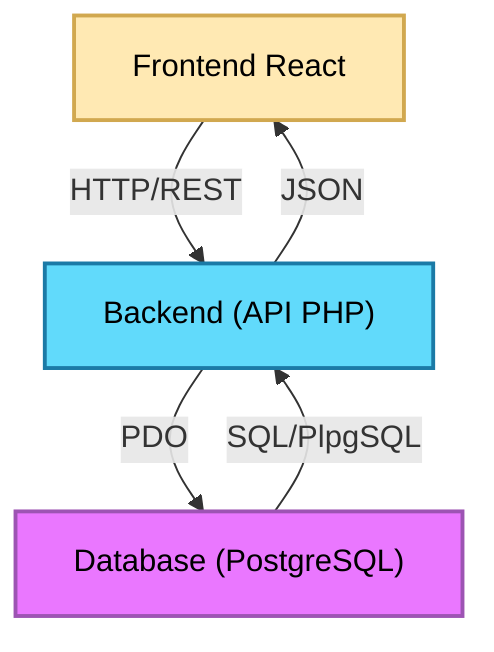

</div>

*Architecture simplifiée de UnlockIt (SAÉ 3.01).*

\* Si du code s'affiche à la place du schéma, rafraichissez la page.

</div>

Cette architecture nous a permis de développer rapidement un ensemble riche de fonctionnalités et de mieux appréhender les enjeux liés à la conception d’une application web complète. Toutefois, au fil de l’avancement du projet, plusieurs limites sont apparues. Le développement de nouvelles fonctionnalités devenait progressivement plus complexe, certains composants frontend mélangeaient logique métier et rendu visuel, et plusieurs parties du code manquaient d’homogénéité. Certains endpoints en backend faisaient 4 à 5 requêtes SQL de manières silencieuse et les implémentations était très rigides et peu modulaires. L’absence d’outils d’analyse compliquait également la détection des régressions et l’optimisation des performances.

Bien que fonctionnelle et suffisamment robuste pour être présentée lors de la première soutenance, cette version s’apparentait davantage à un produit minimum viable (MVP) qu’à une base technique durable. Avec la montée en compétences de l’équipe, les parties les plus anciennes du code nous sont apparues comme insuffisamment structurées, parfois mal écrites, voire difficilement lisibles en comparaison des fonctionnalités plus récentes. Le projet tenait, mais ses fondations étaient fragiles. Pour envisager une évolution pérenne, une refonte devenait nécessaire.

Ces constats nous ont naturellement conduits à envisager une seconde itération du projet, non plus centrée sur l’ajout de fonctionnalités, mais sur une amélioration profonde de sa qualité technique et de son architecture.

## 1.2 Présentation des membres

### 1.2.1 Organisation

Notre équipe était composée de deux membres, chacun avec un domaine principal : le frontend pour l’un, le backend pour l’autre. Malgré cette répartition naturelle, notre manière de travailler n’a jamais été cloisonnée. Nous échangions en permanence sur nos avancées, nos idées, nos essais et nos ajustements, et chaque décision importante était discutée ensemble, même lorsqu’elle concernait un domaine attribué à l’autre. Cette communication continue nous a permis de conserver une vision commune du projet et d’assurer une cohérence globale entre toutes ses couches, du design de l’interface jusqu’à la structure de la base de données.

Pour organiser notre travail, nous nous appuyions sur trois outils complémentaires : Git pour le versionnement, Trello pour le suivi des tâches et Discord pour la communication quotidienne. Notre workflow Git était volontairement simple : nous ne travaillions pas avec des branches séparées, car nos fichiers ne se chevauchaient pas et les types étaient centralisés dans un module partagé compilé automatiquement. Cette approche, combinée à une communication fluide, nous a permis d’éviter les conflits et de maintenir un rythme de développement efficace. Nous nous synchronisions régulièrement sur l’avancement des fonctionnalités, en nous attendant mutuellement lorsque l’un avait besoin d’un ajustement côté front ou d’une nouvelle route côté back.

Lors des périodes de télétravail, nous travaillions dans le même salon vocal Discord, ce qui recréait une véritable proximité malgré la distance. Nous développions en direct, partagions nos écrans lorsque nécessaire et prenions même nos pauses ensemble. Cette dynamique a rendu le travail plus agréable et a renforcé notre coordination. Elle a également permis de résoudre rapidement les problèmes, d’ajuster les fonctionnalités au fur et à mesure et de maintenir une cohésion forte tout au long du projet.

### 1.2.2 Les membres

<div class="card">

<a href="https://github.com/Frozen1753" target="_blank">
    <h3>Frozen1753</h3>
</a>

**Compétences techniques**

- **Développement & Programmation :** Java • C • C++ • C# • Bash • Python
- **Développement Web :** JavaScript • TypeScript • React • Vite • Playwright • PHP • NestJS • TypeORM
- **Design & Interfaces :**  XAML • HTML • CSS • Figma
- **Bases de données :**  SQL • PostgreSQL
- **Réseaux & Systèmes :** TCP/IP • Cisco Packet Tracer • Windows • Linux
- **Outils & Environnements :** Visual Studio • IntelliJ • Git • GitHub • PowerBI • PhpMyAdmin • MySQL • Workbench • Docker

**Formation**  
Étudiant en 2ᵉ année de BUT Informatique (formation initiale)

**Rôles dans le projet**  
Frontend • UX/UI Design • Design graphique • Optimisation • Testing

</div>

<div class="card">

<a href="https://github.com/ElPotatoCorp" target="_blank">
    <h3>ElPotato</h3>
</a>

**Compétences techniques**

- **Développement & Programmation :** Rust • C • C++ • C# • Bash • Python
- **Développement Web :** JavaScript • TypeScript • React • PHP • Swagger • Vite • NestJS • TypeORM
- **Design & Interfaces :** XAML • XML • HTML • CSS
- **Bases de données :** SQL • PostgreSQL
- **Réseaux & Systèmes :** TCP/IP • Cisco Packet Tracer • Windows • Linux
- **Outils & Environnements :** Visual Studio • IntelliJ • Git • GitHub • PowerBI • PhpMyAdmin • MySQL • Workbench • Docker

**Formation**  
Étudiant en 2ᵉ année de BUT Informatique (formation initiale)

**Rôles dans le projet**  
Backend • Base de données • Documentation • Optimisation • Scripts

</div>

## 1.3 Pourquoi une refonte complète ?

À l'issue de la SAÉ 3.01, nous disposions d'une application fonctionnelle répondant à la majorité des objectifs initiaux. Malgré ce résultat satisfaisant, nous avions pleinement conscience des limites de notre implémentation. Une grande partie de l'architecture avait été construite progressivement, au fur et à mesure de l'ajout de nouvelles fonctionnalités et de notre montée en compétences durant le projet.

Avec le recul, certaines décisions techniques prises au début du développement ne correspondaient plus à nos besoins actuels. Plusieurs composants étaient devenus trop volumineux, certaines responsabilités étaient mal réparties et une partie du code était devenue difficile à maintenir. Ajouter une nouvelle fonctionnalité nécessitait parfois de modifier plusieurs zones de l'application, augmentant le risque d'introduire des régressions.

De plus, la première version du projet avait été développée avec un objectif principalement fonctionnel : produire une application complète dans le temps imparti. Des aspects plus avancés tels que l'optimisation des performances, le référencement, l'analyse des rendus React ou encore la mise en place d'une architecture frontend et backend plus moderne avaient volontairement été laissés de côté.

La SAÉ 4.01 nous a offert l'opportunité de revenir sur ce projet avec un regard plus critique et davantage d'expérience. Plutôt que d'ajouter de nouvelles fonctionnalités sur des fondations que nous jugions désormais fragiles, nous avons fait le choix de repartir de zéro.

Cette décision peut sembler radicale, mais elle nous a permis de repenser entièrement l'application :

* en adoptant une architecture plus propre et plus maintenable
* en améliorant les performances globales du site
* en modernisant les outils utilisés
* en introduisant des pratiques de développement plus professionnelles
* en préparant le projet à de futures évolutions

L'objectif de cette seconde version n'était donc pas simplement de produire un « UnlockIt plus complet », mais de transformer un premier prototype fonctionnel en une base technique plus robuste, plus cohérente et davantage orientée vers la qualité logicielle.

## 1.4 Avertissements et déclarations

### **1.4.1 Utilisation de l’intelligence artificielle**

L’intelligence artificielle n’a été utilisée dans ce projet qu’à des fins ponctuelles et strictement encadrées. Elle a servi principalement à automatiser certaines tâches répétitives, à reformuler ou clarifier certains passages, et surtout à répondre à des questions techniques précises lorsque cela permettait d’éviter de longues recherches documentaires. Les sollicitations de l’IA portaient essentiellement sur des interrogations ciblées du type : « Existe‑t‑il une manière plus propre de faire X en Y ? » ou « Comment aborder tel problème sans passer par telle solution ? ». Dès lors qu’une réponse pouvait être trouvée rapidement dans la documentation officielle, nous privilégions systématiquement cette voie plutôt que l’IA.

Toutes les suggestions générées ont été systématiquement vérifiées, corrigées ou réécrites par les membres de l’équipe, et aucune partie du code métier, des algorithmes ou des décisions techniques n’a été produite automatiquement sans supervision humaine. Toute erreur restante sera donc authentiquement humaine, probablement due à notre maladresse ou à notre incompétence personnelle.

### **1.4.2 Images, médias et éléments graphiques**

L’ensemble des éléments visuels présents dans le projet : images, icônes, illustrations, SVG, animations ou compositions graphiques; a été soit réalisé manuellement, soit récupéré depuis des plateformes proposant des licences autorisant explicitement leur utilisation. Aucun média n’a été intégré sans vérification préalable de ses droits d’usage. Les ressources graphiques externes ont été sélectionnées avec soin afin de respecter les contraintes légales et d’assurer une cohérence esthétique avec l’identité visuelle du projet.

### **1.4.3 Ressources externes et données utilisées**

Toutes les données exploitées dans l’application proviennent de sources publiques ou ouvertes. Les informations relatives aux jeux vidéo, par exemple, ont été récupérées via l’API officielle de Steam, qui met ces données à disposition de manière publique. Elles ont ensuite été retraitées, filtrées et enrichies pour améliorer leur qualité et leur pertinence, ce qui explique leur quantité réduite par rapport à la version précédente du projet. De la même manière, les bibliothèques logicielles utilisées dans le code sont exclusivement des solutions publiques, open‑source ou librement accessibles, sélectionnées pour leur fiabilité et leur compatibilité avec les besoins du projet.

# 2. Frontend

## 2.1 Refonte de l'architecture React

### 2.1.1 Le problème

L’un des objectifs majeurs de cette seconde version d’UnlockIt a été d’améliorer et de clarifier l’architecture du frontend. La première version reposait déjà sur une base solide : une structure modulaire, organisée autour de composants réutilisables, de pages fonctionnelles et de dossiers bien séparés. Cette organisation était tout à fait exploitable et scalable, mais elle montrait ses limites à mesure que le projet grandissait.

Le principal défi ne venait donc pas d’un manque de modularité, mais plutôt de la **classification des composants et des fichiers**. Il devenait parfois difficile de déterminer où placer un nouvel élément :  
- un composant était‑il propre au projet ou suffisamment générique pour être réutilisable ailleurs ?  
- un hook relevait‑il de la logique métier, d’un helper ou d’un validateur ?  
- où ranger les refactors liés à l’API sans mélanger logique et présentation ?  
- comment éviter que certains dossiers deviennent des “fourre‑tout” au fil du temps ?  

Ces zones grises entraînaient des hésitations, des réorganisations ponctuelles et une perte de cohérence dans la structure globale.

La refonte n’a donc pas consisté à repartir de zéro, mais à rendre l’architecture plus explicite, plus cohérente et plus prévisible. Plusieurs dossiers ont été introduits ou repensés pour clarifier les responsabilités et éviter les ambiguïtés :

- <code class="c">layout/</code> regroupe désormais tous les composants qui encadrent ou se superposent aux pages (header, footer, background, panneau de debug, etc.). Le layout est ensuite appliqué globalement dans <code class="c">App.tsx</code>, ce qui simplifie la structure des pages.  
- <code class="c">common/</code> accueille les composants génériques et réutilisables indépendamment du projet : systèmes de skeleton, modals, alertes, providers, etc. Ce sont des briques transversales que l’on pourrait réutiliser dans d’autres applications.  
- <code class="c">api/</code> centralise toute la logique liée aux appels API : hooks dédiés, services, stores Zustand, types, mocks, et l’instance Axios. Les composants n’ont plus aucune logique API : ils se contentent d’appeler un hook métier.  
- <code class="c">utils/</code> regroupe tous les refactors logiques qui ne relèvent pas de l’API : formatteurs, validateurs, helpers, hooks transversaux, stores globaux (langue, thème, etc.).  
- <code class="c">public/media/</code> remplace l’ancien dossier <code class="c">images/</code>, qui servait parfois de fourre‑tout. Les médias sont désormais classés par type (images, vidéos, icônes, etc.), ce qui améliore la lisibilité et la maintenance.

L’objectif global était de **lever les ambiguïtés**, d’améliorer la lisibilité et de rendre l’architecture plus intuitive pour toute l’équipe. Cette nouvelle organisation facilite aujourd’hui l’intégration de nouvelles fonctionnalités, limite les risques de confusion et renforce la cohérence du projet sur le long terme.

### 2.1.2 Nouvelle architecture 

<div class="before">

<h3>Avant</h3>

<details class="accordion">
<summary>Voir plus d'informations</summary>

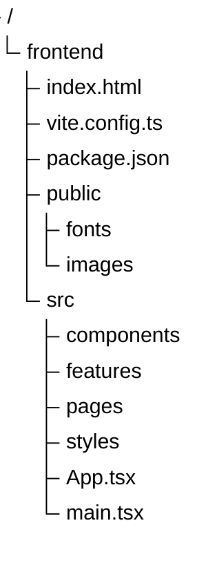

Les composants pouvaient ressembler à ceci :

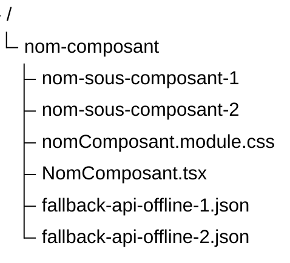


</details>

</div>

<div class="after">

<h3>Après</h3>

<details class="accordion">
<summary>Voir plus d'informations</summary>


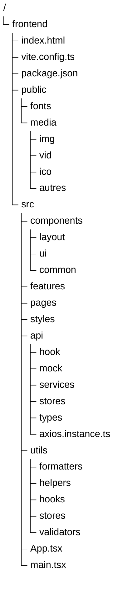

La structure d'un composant n'a pas réellement changé, sauf que cette fois ci, il n'y a pas de fallback locaux car tout marche bien :

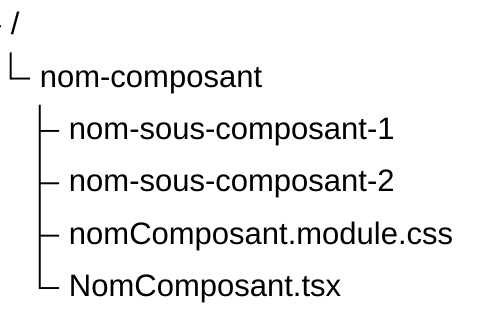

</details>

</div>

## 2.2 Référencement et indexation

### 2.2.1 React Helmet

Lors du développement de la première version de UnlockIt, très peu d’attention avait été portée aux problématiques de référencement naturel. Comme dans la plupart des applications React, l’architecture reposait sur le principe d’une **Single Page Application (SPA)** : un unique fichier <code class="c">index.html</code> sert de point d’entrée, puis React prend le relais pour générer et mettre à jour l’interface.

Le fonctionnement suit une chaîne simple :

- **index.html :** contient uniquement la structure minimale et un conteneur <code class="c">\<div id="root"\></code>.
- **main.tsx :** monte l’application React dans <code class="c">#root</code>.
- **App.tsx :** constitue le composant racine et gère le routage.
- **Composants :** chaque page ou section du site est rendue dynamiquement à l’intérieur de <code class="c">App</code>.

Dans ce modèle, changer de page ne provoque pas le chargement d'un nouveau document HTML. Seul le contenu affiché à l'écran est modifié par JavaScript, ce qui empêche naturellement chaque page de disposer de ses propres métadonnées.

<details class="accordion">
<summary>Exemple de SPA React</summary>

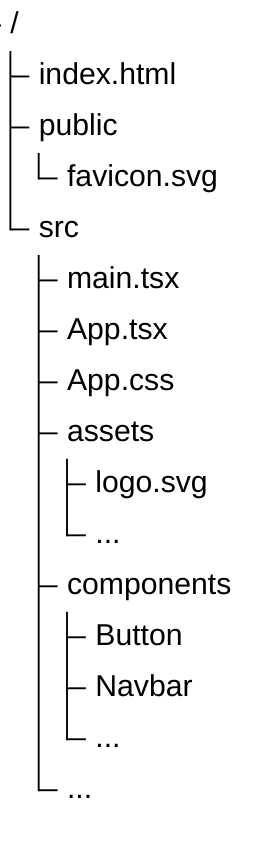

```html
<!-- index.html -->
<!doctype html>
<html lang="en">
  <head>
    ...
  </head>
  <body>
    <div id="root"></div>
    <script type="module" src="/src/main.tsx"></script>
  </body>
</html>
```

```tsx
// main.tsx
createRoot(document.getElementById('root')!).render(
  <StrictMode>
    <App />
  </StrictMode>,
)
```

```tsx
// App.tsx
export default function App() {
  return (
      <BrowserRouter>
        <Routes>
          <Route element={<Layout />}>
            <Route index element={<Home />}/>
            <Route ... />
            <Route path="*" element={<NotFound />} />
          </Route>
        </Routes>
      </BrowserRouter>
  );
}
```

</details>

En nous intéressant davantage au fonctionnement des moteurs de recherche et aux recommandations fournies par Lighthouse, nous avons constaté que l'absence de métadonnées adaptées à chaque page pénalisait le référencement du site ainsi que le partage de son contenu sur les réseaux sociaux.

Pour répondre à cette problématique, nous avons intégré la bibliothèque **React Helmet Async**, qui permet de modifier dynamiquement le contenu de l'élément <code class="c">\<head\></code> en fonction de la page actuellement affichée.

Plutôt que de dupliquer les mêmes balises dans chaque composant, nous avons créé un composant réutilisable nommé <code class="c">UnlockItHelmet</code>, appliquant le principe DRY (Don't Repeat Yourself).  Celui-ci centralise la gestion :

* du titre de la page ;
* de la description ;
* des balises <code class="c">OpenGraph</code> ;
* des métadonnées Twitter ;
* de l'URL canonique ;
* des consignes d'indexation.

```tsx
<UnlockItHelmet
    title="Accueil"
    path="/"
/>
```

À partir de cette simple déclaration, le composant génère automatiquement l'ensemble des métadonnées nécessaires.

<details class="accordion">
<summary>Résultats</summary>

```html
<head>
    <...>
    <title>UnlockIt – Accueil</title>
    <meta name="description" content="UnlockIt : achetez vos jeux PC moins cher. Clés Steam, Origin et Uplay livrées instantanément au meilleur prix.">
    <meta name="robots" content="index, follow">
    <meta property="og:title" content="UnlockIt – Accueil">
    <meta ...>
    <meta name="twitter:card" content="summary_large_image">
    <meta ...>
    <link rel="canonical" href="https://unlock-it.com/">
    <...>
</head>
```

</details>

L'approche devient encore plus intéressante pour les pages dynamiques. Une recherche sur le terme <code class="c">test</code> génère automatiquement un titre et une description adaptés au contenu affiché.

```tsx
<UnlockItHelmet
    title={`Recherche : ${term}`}
    description={`Résultats de recherche pour "${term}"`}
    path={`/search/${term}`}
/>
```

<details class="accordion">
<summary>Résultats</summary>

```html
<head>
    <...>
    <title>UnlockIt – Recherche : test</title>
    <meta name="description" content="Résultats de recherche pour &quot;test&quot; sur UnlockIt. Trouvez vos jeux PC au meilleur prix.">
    <meta name="robots" content="index, follow">
    <meta property="og:title" content="UnlockIt – Recherche : test">
    <meta ...>
    <meta name="twitter:card" content="summary_large_image">
    <meta ...>
    <link rel="canonical" href="https://unlock-it.com/search/test">
    <...>
</head>
```

</details>

Cette amélioration, relativement simple à mettre en œuvre, rapproche davantage UnlockIt du fonctionnement d'un véritable site de production. Elle améliore les scores de référencement fournis par Lighthouse, facilite l'indexation par les moteurs de recherche et permet également un meilleur rendu lors du partage des pages sur les réseaux sociaux.

Au-delà de l'aspect technique, cette démarche nous a permis de mieux comprendre le fonctionnement du web moderne et de découvrir des problématiques que nous n'avions encore jamais abordées dans le cadre des précédentes SAÉ.

---

### 2.2.2 Robots.txt

Lors des différents audits réalisés avec Lighthouse, nous avons découvert plusieurs recommandations liées au référencement naturel et à l'indexation du site. Parmi celles-ci figurait la présence d'un fichier <code class="c">robots.txt</code>, mécanisme que nous ne connaissions pas avant cette refonte.

En nous documentant davantage, notamment à l'aide de la documentation officielle et de l'intelligence artificielle, nous avons découvert qu'il s'agissait d'un fichier standard du Web permettant de communiquer certaines informations aux robots d'exploration des moteurs de recherche.

Encore une fois, même si UnlockIt reste un projet académique et n’a pas vocation à être réellement indexé (surtout avec le marché actuel et des géants comme Steam ou Instant Gaming… on ne ferait pas long feu), nous avons tout de même souhaité reproduire le fonctionnement d’une application de production en mettant en place ce fichier.

Le fichier <code class="c">robots.txt</code> est placé dans le dossier <code class="c">public</code> afin d'être directement accessible à l'adresse :

<a>https://unlock-it.com/robots.txt</a>

Son contenu a été enrichi afin de refléter les bonnes pratiques d’un site e‑commerce moderne :

```txt
User-agent: *
Allow: /

Disallow: /settings
Disallow: /login
Disallow: /register
Disallow: /purchases
Disallow: /purchases/
Disallow: /purchases/*
Disallow: /wishlist

Sitemap: https://unlock-it.com/sitemap.xml
```

Ce fichier indique que l'ensemble du site peut être exploré, à l’exception des pages sensibles.
Nous avons choisi de bloquer explicitement :

* <code class="c">/login</code>, <code class="c">/register</code> et <code class="c">/settings</code> : pages strictement personnelles, sans intérêt SEO.
* <code class="c">/wishlist</code> : page liée au compte utilisateur, non destinée à être publique.
* <code class="c">/purchases</code> et <code class="c">/purchases/:id</code> : pages critiques contenant l’historique d’achat et les clés de jeux.

Même si ces pages sont protégées côté serveur, les exposer aux robots pourrait révéler des identifiants sensibles ou provoquer une indexation accidentelle, ce qui serait contraire aux bonnes pratiques de sécurité et de confidentialité.

Ainsi, le fichier robots.txt contribue à protéger les zones privées du site tout en guidant correctement les moteurs de recherche vers les pages réellement destinées à être explorées.

<details class="accordion">
<summary>Pourquoi le placer dans public ?</summary>

Le dossier <code class="c">public</code> de Vite contient les ressources statiques qui doivent être servies directement par le serveur sans être traitées par le bundler. Les fichiers <code class="c">robots.txt</code>, <code class="c">sitemap.xml</code> ou encore <code class="c">favicon.ico</code> sont donc naturellement placés dans ce répertoire afin d'être accessibles depuis la racine du site.

```
public/
├── favicon.ico
├── robots.txt
└── sitemap.xml
```

</details>

L'ajout de ce fichier participe à rendre le projet plus conforme aux standards actuels du Web et nous a permis de mieux comprendre le fonctionnement de l'exploration et de l'indexation des sites internet.

Le fichier <code class="c">robots.txt</code> ne garantit pas qu'une page sera indexée ou non par un moteur de recherche. Il constitue uniquement une convention permettant de donner des indications aux robots d'exploration.

---

### 2.2.3 Sitemap XML

Si le fichier <code class="c">robots.txt</code> indique aux robots d'exploration où trouver certaines informations, le fichier <code class="c">sitemap.xml</code> leur fournit quant à lui la liste des pages disponibles sur le site ainsi que certaines informations complémentaires concernant leur importance et leur fréquence de mise à jour.

<details class="accordion">
<summary>Grosso modo</summary>

> <code class="c">robots.txt</code> dit aux robots "où regarder".
>
> <code class="c">sitemap.xml</code> dit aux robots "quelles pages existent".

</details>

Lors de nos recherches sur le référencement naturel et après plusieurs audits réalisés avec Lighthouse, nous avons découvert qu'il était courant pour les sites de production de mettre à disposition un sitemap afin de faciliter leur indexation.

Nous avons donc décidé d'ajouter un fichier <code class="c">sitemap.xml</code> à la racine du projet, également placé dans le dossier <code class="c">public</code> afin qu'il soit accessible à l'adresse :

<a>https://unlock-it.com/sitemap.xml</a>

Le sitemap contient les principales pages publiques du site, accompagnées de plusieurs informations :

* <code class="c">loc</code> : l'adresse de la page ;
* <code class="c">changefreq</code> : la fréquence estimée des modifications ;
* <code class="c">priority</code> : l'importance relative de la page au sein du site.

L'extrait suivant présente quelques entrées du fichier :

```xml
<?xml version="1.0" encoding="UTF-8"?>
<urlset xmlns="http://www.sitemaps.org/schemas/sitemap/0.9">

  <url>
    <loc>https://unlock-it.com/</loc>
    <changefreq>weekly</changefreq>
    <priority>0.9</priority>
  </url>

  <url>
    <loc>https://unlock-it.com/search</loc>
    <changefreq>weekly</changefreq>
    <priority>0.5</priority>
  </url>

  ...

  <url>
    <loc>https://unlock-it.com/privacy</loc>
    <changefreq>yearly</changefreq>
    <priority>0.2</priority>
  </url>

  <url>
    <loc>https://unlock-it.com/login</loc>
    <changefreq>yearly</changefreq>
    <priority>0.1</priority>
  </url>

  ...

</urlset>
```

Concernant les pages dynamiques, même si UnlockIt (SAÉ 4.01) ne comporte actuellement qu’une soixantaine de jeux issus de l’API Steam, l’application a été pensée pour évoluer. Dans un contexte réel, un site de vente de licences pourrait facilement proposer **plusieurs milliers de jeux**, chacun accessible via une URL de type : <code class="c">/games/:slug</code>

Dans ce cas, il serait évidemment **impossible et totalement irréaliste** de maintenir manuellement une entrée dans le sitemap pour chaque jeu.  
C’est d’ailleurs pour cette raison que les sites e‑commerce professionnels (Steam, Instant Gaming, Eneba, Amazon…) génèrent leurs sitemaps automatiquement, à l’aide d’un script.

Un tel script peut être exécuté :

* à partir de la base de données (pour lister tous les jeux disponibles)
* à chaque déploiement
* ou encore une fois par jour, afin de refléter les ajouts ou suppressions de produits

Cette approche garantit que le sitemap reste toujours à jour, sans intervention manuelle, même lorsque le catalogue atteint plusieurs milliers d’entrées.  
Le sitemap actuel d’UnlockIt ne contient donc que les pages statiques et publiques, mais sa structure a été pensée pour être compatible avec une génération dynamique future, comme cela se ferait dans un environnement de production.

Cette réflexion autour du sitemap nous a permis de mieux comprendre les mécanismes d’indexation modernes et de découvrir un aspect du développement web que nous n’avions encore jamais abordé au cours des précédentes SAÉ.  
Au‑delà de son utilité immédiate, cette fonctionnalité a constitué un excellent exercice pour adopter une démarche plus professionnelle et se rapprocher du fonctionnement réel d’une application web en production.

## 2.3 Optimisation des performances

L’optimisation des performances a constitué l’un des principaux axes de travail de cette nouvelle version de l’application. Lors du développement de la SAÉ 3.01, notre démarche reposait essentiellement sur une évaluation subjective : tant que l’interface semblait fluide et réactive, nous considérions que les performances étaient satisfaisantes. Avec davantage d’expérience, nous avons compris que cette approche était insuffisante. Une application peut en effet paraître rapide tout en exécutant des traitements inutiles, en chargeant des ressources superflues ou en déclenchant des rendus React non nécessaires.

Afin d’adopter une démarche plus rigoureuse et professionnelle, nous avons choisi de mesurer avant d’optimiser. Nous avons ainsi intégré plusieurs outils de profilage, d’audit et d’analyse permettant d’identifier objectivement les points de ralentissement, de comprendre leur origine et de valider l’impact réel des optimisations apportées. Cette approche nous a également permis de mieux appréhender le fonctionnement interne de React, du moteur JavaScript et du navigateur, révélant des problématiques que l’on ne perçoit pas sans instrumentation adaptée.

Les outils utilisés couvrent différents aspects de la performance : certains se concentrent sur le rendu React, d’autres analysent le comportement global du navigateur, tandis que des outils comme Lighthouse évaluent la qualité générale de l’application (accessibilité, bonnes pratiques, poids des ressources, etc.). Les sections suivantes détaillent ces outils et expliquent comment ils nous ont guidés dans l’amélioration de l’application.

---

### 2.3.1 React Scan

L’outil principal utilisé durant cette phase a été **React Scan**, un utilitaire léger permettant de visualiser en temps réel les composants qui se réaffichent. Son activation est extrêmement simple : une seule ligne ajoutée dans le <code class="c">\<head\></code> du fichier <code class="c">index.html</code> suffit pour le rendre opérationnel.

```html
<script
  crossorigin="anonymous"
  src="//unpkg.com/react-scan/dist/auto.global.js">
</script>
```

React Scan met en évidence les composants qui se réaffichent, la fréquence de leurs re-rendus ainsi que les zones de l’interface les plus coûteuses. À chaque rendu, l’outil dessine une boîte autour du composant concerné, ce qui permet d’observer immédiatement si un comportement est normal ou excessif. Lors de l’ouverture d’un menu, par exemple, seuls le bouton déclencheur et le menu devraient être redessinés ; un re-rendu du header entier indiquerait au contraire une propagation indésirable des mises à jour.

<div class="card">

#### Exemple de diagnostic avec React Scan.

Lors d’un premier clic, le menu apparaît et seuls les éléments directement concernés sont redessinés. Un second clic ferme le menu, ce qui provoque son re-rendu et la disparition de son contenu. Cette visualisation simple permet de distinguer très rapidement un rendu localisé d’un rendu trop large.


L’outil propose également un panneau d’analyse affichant l’historique des re-rendus, leur durée et les FPS en temps réel. Cette vue est particulièrement utile pour repérer les composants les plus coûteux ou identifier des pics de latence. Un re-rendu complet de la page, par exemple, ferait chuter les FPS de manière notable.


<details class="accordion">
<summary>Voir plus d'informations</summary>

PS 1 : Dans cet exemple, les FPS sont limités à environ 40 en raison du mode développement et des programmes en arrière-plan (base de données, Docker, enregistrement vidéo, etc.). En production, la page atteint généralement autour de 100 FPS, sauf sur des machines peu performantes.

PS 2 : Le premier événement affiché à 7 FPS correspond simplement au démarrage de l’application et de React Scan. Les rendus se font généralement dans l’ordre de la dizaine de millisecondes.

</details>

</div>

Ces analyses nous ont encouragés à adopter de meilleurs réflexes lors de la conception de nouveaux composants, notamment en limitant les dépendances inutiles et en structurant plus clairement les responsabilités de chaque élément.  

Découper les grands composants joue également un rôle essentiel. Une page représentée par un seul composant implique que la moindre modification locale, par exemple l’apparition conditionnelle d’un simple <code class="c">\<div\></code> déclenchera le re‑rendu de l’ensemble. Fragmenter un composant lorsqu’il devient trop volumineux ou contient trop de logique améliore à la fois la lisibilité et les performances. Heureusement, cette habitude avait déjà été adoptée dans l’ancien projet. D’autres découpes ont été réalisées, mais en quantité limitée.

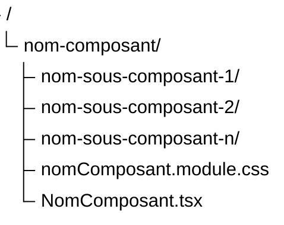

Au-delà des gains de performance, React Scan nous a surtout permis de **visualiser concrètement** ce qui se passe dans React : comprendre pourquoi certains composants se réaffichent, comment les changements d’état se propagent et quels éléments sont réellement coûteux.

---

### 2.3.2 React Developer Tools

En complément de **React Scan**, nous avons utilisé **React Developer Tools**, une extension officielle disponible sur les navigateurs Chromium et Firefox. Cet outil constitue une référence pour analyser le comportement interne d’une application React, car il permet d’inspecter précisément la structure des composants, leurs états et leurs contextes.

Contrairement à React Scan, qui met l’accent sur la visualisation immédiate des re‑rendus, React Developer Tools offre une analyse plus détaillée et plus technique. Il permet d’examiner l’arbre complet des composants, d’observer leurs props et états en temps réel, et d’inspecter les contextes utilisés dans l’application. Ces fonctionnalités nous ont permis de confirmer l’origine de certains re‑rendus et de valider l’efficacité des optimisations appliquées, comme l’utilisation de **React.memo** ou la stabilisation de certaines props.

<div class="card">

Analyse de l'arbre des composants avec React Developer Tools.  


L’onglet **Components** a un interface qui reprend les principes de l’inspecteur d’éléments classique : sélection d’éléments, navigation dans l’arbre, recherche, et affichage des propriétés spécifiques à React. On peut notamment identifier les composants mémorisés via *Memo*, les contextes consommés ou encore les hooks utilisés.


Le **Profiler** complète parfaitement React Scan. Il permet d’identifier quel composant a déclenché un rendu, à quel moment, en combien de temps, et de visualiser la chronologie des rendus ainsi que les relations entre composants. Cette vue temporelle est particulièrement utile pour repérer les goulots d’étranglement.

</div>

React Developer Tools s’est révélé utilie tout au long du développement. Même si nous n’avons jamais rencontré de problèmes de performance majeurs ou de composants réellement trop lourds, la possibilité d’inspecter rapidement la hiérarchie, les contextes consommés ou la raison d’un re‑rendu offrait une grande tranquillité d’esprit. Dès qu’un comportement semblait inhabituel, React Developer Tools permettait de vérifier en quelques secondes si tout fonctionnait comme prévu. Couplé à React Scan, qui met en évidence les re‑rendus en temps réel, l’outil offrait une vision complète : d’un côté l’observation instantanée du rendu, de l’autre une analyse détaillée des causes et du coût associé.

### 2.3.3 Lighthouse

Lighthouse a été utilisé tout au long du développement pour mesurer plusieurs indicateurs essentiels à la qualité globale de l’application : performances, accessibilité, référencement et bonnes pratiques. Contrairement aux outils centrés sur React, Lighthouse évalue l’application dans son ensemble : structure HTML, chargement initial, gestion des ressources, interactions, et conformité aux standards du web.  
Ces audits nous ont permis de valider objectivement l’impact de nos optimisations et d’orienter les améliorations à apporter.


Les scores Lighthouse peuvent varier légèrement selon la page analysée ou les conditions d’exécution, en particulier pour la partie Performance. En build, les résultats restent toutefois très stables et dépassent généralement 95, ce qui confirme la bonne optimisation globale de l’application.

<details class="accordion">
<summary>Les 4 notations</summary>

Lighthouse évalue l’application selon quatre axes principaux :

**Performance**  
Analyse la rapidité de chargement et la fluidité générale.  
Exemples de critères :  
- temps d’affichage du premier contenu (FCP) ;  
- temps d’affichage du contenu principal (LCP) ;  
- délai avant interactivité (TTI) ;  
- poids des ressources et efficacité du cache.

**Accessibilité**  
Vérifie la conformité aux bonnes pratiques d’accessibilité.  
Exemples :  
- contraste des couleurs ;  
- présence de labels sur les champs de formulaire ;  
- structure correcte des titres ;  
- attributs alt sur les images.

**Best Practices**  
Évalue la sécurité et la qualité technique du site.  
Exemples :  
- utilisation de HTTPS ;  
- absence d’erreurs JavaScript ;  
- images correctement dimensionnées ;  
- absence d’API obsolètes.

**SEO**  
Mesure la capacité du site à être correctement référencé.  
Exemples :  
- présence de balises meta essentielles ;  
- structure HTML sémantique ;  
- liens accessibles et valides.

</details>

<div class="card">

Lighthouse met en évidence encore aujourd'hui des points d’améliorations, même si les scores sont excellents. Certains avertissements ne peuvent tout simplement pas être corrigés, notamment ceux provenant de scripts tiers. L’outil doit donc être vu comme un guide, non comme une vérité absolue. Sa documentation, en revanche, s’est révélée extrêmement utile : elle fournit des explications claires et concrètes sur les bonnes pratiques du web, bien plus accessibles que la plupart des ressources généralistes.

- Concernant l’accessibilité, Lighthouse a notamment signalé un contraste comme insuffisant : les quatres liens du footer, de couleur bleu foncé et vert néon au survol. Sans l'animation et un écran sombre il est vrai que la visibilité pour être complexifié sur fond noir. Nous avons décidé de ne pas le corriger, car il s'agissait de liens pour des pages peu importantes pour conserver l'identité graphique et l'harmonie des couleurs, gardant également la seule faute de l'audit sur le point de l'accessiblité.


- Pour les performances, l’outil a relevé que les polices locales prenaient du temps a charger en raison de leur taille (0.4s pour 2 fois 40ko). Nous avons choisi de conserver ces polices d'ecritures car nous ne voulons pas dépendre d'un site externe pour assurer le bon fonctionnement de notre texte.


- Du côté des bonnes pratiques, certains avertissements provenaient de scripts externes, notamment ceux de l’API YouTube utilisée pour les trailers. Ces logs ne peuvent pas être supprimés puisqu’ils proviennent de services tiers.


- Enfin, le SEO a un score parfait. 🎉🎉🎉 (allez voir la partie <a href="#22-référencement-et-indexation">2.2 Référencement et indexation</a>)

</div>

Lighthouse s’est donc révélé être un outil précieux pour valider nos choix techniques et garantir une qualité globale élevée. Là où **React Developer Tools** et **React Scan** se concentrent sur le comportement interne de React, Lighthouse adopte une perspective plus large, centrée sur l’expérience utilisateur, la robustesse du site et sa conformité aux standards du web.

---

### 2.3.4 Firefox Profiler

En complément des outils orientés React, nous avons utilisé **Firefox Profiler** afin d’obtenir une vision plus large du comportement global de l’application. Contrairement à React Developer Tools, qui se concentre sur l’arbre des composants et leurs re‑rendus, Firefox Profiler analyse l’activité complète du navigateur : exécution JavaScript, calcul des styles, opérations de rendu, gestion des événements et utilisation des ressources matérielles.


Dans notre cas, l’outil n’a pas servi à résoudre des problèmes de performance critiques (nous n’en avons jamais réellement rencontrés), mais plutôt comme un gestionnaire de tâches avancé, capable d’expliquer pourquoi le navigateur utilise le CPU ou le GPU. Là où le gestionnaire de tâches classique affiche uniquement un pourcentage global, Firefox Profiler permet de comprendre ce qui se cache derrière ce chiffre.

Lorsque nous avons développé la première version du background animé, un comportement nous avait particulièrement inquiétés. En faisant simplement défiler la page, le gestionnaire de tâches affichait parfois 90 % d’utilisation GPU, ce qui donnait l’impression que l’animation risquait de surcharger les machines des utilisateurs. Pensant qu’il s’agissait d’un problème sérieux, nous avions même imposé un rafraîchissement extrêmement bas (4 FPS) pour éviter de consommer "ne serait‑ce qu’1 %" de GPU selon l’outil système.


Firefox Profiler a finalement montré que cette interprétation était trompeuse :  
le GPU était bien sollicité, mais **à une fréquence extrêmement basse**, ce qui signifie que la charge réelle était minime. En d’autres termes, l’animation n’était pas dangereuse pour les cartes graphiques, et aurait pu fonctionner à un framerate plus élevé sans poser de problème.  
Cette analyse a été particulièrement utile lors de la refonte du background avec **PixiJS** (voir <a href="#236-pixijs">2.3.6 PixiJS</a>), où nous avons pu vérifier que les optimisations graphiques appliquées n’entraînaient aucune surcharge matérielle.

<details class="accordion">
<summary>GPU élevé ≠ danger</summary>

**Grosso modo :**

Le gestionnaire de tâches affiche un **pourcentage d’utilisation**, mais pas l’**intensité réelle** du travail effectué. Un GPU peut très bien indiquer **80 % d’utilisation**, tout en tournant à une **fréquence extrêmement basse** (par exemple 200 MHz au lieu de 1800 MHz).  
Autrement dit, il "travaille", mais très lentement, sans effort.  
Une analogie simple serait une voiture roulant à "80 % de sa vitesse"... mais en première, moteur à peine allumé.

**Cas concret :**
 
| Situation     | Fréquence GPU | Utilisation | Charge réelle |
| ------------- | ------------- | ----------- | ------------- |
| Jeu vidéo     | 1800 MHz      | 80 %        | Très élevée   |
| Animation web | 200 MHz       | 80 %        | Très faible   |

Dans notre cas, Firefox Profiler a montré que le navigateur utilisait le GPU à **faible fréquence**, ce qui signifie que l’animation était **peu coûteuse**, même si le gestionnaire de tâches affichait un pourcentage élevé.  
On peut d’ailleurs observer le même phénomène sur d’autres sites utilisant un <code class="c">\<canvas\></code> ou des animations WebGL : le GPU peut afficher 70–90 % d’utilisation, mais l’ordinateur reste parfaitement silencieux et froid, loin de la charge réelle d’un logiciel de montage vidéo, d’un jeu 3D ou d’une simulation lourde.

</details>

Au‑delà de ce cas précis, nous n’avons pas eu besoin d’utiliser Firefox Profiler de manière plus poussée : les outils comme React Developer Tools et React Scan étaient largement suffisants pour le reste du projet.
Cependant, comprendre comment un navigateur répartit réellement le travail (exécution JavaScript, calcul des styles, layout, paint, etc.) reste extrêmement utile. Dans des situations plus complexes, ou lorsqu’un comportement semble inhabituel, nous savons désormais où regarder et comment interpréter les données pour éviter de fausses alertes.

---

### 2.3.5 Lazy Loading et Suspense

L’une des optimisations majeures apportées à cette nouvelle version concerne la manière dont les pages sont chargées. Dans la première version du projet, toutes les routes principales étaient importées dès le démarrage de l’application. Même lorsqu’un utilisateur ne consultait qu’une seule page, il téléchargeait malgré tout l’ensemble du code JavaScript du site. Cette approche reste acceptable pour une petite application, mais devient rapidement coûteuse lorsque le nombre de pages augmente : le navigateur doit charger, analyser et exécuter davantage de code avant d’afficher la moindre interface.

Pour résoudre ce problème, nous avons mis en place une stratégie de **code splitting** basée sur **React.lazy** et **Suspense**. Chaque page importante est désormais chargée dynamiquement, uniquement lorsque l’utilisateur en a réellement besoin.

```tsx
const Home = lazy(() => import("./pages/home/Home"));
const Search = lazy(() => import("./pages/search/Search"));
// ...
```

Pour éviter de répéter la même structure dans chaque route, une petite fonction utilitaire <code class="c">lazyRoute()</code> encapsule automatiquement le composant dans un <code class="c">\<Suspense\></code> avec un loader personnalisé :

```tsx
function lazyRoute(element: React.ReactNode) {
  return (
    <Suspense fallback={<Loader />}>
      {element}
    </Suspense>
  );
}
```

Le composant **Loader** affiche un spinner (composant <code class="c">Loading</code> réutilisé depuis un autre projet) et sert d’indicateur visuel pendant le chargement d’une page, évitant ainsi à l’utilisateur de se retrouver face à un écran vide.

```tsx
export function Loader() {
  return (
    <div id="page-loading">
      <Loading />
    </div>
  );
}
```

Voici un exemple forcé avec une mauvaise connexion (Regular 2G) : on peut voir apparaître rapidement le spinner entre les pages. En général, on ne le voit jamais ou seulement une fraction de seconde grâce à l’optimisation des fichiers et à la réduction des dépendances ; voir la section <a href="#26-build-et-compression">2.6 Build et compression</a> pour plus d’informations sur la taille des bundles et le découpage en chunks.

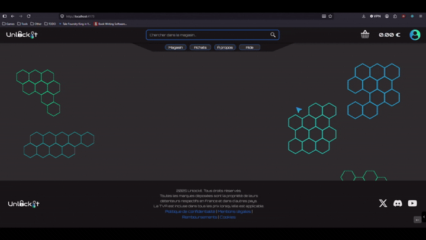

<details class="accordion">
<summary>Utilisation dans le <code class="c">App.tsx</code></summary>

```tsx
export default function App() {
  return (
    <...>
      <BrowserRouter>
        <Routes>
          <Route element={<Layout />}>
            <Route index element={<Home />}/>
            {["/home", "/store", "/shop"].map((path) => (
              <Route key={path} path={path} element={<Navigate to="/" replace />} />
            ))}

            <Route path="/search" element={lazyRoute(<Search />)} />
            <Route path="/search/:term" element={lazyRoute(<Search />)} />

            ...

            <Route path="*" element={<NotFound />} />
          </Route>
        </Routes>
      </BrowserRouter>
    </...>
  );
}
```

</details>

Grâce à cette architecture, chaque page devient un bundle indépendant, chargé uniquement lorsqu’elle est visitée. Cela réduit significativement la taille du bundle initial, diminue le temps de téléchargement et le temps d’analyse/exécution JavaScript au premier chargement, améliore les métriques Lighthouse (notamment Performance et Best Practices) et offre une meilleure expérience utilisateur sur les connexions lentes. Le composant **Suspense** est central : lorsqu’un module n’est pas encore disponible, React affiche le *fallback* (le <code class="c">Loader</code>), fournissant un retour visuel immédiat et améliorant la perception de fluidité.

---

### 2.3.6 PixiJS

L’arrière‑plan animé constituait l’un des éléments visuels les plus visibles et les plus délicats de la nouvelle version d’UnlockIt. La première implémentation reposait sur un simple <code class="c">\<canvas\></code> et de la logique Typescript maison. Bien que globalement performante (et comme l’a confirmé l’analyse avec **Firefox Profiler**, sans surcharge matérielle), cette version présentait plusieurs problèmes visuels : floutage lors du zoom, rendu étrange hors du format 16:9, et comportement peu satisfaisant sur mobile. Par précaution, nous avions même temporairement limité le framerate à 4 FPS pour éviter d’être alertés par des pourcentages d’utilisation GPU affichés par le gestionnaire de tâches, alors que la charge réelle restait faible.

Pour corriger ces défauts visuels tout en conservant les bonnes performances, nous avons réécrit le background avec PixiJS, une bibliothèque 2D s’appuyant sur WebGL. PixiJS facilite la gestion d’une scène graphique, la manipulation de sprites, la création de textures et la boucle de rendu, tout en exploitant l’accélération matérielle pour déléguer au GPU les opérations coûteuses. Grosso modo, PixiJS transforme le <code class="c">\<canvas\></code> en une véritable scène graphique, comparable à ce qu’on utiliserait pour un petit jeu vidéo ou un moteur d’animation, mais avec une simplicité d’utilisation bien supérieure à un canvas HTML classique.

En réécrivant le code Typescript avec PixiJS, nous avons obtenu une meilleure gestion du redimensionnement et une qualité visuelle nettement supérieure. Un listener sur la largeur de l’écran permet désormais d’adapter dynamiquement la scène au device : le background se redimensionne proprement, conserve sa netteté au zoom et s’ajuste correctement aux formats non‑16:9. Les motifs sont rendus comme des textures WebGL, ce qui évite la pixellisation et garantit une qualité optimale sur les écrans haute densité. L’animation est devenue parfaitement fluide, le cap à 4 FPS a été levé, et PixiJS gère désormais un taux de rafraîchissement stable et performant.

<details class="accordion">
<summary>Implementation avec PixiJS</summary>

L’implémentation du background repose sur un ensemble de fichiers qui dialoguent entre eux comme les membres d’une petite équipe technique. Pour quelqu’un qui ne connaît pas JavaScript, on peut imaginer que <code class="c">Background.tsx</code> joue le rôle de l’ouvreur de rideau : il prépare la scène, installe le décor vide et appelle le responsable des lumières et des animations. Ce responsable, c’est <code class="c">HexBackground.ts</code>, qui orchestre toute la partie graphique. Autour de lui gravitent plusieurs assistants spécialisés : <code class="c">hexGeometry.ts</code> s’occupe de la géométrie des hexagones, <code class="c">HexPatternContainer.ts</code> fabrique les motifs, <code class="c">color.ts</code> gère les transitions de couleurs, <code class="c">layout.ts</code> décide où placer les motifs selon la taille de l’écran, et <code class="c">seededRandom.ts</code> garantit que le rendu reste identique pour une même session utilisateur.

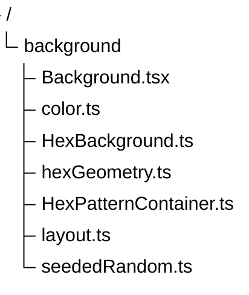

Le fond doit rester stable pour un utilisateur donné, ce qui est assuré grâce à une seed dérivée de son identifiant de session. Si aucune session n’est active, une seed par défaut est utilisée. Le composant <code class="c">Layout</code> illustre ce mécanisme en transmettant l’identifiant de session au composant <code class="c">Background</code>.

```tsx
export const Layout = memo(() => {
    const sid = useAuthStore((s) => s.session?.sid);

    return (
        <div>
            <Header />

            <main>
                <Background seedOverride={sid} />
                <Outlet />
                <SessionStatusPanel />
            </main>

            <Footer />
        </div>
    );
});
```

Le premier fichier réellement actif dans le rendu est <code class="c">Background.tsx</code>. Grosso modo, il crée un simple <code class="c">\<div\></code> invisible qui servira de scène, puis il instancie <code class="c">HexBackground</code> en lui donnant ce conteneur et la seed calculée. Il ne fait rien d’autre : il ne dessine pas, ne calcule pas les motifs, ne gère pas l’animation. Il se contente de dire « voici la scène, voici la seed, débrouille‑toi ». Lorsqu’on change de page ou que le composant se démonte, il demande simplement à <code class="c">HexBackground</code> de tout nettoyer proprement.

```tsx
useEffect(() => {
  const el = containerRef.current;
  if (!el) return;
  const bg = new HexBackground({ container: el, seed: seedFromString(seedStr) });
  bg.init().then(() => { bgRef.current = bg; }).catch(console.error);
  return () => { bg.destroy(); };
}, [seedStr]);
```

C’est dans <code class="c">HexBackground.ts</code> que tout commence réellement. On peut le voir comme le régisseur de scène : il installe le canvas PixiJS, configure l’éclairage, crée deux calques (un à gauche, un à droite), et lance la construction des motifs. PixiJS fonctionne comme un mini‑moteur graphique : il crée une scène, une boucle de rendu et délègue au GPU les opérations coûteuses. <code class="c">HexBackground</code> s’appuie sur cette boucle pour animer les motifs et appliquer un léger effet de parallaxe lorsque l’utilisateur fait défiler la page. L’initialisation ressemble à ceci : PixiJS crée son canvas, l’insère dans la page, ajoute les calques, génère les motifs, puis branche un observateur de redimensionnement et un écouteur de scroll.

```ts
await this.app.init({ width: window.innerWidth, height: window.innerHeight, backgroundAlpha: 0 });
container.appendChild(this.app.canvas);
this.app.stage.addChild(this.leftLayer);
this.app.stage.addChild(this.rightLayer);
this.buildPatterns(w, h);
this.resizeObserver = new ResizeObserver(() => this.onResize());
window.addEventListener("scroll", this.onScroll, { passive: true });
this.app.ticker.add(this.onTick);
```

La méthode <code class="c">buildPatterns</code> est l’endroit où les motifs prennent vie. Grosso modo, elle découpe l’écran en zones selon la taille du device : une seule zone sur mobile, deux colonnes latérales sur desktop. Dans chaque zone, elle tente de placer plusieurs motifs hexagonaux sans qu’ils ne se chevauchent. Pour cela, elle génère un motif aléatoire mais connecté, calcule sa boîte englobante, et vérifie qu’il ne touche aucun motif déjà placé. Cette logique donne un rendu aéré et harmonieux, sans amas chaotiques.

Le motif lui‑même est construit par <code class="c">HexPatternContainer.ts</code>. On peut l’imaginer comme un artisan qui fabrique un tampon hexagonal, puis l’utilise pour imprimer plusieurs copies sur la scène. Il commence par dessiner un seul hexagone dans une texture GPU, en utilisant les fonctions de géométrie fournies par <code class="c">hexGeometry.ts</code>. Ce dessin est ensuite réutilisé pour tous les hexagones du motif, ce qui est extrêmement efficace. Voici le dessin initial du tampon :

```ts
const hexGfx = new PIXI.Graphics();
const verts  = hexVertices(texSize / 2, texSize / 2, opts.size, angleOffset);
hexGfx.poly(verts);
hexGfx.stroke({ color: 0xffffff, width: opts.borderWidth });
opts.renderer.render({ container: hexGfx, target: this.texture, clear: true });
hexGfx.destroy();
```

Le motif n’est pas généré au hasard complet. Une petite fonction crée une grille de cases et remplit progressivement des cellules voisines pour former un amas connecté. Cela donne des formes organiques, ni trop régulières ni trop chaotiques. Voici un exemple de motif généré sous forme de tableau booléen :

```txt
[ 0 1 1 0 ]
[ 0 1 0 0 ]
[ 1 1 1 0 ]
```

Chaque <code class="c">1</code> représente un hexagone à dessiner. Une fois ce motif établi, <code class="c">HexPatternContainer</code> calcule la position exacte de chaque hexagone en tenant compte de l’orientation (pointue ou plate) et des décalages nécessaires pour former une grille hexagonale correcte.

L’animation des couleurs est ensuite appliquée à l’ensemble du motif. Chaque motif possède deux couleurs de base et une vitesse d’animation. À chaque frame, une valeur oscillante est calculée, puis utilisée pour interpoler entre les deux couleurs. Le résultat est appliqué à tous les sprites via la propriété <code class="c">tint</code>, ce qui crée une pulsation douce et continue.

```ts
update() {
  const t = animatedT(this.animSpeed);
  const color = lerpColor(this.colorA, this.colorB, t);
  for (const s of this.sprites) s.tint = color;
}
```

Les fichiers utilitaires complètent cette architecture. <code class="c">hexGeometry.ts</code> fournit les calculs mathématiques nécessaires pour positionner correctement les hexagones. <code class="c">layout.ts</code> décide comment découper l’écran selon sa largeur. <code class="c">seededRandom.ts</code> transforme une chaîne en une graine numérique et fournit un générateur pseudo‑aléatoire déterministe, ce qui garantit que le fond reste identique pour une même session utilisateur. La conversion d’une chaîne en seed est volontairement simple et reproductible :

```ts
export function seedFromString(value: string): number {
  return hashString(value);
}
```

L’ensemble forme une architecture cohérente où chaque fichier a un rôle clair. React prépare la scène, <code class="c">HexBackground</code> orchestre le rendu, <code class="c">HexPatternContainer</code> fabrique et anime les motifs, et les utilitaires fournissent les outils mathématiques et aléatoires nécessaires. PixiJS apporte la stabilité, la netteté et la performance qui manquaient à la première version basée sur un simple <code class="c">\<canvas\></code>. Grâce à cette réécriture, le fond est devenu plus net, plus fluide, plus adaptable et surtout beaucoup plus robuste visuellement.

</details>

L’adaptation du code a été plutôt simple car beaucoup de la logique du canvas a été conservée, avec quelques exceptions, mais nous avons rapidement retrouvé nos repères et adapté le code aux types proposés par la bibliothèque. Aujourd’hui, si je devais concevoir des interfaces pour des petits moteurs ou des animations, j’utiliserais PixiJS sans hésiter, car la bibliothèque est bien plus complète et agréable à utiliser qu’un canvas HTML classique accompagné de code maison.

---

### 2.3.7 SVGR

Dans l’ancienne version d’UnlockIt, une grande partie des icônes était fournie sous forme de fichiers PNG. Cette approche fonctionnait, mais elle avait plusieurs limites : les images étaient plus lourdes, étaient de trop grande qualité pour leur taille, et ne pouvaient pas être facilement recolorées ou adaptées à différents contextes. Avec la refonte, nous avons progressivement remplacé ces ressources par des fichiers SVG, beaucoup plus adaptés à une interface moderne. Un SVG est un dessin vectoriel, ce qui signifie qu’il reste parfaitement net quelle que soit la résolution de l’écran, tout en pesant souvent trois fois moins qu’un PNG équivalent.

Pour intégrer ces SVG dans React, nous avons adopté deux approches complémentaires. Lorsque l’icône est simple, monochrome ou peu détaillée, nous utilisons **SVGR**, un outil qui transforme automatiquement un fichier SVG en composant React. Cela permet d’utiliser une icône comme n’importe quel composant, de lui passer des props, de changer sa couleur ou sa taille dynamiquement, et de l’intégrer naturellement dans l’arbre React. Au lieu d’écrire une balise <code class="c">\</code> classique comme dans l’ancien projet, nous pouvons importer directement l’icône et l’utiliser comme un composant.

```tsx

```

devient simplement :

```tsx
import CartIcon from "./cart.svg";

<CartIcon />
```

Cette manière de faire rend l’interface plus cohérente et plus flexible. Les icônes ne sont plus des images externes, mais de véritables éléments React, capables de s’adapter automatiquement au thème, à la taille du texte ou à l’état d’un bouton. Cela évite également une requête réseau supplémentaire dans certains cas, puisque l’icône est directement intégrée au bundle.

Pour les icônes plus complexes, comme le logo d’UnlockIt, nous avons préféré créer nous‑mêmes un composant React dédié. Cela nous permet de contrôler précisément chaque forme, chaque couleur et chaque animation éventuelle, tout en conservant les avantages du SVG. Les logos ou illustrations plus détaillés bénéficient ainsi d’un traitement sur mesure, tandis que les icônes plus simples sont gérées automatiquement par SVGR, ce qui accélère considérablement le développement.

Même si cette optimisation n’a pas l’impact massif d’un lazy loading ou d’une minification avancée, elle contribue à alléger l’application, à améliorer la netteté générale de l’interface et à rendre le code plus propre. Le passage aux SVG et à SVGR s’inscrit dans une démarche globale de modernisation du frontend : des ressources plus légères, plus flexibles et plus faciles à maintenir.

---

### 2.3.8 React Doctor

Au cours de la refonte, nous avons également porté notre attention sur **React Doctor**, un outil encore jeune mais déjà prometteur, conçu pour analyser automatiquement une application React et mettre en lumière des comportements susceptibles d’affecter les performances. Là où des outils plus visuels comme React Scan permettent d’observer les re‑rendus en direct, React Doctor adopte une approche plus introspective : il examine les cycles de rendu, surveille la stabilité des props et des hooks, et signale les composants dont le comportement semble anormal.

Nous avons découvert cet outil relativement tard dans le développement, à un moment où la majorité des optimisations essentielles étaient déjà en place. Même si nous ne l’avons finalement pas intégré au workflow, son fonctionnement reste intéressant à mentionner et peut être que nous l'utiliserons dans le prochain projet.

---

## 2.4 Nouvelle couche API Frontend

L’un des changements les plus importants de cette refonte concerne la manière dont le frontend communique avec le backend. Dans la première version, les composants réalisaient eux‑mêmes leurs appels réseau, mélangeant logique métier, gestion des erreurs et rendu visuel. Cette approche fonctionnait pour un prototype, mais elle devenait difficile à maintenir à mesure que l’application grandissait.

La nouvelle architecture introduit une véritable couche d’abstraction, organisée autour de trois éléments complémentaires : les hooks métiers, les services d’accès aux données et les stores centralisés. L’idée est simple : chaque couche doit avoir une responsabilité unique. Les composants ne s’occupent plus de la logique réseau, les services ne gèrent plus l’état global, et les hooks orchestrent les appels pour exposer une API claire et stable aux composants. Cette séparation améliore la lisibilité, la maintenabilité et facilite l’écriture de tests automatisés.

### 2.4.1 Architecture de la nouvelle couche API

La structure générale repose sur trois dossiers principaux :

```
src/api/
├── hooks/
├── services/
└── stores/
```

Chaque fonctionnalité (authentification, produits, panier, etc.) possède son propre trio *hook / service / store*, ce qui rend l’ensemble modulaire et évolutif.

<details class="accordion">
<summary>Exemple : la gestion de l’authentification</summary>

L’authentification illustre parfaitement cette architecture. Elle repose sur un store Zustand pour conserver la session, un service chargé de communiquer avec l’API, et un hook métier qui orchestre les appels et expose une API simple aux composants.

#### Le hook métier : <code class="c">useAuth</code>

Le hook regroupe toute la logique métier liée à l’authentification. Les composants n’ont pas besoin de connaître les détails internes : ils appellent simplement des fonctions comme <code class="c">login</code> ou <code class="c">logout</code>.

```ts
export function useAuth() {
  const { session, isLogged, setSession, clearSession } = useAuthStore();

  const login = async (identifier: string, password: string) => {
    await authService.login(identifier, password);
    await fetchSession();
  };

  const register = async (...) => {
    await authService.register(...);
  };

  const fetchSession = async () => {
    try {
      const data = await authService.fetchSession();
      setSession(data);
    } catch {
      try {
        await authService.refresh();
        const data = await authService.fetchSession();
        setSession(data);
      } catch {
        clearSession();
      }
    }
  };

  const logout = async () => {
    await authService.logout();
    clearSession();
  };

  return { session, isLogged, login, register, logout, fetchSession };
}
```

#### Le service : <code class="c">authService</code>

Le service encapsule tous les appels HTTP et uniformise la gestion des erreurs.  
Seules les parties importantes sont conservées ici pour illustrer la structure.

```ts
export const authService = {
  login: async (identifier, password) => {
    try {
      await api.post("/auth/login", { identifier, password });
    } catch (err: any) {
      const s = err.response?.status;
      if (s === 401) throw { message: "Identifiants invalides." };
      if (s === 429) throw { message: "Trop de tentatives." };
      throw { message: "Erreur serveur." };
    }
  },

  register: async (...) => { ... },
  fetchSession: async () => { ... },
  refresh: async () => { ... },
  logout: async () => { ... },
};
```

#### Le store Zustand : <code class="c">useAuthStore</code>

Le store conserve l’état global lié à l’authentification.  
Il reste volontairement minimaliste.

```ts
export const useAuthStore = create<AuthState>((set) => ({
  session: null,
  isLogged: false,

  setSession: (session) => set({ session, isLogged: true }),
  clearSession: () => set({ session: null, isLogged: false }),
}));
```

#### Un composant React : <code class="c">Login.tsx</code>

Pour illustrer concrètement l’utilisation de cette nouvelle couche API, on peut observer le fonctionnement du composant <code class="c">Login.tsx</code>. Ce composant ne s’occupe plus de la logique réseau ni de la gestion des erreurs HTTP : il se contente d’appeler le hook métier <code class="c">useAuth</code>, qui lui fournit des fonctions prêtes à l’emploi comme <code class="c">login</code> ou <code class="c">logout</code>. Le composant reste ainsi focalisé sur son rôle premier : afficher un formulaire, réagir aux actions de l’utilisateur et mettre à jour l’interface en fonction de l’état global.

Lorsqu’un utilisateur soumet le formulaire, le composant appelle simplement <code class="c">login</code>, puis <code class="c">loadUser</code> pour récupérer les informations du profil. Toute la logique complexe : appels réseau, gestion des erreurs, rafraîchissement de session, stockage du JWT, etc.; est entièrement prise en charge par le hook et le service. Le composant devient donc beaucoup plus lisible et facile à maintenir.

```tsx
const Login: FC = () => {
  ...

  const { session, login, logout } = useAuth();
  const { user, loadUser } = useUser();

  ...

  const onSubmit = async ({ identifier, password }: FormData) => {
    try {
      await login(identifier, password);
      await loadUser();
      navigate("/");
    } catch (err: any) {
      setError("root", { message: err.message ?? "Erreur de connexion." });
    }
  };

  const handleLogout = async () => {
    try {
      await logout();
    } catch (err) {
      console.error("Logout failed:", err);
    }
  };

  // Si on est déjà connecté :
  // session existe (JWT valide)
  // user existe (core user chargé)
  if (session && user) {
    return (
      ...
    );
  }

  // Formulaire du login
  return (
    ...
  );
};
```

Ce petit exemple montre bien l’intérêt de la nouvelle architecture. Le composant ne manipule plus directement Axios, ne gère plus les statuts HTTP, ne stocke plus la session et ne s’occupe plus de savoir si le JWT est valide ou non. Il délègue tout cela au hook métier, ce qui rend le code plus clair, plus robuste et beaucoup plus simple à tester.

</details>

### 2.4.2 Schéma de fonctionnement de la couche API

Le schéma ci‑dessous illustre le flux complet : un composant React appelle un hook métier, qui utilise un service, lequel communique avec le backend via Axios. Le backend renvoie ensuite des données (par exemple la session, un profil utilisateur ou des informations métier), qui sont stockées dans Zustand.
Le cookie httpOnly contenant la session est géré automatiquement par le navigateur et vérifié par le backend, ce qui simplifie la logique côté frontend.

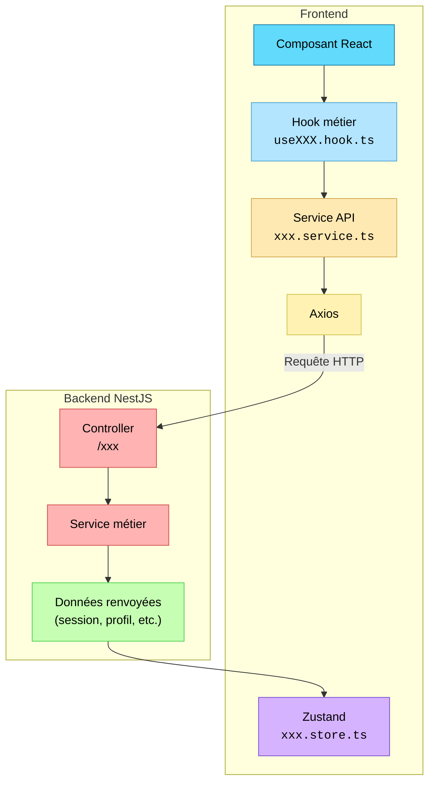

Cette architecture clarifie le rôle de chaque couche et rend l’ensemble beaucoup plus robuste. Les composants se concentrent sur l’interface, les hooks sur la logique métier, les services sur les appels réseau, et Zustand sur l’état global. Nous appliquons désormais systématiquement ce principe dans nos nouveaux projets, tant son fonctionnement s’est révélé propre, clair et agréable à maintenir.

---

## 2.5 Tests automatisés

La première version du projet reposait principalement sur des tests manuels. Cette approche fonctionnait tant que l’application restait simple, mais elle devenait rapidement chronophage à mesure que les fonctionnalités se multipliaient. Chaque nouvelle évolution nécessitait de repasser manuellement sur plusieurs parcours utilisateurs, ce qui augmentait le risque d’erreurs et de régressions.

Pour sécuriser davantage le développement, nous avons intégré **Playwright**, un outil moderne de tests end‑to‑end capable de simuler un utilisateur réel : navigation, clics, formulaires, redimensionnement, interactions mobiles, etc. L’objectif était de couvrir les parcours critiques (authentification, navigation, panier, wishlist, historique d’achats) et de garantir qu’ils restent fonctionnels au fil des mises à jour.

Playwright s’inscrit dans la même logique que le reste du projet : analyser les problèmes, comprendre leur origine et mettre en place des solutions robustes. Là où React Scan ou les outils de profiling nous aident à comprendre le comportement interne de l’application, Playwright nous permet de valider son comportement externe, celui que perçoit réellement l’utilisateur.

### 2.5.1 Exemple : exécution d’un test Playwright

<div class="card" style="text-align:center; padding:1rem;">


<strong>Exemple d’exécution d’un scénario de tests automatisés.</strong>

</div>

### 2.5.2 Organisation des tests

Dans le dossier <code class="c">frontend/</code>, un répertoire <code class="c">tests/</code> regroupe l’ensemble des scénarios, organisés par thématique (<code class="c">auth/</code>, <code class="c">nav/</code>, <code class="c">cart/</code>, etc.).  
Cette structure permet d’étendre progressivement la couverture de tests sans complexifier le projet.

### 2.5.3 Exemple : test du login

Pour éviter d’alourdir le rapport, voici une version raccourcie du test Playwright dédié au login.  
Elle illustre comment Playwright simule un utilisateur réel : remplissage du formulaire, clic sur le bouton, vérification de l’URL, et contrôle de l’état de connexion.

<details class="accordion">
<summary>Voir l’exemple de test Playwright</summary>

```tsx
import { test, expect } from "@playwright/test";
import { ensureLoggedOut, isLoggedIn } from "../helpers/auth";

test.describe("Login", () => {

  test.beforeEach(async ({ page }) => {
    await ensureLoggedOut(page);
  });

  test("login successfully", async ({ page }) => {
    await page.goto("/login");

    const form = page.locator("#login-form");
    await form.locator("#identifier").fill("test@test.test");
    await form.locator("#password").fill("Test123&");
    await form.locator('button[type="submit"]').click();

    await expect(page).toHaveURL("/");
    expect(await isLoggedIn(page)).toBe(true);
  });

  test("invalid credentials", async ({ page }) => {
    await page.goto("/login");

    const form = page.locator("#login-form");
    await form.locator("#identifier").fill("test@test.test");
    await form.locator("#password").fill("Wrong123!");
    await form.locator('button[type="submit"]').click();

    await expect(form.getByText("Identifiants invalides.")).toBeVisible();
  });

  ...

});
```

</details>

L’introduction de Playwright a représenté un véritable gain de temps. Une fois les scénarios écrits, ils peuvent être exécutés en quelques secondes, ce qui réduit considérablement le risque de réintroduire d’anciens bugs. Les tests servent également de documentation vivante : ils décrivent précisément ce que l’application est censée faire et permettent de détecter immédiatement toute régression.

Cette automatisation complète parfaitement les autres outils utilisés dans le projet. Là où React Developer Tools ou React Scan nous aident à comprendre le comportement interne des composants, Playwright garantit que l’expérience utilisateur reste cohérente et fiable, même après des modifications importantes du code.

---

## 2.6 Build et compression

L'optimisation d'une application web ne se limite pas au développement de nouvelles fonctionnalités. Une fois l'application terminée, il devient tout aussi important de s'intéresser à la manière dont elle est distribuée aux utilisateurs. En effet, même une application parfaitement conçue peut offrir une expérience dégradée si les ressources téléchargées sont trop volumineuses ou mal organisées.

Au cours du projet, nous avons constaté que nos fichiers dépassaient la taille recommandée de 500ko, cela était due à certaines dépendances, notamment React et PixiJS qui représentaient chacun une part importante du poids total de l'application. Cette observation nous a conduits à étudier différentes stratégies permettant de réduire les temps de chargement, d'améliorer l'utilisation du cache navigateur et de limiter la quantité de données transférées sur le réseau.

Les optimisations mises en place reposent principalement sur quatre axes complémentaires : la minification du code, la compression des ressources, le découpage manuel des bundles et l'analyse de la structure finale du build. Bien que chacune de ces techniques puisse être utilisée indépendamment, leur combinaison permet d'obtenir un résultat significativement plus efficace qu'une simple compilation standard.

### 2.6.1 Terser

La première étape consiste à réduire la quantité de code réellement distribuée aux utilisateurs. Lors du développement, le code source est volontairement structuré pour être lisible et maintenable. Les noms de variables sont explicites, les commentaires facilitent la compréhension et l'indentation améliore la navigation dans les fichiers. Ces éléments sont indispensables pour les développeurs mais n'apportent aucune valeur au navigateur lors de l'exécution.

Le processus de minification consiste donc à transformer ce code en une version plus compacte tout en conservant exactement le même comportement fonctionnel. Pour cela, nous avons utilisé **Terser**, un outil spécialisé dans l'optimisation des bundles JavaScript.

Grâce à cet outil, plusieurs transformations sont appliquées automatiquement :

- suppression des commentaires ;
- suppression des espaces et indentations inutiles ;
- raccourcissement des identifiants ;
- simplification d'expressions ;
- élimination du code mort (*dead code*) ;
- suppression des instructions de débogage telles que <code class="c">console.log</code> ou <code class="c">debugger</code>.

Exemple :

```ts
function calculateTotal(price, quantity) {
    return price * quantity;
}
```

devient :

```js
function calculateTotal(t,n){return t*n}
```

Cette réduction, appliquée à l'ensemble du code applicatif, contribue directement à diminuer la taille des bundles générés. Bien que Vite utilise aujourd'hui OXC comme moteur de minification par défaut, nous avons choisi de conserver Terser pour la génération du build de production. Ce dernier est généralement plus lent lors de la phase de compilation, mais il applique des optimisations plus agressives et produit souvent un résultat légèrement plus compact.

Dans notre contexte, ce temps de compilation supplémentaire reste négligeable puisqu'il n'impacte que les développeurs au moment du déploiement. Nous avons donc privilégié la qualité de l'artefact final plutôt que la vitesse de génération du build.

Les tableaux suivants permettent d'observer l'impact de cette étape sur les différents bundles générés.

<details class="accordion">
<summary>Voir la comparaison</summary>

<div class="before">

#### Avant

```
dist/index.html                             3.13 kB
dist/assets/Cookies-UiqeZG4K.css            0.11 kB
dist/assets/Login-C0AxRG4F.css              0.71 kB
dist/assets/Home-CU98n8zi.css               1.32 kB
dist/assets/Register-B7OLBotr.css           1.58 kB
dist/assets/Search-By_-Ccw_.css             3.19 kB
dist/assets/ui-B8J3Plgw.css                 5.29 kB
dist/assets/index-CXPQlizz.css             18.52 kB
dist/assets/rolldown-runtime-QTnfLwEv.js    0.69 kB
dist/assets/UnlockItHelmet-Bl9_Umwz.js      2.13 kB
dist/assets/Cookies-D7YsTijg.js             2.53 kB
dist/assets/Login-DeHkMpoc.js               2.64 kB
dist/assets/Refunds-BmIthfhZ.js             2.71 kB
dist/assets/Legal-4205ykHu.js               3.01 kB
dist/assets/Register-CmghuGaX.js            3.64 kB
dist/assets/Privacy-89SX7mcJ.js             4.82 kB
dist/assets/Home-DM__jHnt.js                5.19 kB
dist/assets/Background-D1hLlbIc.js          6.87 kB
dist/assets/Search-B7LK6M18.js              8.32 kB
dist/assets/helmet-D0vKat3J.js             17.45 kB
dist/assets/router--Et464wn.js             22.93 kB
dist/assets/vendor-DuOKGao_.js             28.27 kB
dist/assets/index-CR2f_mWw.js              36.81 kB
dist/assets/ui-B1ELsBXC.js                 46.17 kB
dist/assets/api-DC0xgs4J.js                61.96 kB
dist/assets/react-BvDSaTCH.js             185.15 kB
dist/assets/pixi-Dud2fSi5.js              478.58 kB
```

</div>

<div class="after">

#### Après

```
dist/index.html                             3.13 kB
dist/assets/Cookies-UiqeZG4K.css            0.11 kB
dist/assets/Login-C0AxRG4F.css              0.71 kB
dist/assets/Home-CU98n8zi.css               1.32 kB
dist/assets/Register-B7OLBotr.css           1.58 kB
dist/assets/Search-By_-Ccw_.css             3.19 kB
dist/assets/ui-B8J3Plgw.css                 5.29 kB
dist/assets/index-CXPQlizz.css             18.52 kB
dist/assets/rolldown-runtime-NMqb_1LM.js    0.69 kB
dist/assets/UnlockItHelmet-BGK7a8f6.js      2.12 kB
dist/assets/Cookies-DR5NdOr3.js             2.50 kB
dist/assets/Login-Dcmp3sRo.js               2.62 kB
dist/assets/Refunds-BnK6OvgC.js             2.68 kB
dist/assets/Legal-BpHE1FI5.js               2.96 kB
dist/assets/Register-DKQIHVl9.js            3.64 kB
dist/assets/Privacy-YAYa-R_m.js             4.78 kB
dist/assets/Home-BMpoE3-N.js                4.93 kB
dist/assets/Background-CukwmJR_.js          6.83 kB
dist/assets/Search-Cx-u2G8I.js              7.89 kB
dist/assets/helmet-JdfEq1Ls.js             16.16 kB
dist/assets/router-Dja-W-oD.js             20.56 kB
dist/assets/vendor-QzHy5b41.js             28.34 kB
dist/assets/index-CFUwInI2.js              35.74 kB
dist/assets/ui-BGNp2rZQ.js                 45.44 kB
dist/assets/api-eJIyGYhM.js                61.86 kB
dist/assets/react-CaPFs6it.js             181.55 kB
dist/assets/pixi-D5OU-vt1.js              469.04 kB
```

</div>

</details>

---

### 2.6.2 Compression des assets : Gzip + Brotli

La minification constitue une première étape importante, mais elle ne permet pas à elle seule d'exploiter tout le potentiel d'optimisation disponible. Même après suppression des espaces, commentaires et portions de code inutiles, les fichiers générés peuvent encore représenter plusieurs centaines de kilo-octets, notamment lorsqu'ils embarquent des bibliothèques importantes.

Afin de réduire davantage la quantité de données réellement transférée entre le serveur et le navigateur, nous avons mis en place une stratégie de compression reposant sur deux algorithmes complémentaires : **Gzip** et **Brotli**.

Gzip est aujourd'hui supporté par la quasi-totalité des navigateurs et constitue une référence dans l'écosystème web. Brotli est plus récent mais offre généralement de meilleurs taux de compression, en particulier sur les fichiers JavaScript et CSS volumineux. Utiliser simultanément ces deux formats permet de garantir une compatibilité maximale tout en profitant des meilleures performances possibles lorsque le navigateur les supporte.

Grâce au plugin <code class="c">vite-plugin-compression</code>, chaque ressource JavaScript, CSS ou HTML est automatiquement générée dans plusieurs versions compressées.

Les serveurs modernes sélectionnent ensuite dynamiquement la version la plus adaptée aux capacités du navigateur. Ce mécanisme est totalement transparent pour l'utilisateur final et ne nécessite aucune intervention supplémentaire côté client.

L'intérêt de cette approche est particulièrement visible sur les dépendances les plus lourdes du projet. Des bibliothèques comme React ou PixiJS contiennent une grande quantité de code répétitif que les algorithmes de compression parviennent à réduire efficacement. Dans certains cas, la taille réellement transférée peut être réduite de plus de moitié par rapport au fichier initial.

Les résultats obtenus lors de la génération du build illustrent clairement ce gain :

```txt
dist/C:/xampp/htdocs/unlock-it/UnlockIt/apps/frontend/index.html.br                          3.06kb / brotliCompress: 1.06kb
...
dist/C:/xampp/htdocs/unlock-it/UnlockIt/apps/frontend/assets/router-Dja-W-oD.js.br           20.09kb / brotliCompress: 6.63kb
dist/C:/xampp/htdocs/unlock-it/UnlockIt/apps/frontend/assets/vendor-QzHy5b41.js.br           27.68kb / brotliCompress: 9.22kb
dist/C:/xampp/htdocs/unlock-it/UnlockIt/apps/frontend/assets/UnlockItHelmet-BGK7a8f6.js.br   2.08kb / brotliCompress: 0.82kb
dist/C:/xampp/htdocs/unlock-it/UnlockIt/apps/frontend/assets/api-eJIyGYhM.js.br              60.42kb / brotliCompress: 19.08kb
dist/C:/xampp/htdocs/unlock-it/UnlockIt/apps/frontend/assets/ui-BGNp2rZQ.js.br               44.38kb / brotliCompress: 9.70kb
dist/C:/xampp/htdocs/unlock-it/UnlockIt/apps/frontend/assets/react-CaPFs6it.js.br            177.30kb / brotliCompress: 47.88kb
dist/C:/xampp/htdocs/unlock-it/UnlockIt/apps/frontend/assets/pixi-D5OU-vt1.js.br             458.05kb / brotliCompress: 105.18kb
```

---

### 2.6.3 Découpage manuel des bundles

Lors des premiers builds de production, nous avons constaté qu'une partie importante du code était regroupée dans quelques bundles particulièrement volumineux. Cette approche reste acceptable pour de petites applications, mais elle devient rapidement problématique lorsqu'un projet commence à accumuler de nombreuses dépendances externes.

Le principal inconvénient concerne la gestion du cache navigateur. Lorsqu'un bundle contient à la fois du code métier et des bibliothèques tierces, une simple modification dans l'application peut obliger l'utilisateur à retélécharger l'ensemble du fichier, même si les dépendances embarquées n'ont pas changé.

Cette situation est particulièrement inefficace pour des bibliothèques telles que React ou PixiJS, dont le contenu évolue rarement entre deux déploiements successifs. En les mélangeant au reste du code applicatif, on réduit considérablement l'efficacité du cache.

Pour résoudre ce problème, nous avons mis en place un découpage manuel des bundles grâce à la fonctionnalité <code class="c">manualChunks</code> de Rollup. L'objectif est de regrouper les dépendances selon leur rôle afin qu'elles puissent évoluer indépendamment les unes des autres.

Les principales catégories définies sont les suivantes :

* React et son écosystème ;
* le système de routage ;
* la gestion des métadonnées SEO ;
* les dépendances utilitaires ;
* les composants d'interface ;
* la couche API ;
* PixiJS ;
* le code applicatif principal.

<details class="accordion">
<summary>Voir le <code class="c">vite.config.ts</code></summary>

```ts
//  frontend/vite.config.ts
export default defineConfig({
  ...
  plugins: [
    ...,
    viteCompression({ algorithm: "brotliCompress", ext: ".br" }),
    viteCompression({ algorithm: "gzip" })
  ],
  ...
  ,
  build: {
    minify: 'terser',
    terserOptions: {...},
    rolldownOptions: {
      plugins: [
        visualizer({...})
      ],
      output: {
        manualChunks(id) {
          const path = id.replace(/\\/g, "/");

          // React core
          if (path.includes("/node_modules/react/")) return "react";
          if (path.includes("/node_modules/react-dom/")) return "react";
          if (path.includes("/node_modules/scheduler/")) return "react";

          // React Router
          if (path.includes("/node_modules/react-router/")) return "router";
          if (path.includes("/node_modules/react-router-dom/")) return "router";

          // Helmet
          if (path.includes("/node_modules/react-helmet-async/")) return "helmet";

          // Vendor libs
          if (path.includes("/node_modules/zustand/")) return "vendor";
          if (path.includes("/node_modules/use-debounce/")) return "vendor";
          if (path.includes("/node_modules/shallowequal/")) return "vendor";
          if (path.includes("/node_modules/react-fast-compare/")) return "vendor";
          if (path.includes("/node_modules/react-hook-form/")) return "vendor";

          // UI
          if (path.includes("/src/components/ui/")) return "ui";
          if (path.includes("/src/components/common/")) return "ui";

          // API layer
          if (path.includes("/src/api/")) return "api";

          // PixiJS
          if (path.includes("/node_modules/pixi.js/")) return "pixi";
        }
      }
    }
  },
})
```

</details>

Cette séparation présente plusieurs avantages. Tout d'abord, elle améliore considérablement l'efficacité du cache navigateur puisque les bibliothèques stables peuvent être conservées plus longtemps. Elle favorise également la parallélisation des téléchargements, le navigateur pouvant récupérer plusieurs ressources simultanément. Enfin, elle réduit la taille du bundle principal, ce qui accélère le démarrage initial de l'application.

Les comparaisons suivantes permettent d'observer l'évolution de la structure du build après la mise en place de cette stratégie.

<details class="accordion">
<summary>Voir la comparaison</summary>

<div class="before">

#### Avant

```txt
dist/index.html                               2.69 kB
dist/assets/index-BoaJto8A.css               72.69 kB
dist/assets/webworkerAll-CAK8RBGT.js          0.05 kB
dist/assets/init-BYgQinKG.js                  0.11 kB
dist/assets/browserAll-s-NtV_ZP.js            0.19 kB
dist/assets/RenderTargetSystem-D7b02OGI.js   78.19 kB
dist/assets/Geometry-D0qPxWPZ.js            101.78 kB
dist/assets/index-VbOFR_5W.js               893.52 kB

(!) Some chunks are larger than 500 kB after minification. Consider:
- Using dynamic import() to code-split the application
- Use build.rolldownOptions.output.codeSplitting to improve chunking: https://rolldown.rs/reference/OutputOptions.codeSplitting
- Adjust chunk size limit for this warning via build.chunkSizeWarningLimit.
```

</div>

<div class="after">

#### Après

```txt
dist/index.html                               3.13 kB
dist/assets/Cookies-UiqeZG4K.css              0.11 kB
dist/assets/ResetPassword-D1X87k5S.css        0.38 kB
...
dist/assets/Background-BgQMN0Er.js            6.83 kB
dist/assets/helmet-BEWe_TGa.js               16.16 kB
dist/assets/Search-5Cjye_-J.js               20.38 kB
dist/assets/router-Fyyk7RJ2.js               20.56 kB
dist/assets/Settings-1AiFYtGY.js             23.20 kB
dist/assets/Game-BeXVvPTl.js                 27.78 kB
dist/assets/vendor-B06n5S0l.js               28.89 kB
dist/assets/index-BrKeFHW3.js                39.54 kB
dist/assets/Purchase-DbJ9I7WF.js             53.46 kB
dist/assets/ui-gR1ymoNF.js                   62.14 kB
dist/assets/api-ga1waxeO.js                  73.03 kB
dist/assets/react-DaLoBRo7.js               181.55 kB
dist/assets/pixi-D5OU-vt1.js                469.04 kB
```

</div>

</details>

---

### 2.6.4 Visualisation du graphe de dépendances

À mesure que les optimisations se sont multipliées, il est devenu plus difficile d'évaluer précisément leur impact sur la structure finale du build. Les statistiques fournies par Vite donnent une indication sur la taille des fichiers générés, mais elles ne permettent pas toujours de comprendre comment les différentes dépendances sont regroupées ni quelles parties du projet occupent réellement le plus d'espace.

Afin d'obtenir une vision plus globale du résultat produit par la compilation, nous avons intégré le plugin **rollup-plugin-visualizer**.

Cet outil génère un rapport interactif sous la forme d'un fichier <code class="c">stats.html</code>. Chaque module y est représenté graphiquement selon sa taille réelle dans le bundle final, ce qui facilite l'identification des dépendances les plus coûteuses ainsi que l'analyse des relations entre les différents composants de l'application.

Au-delà de son aspect visuel, cet outil s'est révélé particulièrement utile pour valider les optimisations précédemment mises en place. Il nous a notamment permis de vérifier que les différents groupes définis via <code class="c">manualChunks</code> étaient correctement isolés et qu'aucune dépendance importante ne se retrouvait accidentellement dans le bundle principal.

L'analyse du rapport confirme notamment que React, React Router, PixiJS et la couche API sont regroupés dans des chunks distincts. Les composants d'interface sont également isolés dans un bundle dédié, ce qui améliore la lisibilité globale de l'architecture générée lors du build.


La visualisation constitue ainsi une étape de validation complémentaire aux mesures de taille. Elle permet non seulement de constater qu'une optimisation fonctionne, mais également de comprendre précisément pourquoi elle fonctionne et quels modules en bénéficient réellement.

## 2.7 Difficultés rencontrées et solutions

### 2.7.1 : React Router

L’utilisation de React Scan nous a permis d’identifier plusieurs comportements inattendus, notamment liés à **React Router**. Nous avons constaté que certains composants se réaffichaient lors de simples navigations, même lorsque leur contenu ne dépendait pas de l’URL. Les composants contenant des éléments <code class="c">\<Link\></code> étaient par exemple redessinés à cause de la mise à jour du contexte interne de React Router. De même, certains layouts ou composants structurels (comme le header ou le footer) étaient recalculés inutilement à chaque changement de route, alors qu’ils ne dépendaient d’aucune donnée dynamique.

Pour corriger ces comportements, nous avons introduit l’utilisation de **React.memo()**, notamment pour stabiliser les composants structurels tels que le header, le footer ou encore le layout global.

```tsx
export const Layout = memo(() => {
  return (
    <div>
      <Header />

      <main>
        <Background />
        <Outlet />
      </main>

      <Footer />
    </div>
  );
});
```

### 2.7.2 Difficulté n°2 : Suspence

Dans notre cas, nous avions mis en place un composant de chargement personnalisé destiné à s’afficher lors du chargement des pages rendues via lazy(). En théorie, l’utilisation combinée de lazy() et de Suspense devait permettre d’afficher ce loader dès que React chargeait dynamiquement une page. Pourtant, malgré une implémentation correcte, le loader ne s’affichait jamais.

Après plusieurs heures d’investigation, nous avons d’abord suspecté une mauvaise utilisation de Suspense, ou un problème dans la structure de nos routes. Nous avons testé différentes configurations, déplacé le composant de fallback, isolé les routes, et même simplifié la structure pour éliminer les causes possibles. Rien n’y faisait.

C’est en approfondissant nos recherches que nous sommes tombés sur une discussion GitHub liée à React Router v7, indiquant que cette version introduisait un comportement empêchant Suspense de fonctionner correctement dans certains cas. Plusieurs développeurs rencontraient exactement le même problème, et un contributeur avait même mis en ligne deux projets de démonstration permettant de comparer le comportement entre la version 6 et la version 7 :

- Version 6 : <a href="https://react-router-v7-issue-v6.netlify.app/">https://react-router-v7-issue-v6.netlify.app/</a>
- Version 7 : <a href="https://react-router-v7-issue-v7.netlify.app/">https://react-router-v7-issue-v7.netlify.app/</a>

La comparaison entre les deux projets est sans ambiguïté : le loader fonctionne parfaitement en version 6, mais ne s’affiche plus en version 7. Ce comportement est reconnu comme un problème dans React Router, et plusieurs issues sont encore ouvertes à ce sujet.

Ce constat confirmait que notre implémentation était correcte et que le problème ne venait pas de notre code, mais bien d’un changement interne dans React Router.

La solution la plus raisonnable, compte tenu des délais du projet, a donc été de downgrader React Router vers la version 6, ce qui a immédiatement rétabli le fonctionnement attendu de Suspense. Ce choix implique de conserver une version légèrement moins récente, mais cela n’a pas d’impact majeur sur la stabilité de l’application. La seule conséquence est un avertissement lié au fait que la version 7 corrige certaines vulnérabilités mineures, mais aucune n’est critique dans notre contexte.

# 3. Backend
 
## 3.1 Migration vers NestJS
 
### 3.1.1 Constat technique sur le backend existant
 
Avant de détailler les choix qui ont guidé la réécriture du backend, il est utile de revenir sur ce que représentait concrètement l’ancienne version, celle développée en PHP pur durant la SAÉ 3.01. Cette version reposait sur un mini-framework maison, reprenant les grandes lignes du modèle MVC déjà évoqué en introduction, mais construit autour de quatre briques principales : un routeur (<code class="c">Router.php</code>), une couche de requête et de réponse (<code class="c">Request.php</code>, <code class="c">Response.php</code>) et un système de middleware. Ce choix avait du sens à l’époque : il nous permettait de comprendre en profondeur le fonctionnement d’une API HTTP, sans la dépendance ni l’abstraction qu’aurait introduites un framework complet.
 
Le routeur fonctionnait par enregistrement manuel : chaque route était déclarée explicitement, en associant une méthode HTTP, un chemin (pouvant contenir des paramètres dynamiques comme <code class="c">{id}</code>) et un gestionnaire.
 
```php
$router->get('/api/games', [new GameController(), 'index']);
$router->get('/api/games/{id}', [new GameController(), 'show']);
```
 
Ce fonctionnement, bien que tout à fait lisible pour un projet de cette taille, présentait une limite que nous n’avions pas anticipée au départ : chaque route instancie elle-même son contrôleur, directement dans la table de routage. Le contrôleur ne reçoit donc aucune dépendance de l’extérieur ; s’il a besoin d’autre chose qu’un accès à la base de données, c’est à chaque méthode du contrôleur d’aller la chercher elle-même, généralement par un appel statique. Il n’existe aucun mécanisme central capable de dire « voici les outils dont ce contrôleur a besoin, fournis-les-lui automatiquement » : ce mécanisme, l’injection de dépendances, est précisément ce qui manquait le plus à mesure que le projet grossissait.
 
Le second problème, plus structurel, concernait l’accès aux données. Le modèle <code class="c">Game</code> reposait sur des fonctions PostgreSQL dédiées, appelées depuis PHP via une couche de constantes SQL. Récupérer un jeu unique avec l’ensemble de ses informations illustrait bien la limite de cette approche :
 
```php
abstract class Game
{
    /* Code */
 
    public static function findByID(int $id): ?array
    {
        $game = Database::queryOne(DefaultQuery\Game::GET_GAME_FULL, [$id]);
 
        if (!$game) {
            return null;
        }
 
        // Get related data
        $game['categories'] = self::getCategories($id);
        $game['genres'] = self::getGenres($id);
        $game['platforms'] = self::getPlatforms($id);
        $game['developers'] = self::getDevelopers($id);
        $game['publishers'] = self::getPublishers($id);
        $game['media'] = self::getMedia($id);
 
        return $game;
    }
 
    private static function getCategories(int $gameId): array
    {
        return Database::queryValues(DefaultQuery\Game::GET_GAME_CATEGORIES_NAME, [$gameId]);
    }
 
    /* Code */
}
```
 
Nous avons rapidement constaté qu’afficher la fiche complète d’un seul jeu déclenchait sept requêtes SQL distinctes : une pour les données principales, puis une par relation (<code class="c">getGenres</code>, <code class="c">getPlatforms</code>, <code class="c">getDevelopers</code>, <code class="c">getPublishers</code> et <code class="c">getMedia</code> reprenant chacune exactement le même schéma que <code class="c">getCategories</code>). Ce comportement, connu sous le nom de problème N+1, n’était pas rédhibitoire avec le volume de données de l’époque, mais il montrait bien que la responsabilité d’assembler les données reposait entièrement sur le code applicatif, plutôt que d’être déléguée à un mécanisme générique capable de charger plusieurs relations en une seule fois.
 
Pris séparément, ni l’absence d’injection de dépendances ni la multiplication des requêtes n’étaient bloquantes. Mais ces deux constats, ajoutés à l’absence de typage fort, de validation centralisée et de documentation générée automatiquement, dessinaient le portrait d’un backend fonctionnel, mais arrivé aux limites de ce qu’une architecture artisanale peut raisonnablement supporter.
 
### 3.1.2 Réécriture complète plutôt que portage progressif
 
Face à ces constats, le choix du framework de remplacement ne s’est pas porté sur n’importe quelle solution capable de servir une API REST. **NestJS** présentait un avantage déterminant : il répond directement, et avec un seul outil cohérent, à chacune des limites identifiées plus haut. Son conteneur d’injection de dépendances règle le problème du couplage et de l’instanciation manuelle ; son intégration avec **TypeORM** règle la dispersion de la logique d’accès aux données entre PHP et SQL ; et son système de décorateurs permet de coupler validation, autorisation et documentation directement au code, plutôt que de les traiter comme des préoccupations séparées. S’ajoute à cela un avantage plus pragmatique : NestJS repose sur TypeScript, le même langage que celui déjà utilisé côté frontend, ce qui ouvre la possibilité de partager des types entre les deux applications (nous y revenons au chapitre 4).
 
Une fois ce choix posé, une question s’est rapidement imposée : fallait-il porter l’existant progressivement vers cette nouvelle base technique, domaine par domaine, ou repartir d’une page blanche ? Le réflexe le plus prudent, sur le papier, aurait été le portage progressif : conserver une application fonctionnelle à chaque étape, migrer un module, vérifier qu’il fonctionne, puis passer au suivant.
 
Dans notre cas, cette option s’est révélée moins réaliste qu’il n’y paraît. L’écart entre les deux architectures n’était pas une question de syntaxe, mais une question de paradigme. L’ancien backend ne formalisait jamais la notion de dépendance explicite entre composants : un contrôleur appelait un modèle, qui appelait une fonction SQL, sans qu’aucune structure ne décrive ce graphe de dépendances. NestJS, à l’inverse, impose de déclarer explicitement, dès la création d’un module, tout ce dont il dépend et tout ce qu’il expose (nous détaillons ce mécanisme en <a href="#321-découpage-par-domaine">3.2.1</a>).
 
Porter le projet domaine par domaine aurait donc demandé, pour chaque module, de reconstituer à la main un graphe de dépendances qui n’avait jamais existé formellement côté PHP, tout en maintenant en parallèle les domaines pas encore migrés dans l’ancien paradigme. Nous aurions dû faire cohabiter deux philosophies d’architecture pendant toute la durée de la migration, ce qui revenait presque à maintenir deux backends en même temps. Réécrire entièrement le backend, en repensant directement l’ensemble du modèle de données et des dépendances entre domaines, nous a finalement semblé plus rapide et plus sain que ce portage progressif, malgré l’investissement initial plus important.
 
## 3.2 Architecture modulaire
 
Le second axe de la refonte concernait la manière dont le code lui-même est organisé. Là où l’ancien backend regroupait les fichiers par rôle technique (tous les contrôleurs dans un dossier, tous les modèles dans un autre), la nouvelle architecture regroupe le code par domaine métier : chaque fonctionnalité (les jeux, les avis, la wishlist, etc.) possède son propre module, contenant à la fois son contrôleur, sa logique métier et sa persistance. Le schéma suivant résume la circulation d’une requête à travers ces différentes couches, du frontend jusqu’à la base de données :
 
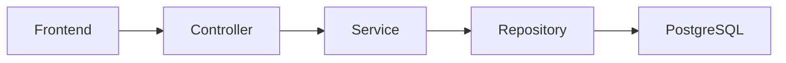
 
*Flux de traitement d’une requête dans le nouveau backend.*
 
Chacune de ces couches a une responsabilité unique : le contrôleur reçoit la requête HTTP et délègue immédiatement le travail, le service contient la logique métier, et le repository (fourni par TypeORM) s’occupe de traduire les opérations en requêtes SQL. Les trois sous-parties suivantes détaillent comment ce découpage se traduit concrètement dans le code, à travers l’exemple du domaine <code class="c">games</code>.
 
### 3.2.1 Découpage par domaine
 
Avant d’entrer dans le détail du code, la comparaison des arborescences de fichiers donne déjà une idée assez parlante de ce que ce découpage par domaine change concrètement :
 
<details class="accordion">
<summary>Voir la comparaison des arborescences</summary>
<div class="before">
<h3>Avant</h3>
 
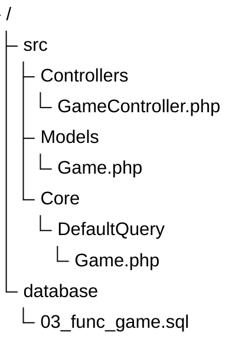
 
</div>
<div class="after">
<h3>Après</h3>
 
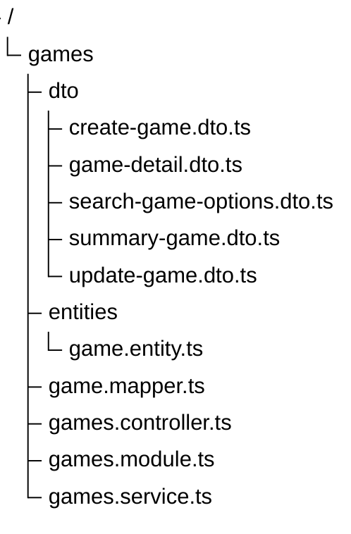
 
</div>
</details>
Ce qui était auparavant réparti dans quatre fichiers, situés dans trois dossiers différents (sans compter la fonction SQL elle-même), est désormais regroupé dans un seul dossier, qui constitue le module dans son intégralité. Cette déclaration tient dans un seul fichier, qui sert à la fois de point d’entrée et de carte des dépendances du domaine :
 
```ts
@Module({
  imports: [
    TypeOrmModule.forFeature([GameEntity, GamePlatformEntity, MediaEntity]),
    TagsModule,
    DevelopersModule,
    PublishersModule,
    WishlistModule,
    ReviewsModule,
    StocksModule,
    UploadModule,
  ],
  controllers: [GamesController],
  providers: [GamesService],
  exports: [TypeOrmModule],
})
export class GamesModule {}
```
 
Ce fichier répond à lui seul à une question que l’ancien backend ne formalisait jamais : de quoi ce domaine dépend-il réellement ? Le décorateur <code class="c">@Module</code> déclare explicitement les sept autres modules nécessaires au fonctionnement du domaine <code class="c">games</code> (étiquettes, développeurs, éditeurs, wishlist, avis, stocks, upload), ainsi que les entités TypeORM auxquelles il a directement accès. C’est précisément ce graphe de dépendances qui, côté PHP, n’existait que de manière implicite, dispersé dans les appels statiques d’un modèle à l’autre.
 
Cette déclaration ne reste pas théorique : elle alimente directement le conteneur d’injection de dépendances de NestJS, qui se charge ensuite d’instancier et de fournir automatiquement chaque dépendance là où elle est demandée. Le constructeur du service en est l’illustration la plus directe :
 
```ts
@Injectable()
export class GamesService {
  /* Code */
 
  constructor(
    @InjectRepository(GameEntity)
    private readonly gameRepository: Repository<GameEntity>,
    @InjectRepository(GamePlatformEntity)
    private readonly platformRepository: Repository<GamePlatformEntity>,
    @InjectRepository(MediaEntity)
    private readonly mediaRepository: Repository<MediaEntity>,
    private readonly wishlistService: WishlistService,
    private readonly reviewsService: ReviewsService,
    private readonly stocksService: StocksService,
    private readonly commonService: CommonService,
  ) {}
 
  /* Code */
}
```
 
Sept dépendances sont injectées ici sans qu’aucune ne soit instanciée manuellement par le développeur. À titre de comparaison, l’ancien <code class="c">GameController</code> n’avait, de son côté, aucune dépendance déclarée : il accédait à tout (base de données, logique métier) à travers des appels statiques sur la classe <code class="c">Game</code>, ce qui revient à dépendre de tout implicitement plutôt que de rien explicitement.
 
### 3.2.2 De la requête SQL brute à TypeORM
 
Le second changement majeur concerne la façon dont les données sont décrites et chargées. Côté PHP, chaque relation entre deux tables se traduisait par une fonction PostgreSQL dédiée.

Une fonction devait être écrite une première fois en SQL, référencée une seconde fois côté PHP sous forme de constante, puis appelée une troisième fois dans le modèle (voir <a href="#311-constat-technique-sur-le-backend-existant">3.1.1</a>). La même information, à savoir qu’un jeu possède plusieurs entités associées, était donc répétée à trois endroits différents, sans qu’aucun de ces trois endroits ne puisse être considéré comme la source de vérité.
 
Avec TypeORM, ce type de relation se déclare une seule fois, directement sur l’entité.

<details class="accordion">
<summary>Voir différence entre une relation PHP et TypeORM</summary>

<div class="before">
<h3>Avant</h3>

```sql
CREATE OR REPLACE FUNCTION get_game_categories(p_game_id BIGINT)
RETURNS SETOF category
LANGUAGE plpgsql
AS
$$
BEGIN
    RETURN QUERY
    SELECT c.*
    FROM category c
    INNER JOIN game_category gc ON c.id = gc.category_id
    WHERE gc.game_id = p_game_id;
END;
$$;
```

</div>

<div class="after">
<h3>Après</h3>

```ts
@ManyToMany(() => TagEntity, (tag) => tag.games)
@JoinTable({
  name: 'game_tags',
  joinColumn: { name: 'game_id', referencedColumnName: 'id' },
  inverseJoinColumn: { name: 'tag_id', referencedColumnName: 'id' },
})
tags: TagEntity[];
```

</div>

</details>
 
Cette unique déclaration suffit ensuite à TypeORM pour générer les jointures nécessaires, sans qu’il soit besoin d’écrire une fonction SQL séparée ni une constante intermédiaire. Le bénéfice devient particulièrement visible au moment de charger un jeu avec l’ensemble de ses relations, directement depuis le contrôleur :
 
```ts
@Get(':id')
findOne(
  @Param('id', ParseIntPipe, EntityFetchPipe(GameEntity, 'id', {
    
    relations: { // On précise ici quelle(s) relation(s) charger
      tags: true,
      publishers: true,
      developers: true,
      platforms: true,
      media: true,
      series: true,
    }, // Tout est séléctionné en une seule requête

  })) game: GameEntity,
  @User('sub') userId?: string,
) {
  return this.gamesService.findOne(game, userId);
}
```
 
Là où l’ancienne version déclenchait sept requêtes successives pour assembler un seul jeu complet (voir <a href="#311-constat-technique-sur-le-backend-existant">3.1.1</a>), cette déclaration laisse TypeORM se charger lui-même d’aller chercher les six relations nécessaires, sans que le développeur n’ait à écrire la moindre requête. Nous reviendrons en détail sur le pipe <code class="c">EntityFetchPipe</code> lui-même en <a href="#323-mutualisation-du-code-transverse">3.2.3</a>, puisqu’il s’agit d’un outil générique réutilisé dans tout le backend, et pas seulement pour les jeux.
 
Cette approche n’élimine cependant pas tous les cas où une requête fine reste nécessaire. La recherche de jeux avec filtres combinés (prix, date de sortie, tags, plateformes...) repose par exemple sur un query builder construit à la main plutôt que sur une relation simple, car aucune déclaration ne permettait d’exprimer correctement une combinaison aussi variable de filtres. TypeORM nous a donc fait gagner en lisibilité sur les cas standards, sans nous priver de la possibilité de redescendre au niveau de la requête quand la situation l’exigeait.
 
Un autre bénéfice, plus discret, concerne les contraintes de validation. Sur l’entité <code class="c">games</code>, certaines règles métier sont désormais déclarées directement aux côtés des colonnes concernées :
 
```ts
@Entity('games')
@Check(`"price" >= 0`)
@Check(`"metacritic_score" BETWEEN 0 AND 100 OR "metacritic_score" IS NULL`)
export class GameEntity implements IGameEntity {
  /* Code */
}
```
 
Ces contraintes, un prix qui ne peut pas être négatif, un score Metacritic compris entre 0 et 100, vivent désormais au même endroit que la définition du schéma, plutôt que d’être reléguées dans un fichier SQL séparé qu’il faut aller chercher pour comprendre les règles réellement appliquées. Le champ <code class="c">price</code> a par ailleurs nécessité un traitement particulier que nous détaillons en <a href="#35-difficultés-rencontrées-et-solutions">3.5</a>, TypeORM ne gérant pas nativement les colonnes décimales de PostgreSQL de la façon que l’on pourrait attendre.
 
### 3.2.3 Mutualisation du code transverse
 
Le découpage par domaine ne doit pas faire oublier qu’un certain nombre de besoins reviennent à l’identique d’un module à l’autre : vérifier qu’une entité existe avant de la modifier, la récupérer avec ses relations, paginer une liste de résultats. Plutôt que de réécrire cette logique dans chaque module, comme c’était implicitement le cas côté PHP (chaque contrôleur gérant ses propres erreurs et sa propre pagination), ces besoins ont été regroupés dans un module commun, mutualisé entre tous les domaines.
 
<code class="c">EntityExistsPipe</code> en est un bon exemple. Il s’agit d’une fabrique de pipes : une fonction qui, à partir d’une entité TypeORM, génère une classe de pipe prête à être utilisée dans n’importe quel contrôleur

<details class="accordion">
<summary>Voir comment une fabrique de pipe se décrit</summary>

```ts
// Cette function défini comment fabrique d'autre pipe...
export function EntityExistsPipe<T extends ObjectLiteral>(
  entityClass: Type<T>,
  field: keyof T = 'id' as keyof T,
): Type<PipeTransform> {

  // Ceci est le pipe
  @Injectable()
  class EntityExistsMixin implements PipeTransform {
    constructor(private readonly dataSource: DataSource) { }
 
    async transform(value: unknown, _metadata: ArgumentMetadata): Promise<unknown> {
      /* Implémentation */
    }
  }
 
  // A l'aide de cette function :
  return mixin(EntityExistsMixin);

}
```

</details>

Ce pipe ne connaît rien des jeux, des étiquettes ou des avis : il sait seulement vérifier qu’une ligne existe pour une entité et un identifiant donnés, et renvoyer une erreur 404 (Non trouvé) proprement formatée si ce n’est pas le cas. Il se retrouve ainsi utilisé de façon identique pour des entités complètement différentes, par exemple lorsqu’il s’agit d’ajouter une étiquette à un jeu :
 
```ts
export class GamesController {
  /* Code */
 
  @Post(':id/tags/:tagId')
  addTag(
    @Param('id', ParseIntPipe, EntityExistsPipe(GameEntity)) gameId: number,  // Ici
    @Param('tagId', ParseIntPipe, EntityExistsPipe(TagEntity)) tagId: number, // Et là
  ) {
    return this.gamesService.addTag(gameId, tagId);
  }
 
  /* Code */
}
```
 
Les deux identifiants de la route sont validés avant même que le code de la méthode ne s’exécute, sans qu’il soit nécessaire d’écrire le moindre <code class="c">if (!found)</code> dans le contrôleur ou le service. La variante <code class="c">EntityFetchPipe</code>, déjà rencontrée en <a href="#322-de-la-requête-sql-brute-à-typeorm">3.2.2</a>, suit exactement la même logique, à la différence qu’elle renvoie l’entité elle-même (avec ses relations éventuelles) plutôt que son simple identifiant. Les rôles requis par certaines routes (<code class="c">@MinRole</code>) et les guards d’authentification rencontrés au passage seront détaillés en 3.3 ; ce qui nous intéresse ici est uniquement la réutilisation du pipe, indépendamment de l’entité ciblée.
 
La pagination suit le même principe de mutualisation. Le module commun expose un service unique, capable de paginer indifféremment un repository simple ou une requête plus complexe construite avec un query builder.

<details class="accordion">
<summary>Voir signatures</summary>

```ts
export class PaginationService {
  /* Code */
 
  public async getPaginatedResponse<T extends ObjectLiteral, U = T>(
    repository: Repository<T>,
    paginationQueryDto: PaginationQueryDto,
    options?: PaginatedResponseOptions<T, U>,
  ): Promise<PaginatedDto<U>>;

  public async getPaginatedResponse<T extends ObjectLiteral, U = T>(
    queryBuilder: SelectQueryBuilder<T>,
    paginationQueryDto: PaginationQueryDto,
    transform?: PaginatedResponseTransform<T, U>,
  ): Promise<PaginatedDto<U>>;
 
  /* Code */
}
```

</details>
 
Cette méthode calcule elle-même le décalage à partir de la page et de la limite demandées, applique éventuellement une fonction de transformation (élément par élément ou sur l’ensemble des résultats), et renvoie une erreur 404 (Non trouvé) plutôt qu’une liste vide silencieuse si la page demandée dépasse le nombre total de résultats. Elle est ensuite appelée de la même manière depuis n’importe quel domaine.

<details class="accordion">
<summary>Voir exemple</summary>

```ts
export class GamesService {
  /* Code */
 
  async findAll(paginationQueryDto: PaginationQueryDto) {
    return this.commonService.pagination.getPaginatedResponse(
      this.gameRepository,
      paginationQueryDto,
      { transform: { fn: GameMapper.toSummary } },
    );
  }
 
  /* Code */
}
```

</details>

Cette unique méthode remplace ce que l’ancien <code class="c">GameController::index</code> faisait à la main : lire les paramètres <code class="c">limit</code> et <code class="c">offset</code> depuis la requête, lancer une requête pour les données, puis une seconde requête séparée pour le total. Le service mutualisé encapsule cette logique une fois pour toutes, et reste utilisable aussi bien avec un repository qu’avec une requête personnalisée, ce qui lui permet de couvrir aussi bien les listes simples que les recherches filtrées évoquées en <a href="#322-de-la-requête-sql-brute-à-typeorm">3.2.2</a>.


## 3.3 Validation et sécurité

### 3.3.1 Authentification par jeton plutôt que par session

Côté PHP, l'authentification reposait entièrement sur une session stockée en base de données, identifiée par un cookie <code class="c">session_id</code>. Chaque requête authentifiée déclenchait donc un aller-retour vers la base pour vérifier que cette session existait toujours. Le système n'était pas naïf pour autant : à la connexion, plutôt que de créer systématiquement une nouvelle session, le contrôleur vérifiait d'abord si une session valide existait déjà pour cet utilisateur, et la réutilisait le cas échéant.

La validation elle-même intégrait par ailleurs un indicateur de sécurité qu'il est facile de négliger dans un système de ce type.

<details class="accordion">
<summary>Voir validation de session</summary>

```php
public static function validate(string $sessionId): ?array
{
    /* Code */

    $session = Database::queryOne(DefaultQuery\Session::GET_SESSION, [$sessionId]);

    if (!$session) {
        return null;
    }

    if ($session['is_unsafe']) {
        return null;
    }

    self::updateLastSeen($sessionId);

    return $session;
}
```

</details>

Une session pouvait ainsi être marquée comme compromise (<code class="c">is_unsafe</code>) sans être supprimée, ce qui permettait de la refuser tout en conservant une trace.

Côté NestJS, cette responsabilité a été redistribuée plutôt que simplement supprimée. L'essentiel de l'authentification repose désormais sur **Passport**, sous la forme de stratégies déclarées une fois et réutilisées par des guards.

Le contenu exact du jeton mérite d'être détaillé, puisque tout ce qui suit en dépend :

```ts
export type JwtPayload = {
  sub: string; // Sujet (User ID)
  sid: string; // Session ID
  iat: number; // Date de création du jeton
  exp: number; // Date d'expiration du jeton

  cartId: string; // Cart ID
  permission: EmployeeRole | null; // Le niveau de permission
};
```

Ce choix n'est pas anodin : <code class="c">sub</code>, <code class="c">cartId</code> et <code class="c">permission</code> sont exactement les trois informations dont nous avions besoin à chaque requête, respectivement pour savoir qui fait la demande (<code class="c">@User('sub')</code>, vu en <a href="#322-de-la-requête-sql-brute-à-typeorm">3.2.2</a>), quel panier manipuler, et quel rôle vérifier (<code class="c">RolesGuard</code>, vu plus haut). En les plaçant directement dans le jeton plutôt que de les recharger depuis la base à chaque fois, ces trois vérifications ne coûtent plus aucune requête SQL : elles sont disponibles dès que la signature du jeton est validée, sans <code class="c">find</code> TypeORM. La contrepartie est honnête à signaler : si la permission d'un utilisateur change en cours de session, l'ancien jeton continue de porter l'ancienne valeur jusqu'à son expiration ou son renouvellement, ce que l'ancien système, qui revalidait la session à chaque requête, n'avait pas à gérer.

Le jeton continue de voyager dans un cookie, comme l'ancien <code class="c">session_id</code>, mais sa validité ne dépend plus d'une requête en base : la signature suffit. <code class="c">validate</code> n'a même rien à faire, puisque Passport n'arrive à cette étape qu'après avoir déjà vérifié cette signature.

<details class="accordion">
<summary>Voir comment le système d'authentification vérifie qu'une route est publique</summary>

```ts
@Injectable()
export class JwtAuthGuard extends AuthGuard('jwt') {
  constructor(private reflector: Reflector) {
    super();
  }

  canActivate(context: ExecutionContext) {
    // On vérifie juste si l'endpoint est accessible à tous (Publique)
    const isPublic = someCode();
    if (isPublic) {
      return true;
    }

    // Sinon, on laisse faire Passport
    return super.canActivate(context);
  }
}
```

</details>

Ce guard est déclaré globalement : par défaut, toute route exige un jeton valide. C'est l'inverse de l'ancien fonctionnement, où chaque méthode de contrôleur décidait elle-même, au cas par cas, si elle devait vérifier le cookie de session (<code class="c">AuthController::me</code> le faisait, <code class="c">GameController::index</code> ne le faisait pas). Pour échapper à cette vérification globale, une route doit s'en exclure explicitement :

```ts
@Public() // <-- Rend un endpoint accessible au publique
@Get('ma-route')
maRoute(/* Paramètres */) {/* Implémentation */}
```

Une troisième variante répond à un besoin que nous avons déjà croisé en <a href="#322-de-la-requête-sql-brute-à-typeorm">3.2.2</a>, sans le détailler à l'époque : certaines routes (la recherche de jeux, la fiche d'un jeu) doivent rester accessibles sans connexion, tout en se comportant différemment si l'utilisateur est identifié.

C'est <code class="c">JwtAuthOptionalGuard</code>, combiné au décorateur <code class="c">@User('sub')</code> rendu optionnel, qui permettait à <code class="c">GamesController.findOne</code> de renvoyer un indicateur <code class="c">wishlisted</code> pour un utilisateur connecté, sans pour autant bloquer l'accès à un visiteur anonyme.

Reste la question de la déconnexion et du renouvellement, qui est précisément l'endroit où la notion de session n'a pas disparu, elle a simplement changé de rôle. Le jeton d'accès est volontairement éphémère, et son renouvellement passe par un second jeton, vérifié cette fois contre une session bien réelle :

```ts
@Injectable()
export class JwtRefreshStrategy extends PassportStrategy(Strategy, 'jwt-refresh') {
  constructor(private readonly authService: AuthService, jwt: ConfigType<typeof jwtConfig>) {
    /* On récupère le jeton expiré avec un peu de code délibérement non inclus ici */
  }

  async validate(request: Request, payload: JwtPayloadDto) {
    const refreshToken = request.cookies?.[this.jwt.refreshTokenCookieName];

    // On vérifie que tout va bien avec la session actuellement utilisée
    // Si non, des errors 403 (Non autorisé) sont renvoyé
    // Forcant donc l'utilisateur à se reconnecter
    const session = await this.authService.refreshAccessToken(refreshToken, payload.sub);

    return { sub: session.userId, sid: session.id };
  }
}
```

Le jeton d'accès n'est donc pas révocable à l'instant où on le souhaiterait, il suffit d'attendre son expiration. Mais le jeton de rafraîchissement, lui, reste systématiquement confronté à une session côté serveur : c'est cette session que l'on peut détruire pour forcer une déconnexion immédiate, exactement comme le faisait <code class="c">Session::destroy</code> côté PHP. Nous avons gardé l'idée de session traçable de l'ancien système, mais déplacé sa responsabilité : elle ne sert plus à valider chaque requête, seulement à autoriser le renouvellement du jeton d'accès.

Enfin, brancher un nouveau mode de connexion reste, dans ce système, une déclaration très courte :

```ts
@Injectable()
export class LocalAuthGuard extends AuthGuard('local') {}

@Injectable()
export class LocalStrategy extends PassportStrategy(Strategy) {
  constructor(private authService: AuthService) {
    super({ usernameField: 'identifier', passwordField: 'password' });
  }

  async validate(identifier: string, password: string) {
    const user = await this.authService.validateUser(identifier, password);
    if (!user) {
      throw new UnauthorizedException('Invalid credentials');
    }
    return user.createJwtPayloadDto;
  }
}
```

Le champ <code class="c">identifier</code> couvre aussi bien l'email que le username. le téléphone, bien que possible à implémenter, est plus complexe du à son formattage particulier en fonction des pays, ce que l'ancien <code class="c">AuthController::login</code> gérait par deux branches distinctes (<code class="c">loginWithEmail</code> / <code class="c">loginWithPhone</code>) avec la partie téléphone ayant une faible vérification du formattage. Ici, le téléphone est remplacé par le username et c'est uniquement <code class="c">authService.validateUser</code> qui s'occupe de la logique, le contrôleur, le guard et la stratégie n'ayant pas besoin de connaître les détails n'étant pas leur rôle.

## 3.4 Maintenabilité

### 3.4.1 Un module complet presque par accident

L'ancien backend ne proposait aucune gestion des catégories de jeux : elles n'existaient que comme une relation en lecture, jointe à la volée (<code class="c">get_game_categories</code>, voir <a href="#322-de-la-requête-sql-brute-à-typeorm">3.2.2</a>). Rien ne permettait d'en créer, d'en renommer ou d'en supprimer une depuis l'API ; ces opérations, si elles avaient lieu, se faisaient directement en base.

Avec NestJS, l'équivalent (les étiquettes, ou <code class="c">tags</code>) a été implémenté comme n'importe quel autre domaine, et s'est retrouvé complet sans que cela ait été un objectif en soi. Le module entier tient dans quatre fichiers courts.

<details class="accordion">
<summary>Voir implémentation complète</summary>

```ts
@Module({
  imports: [TypeOrmModule.forFeature([TagEntity])],
  controllers: [TagsController],
  providers: [TagsService],
  exports: [TypeOrmModule],
})
export class TagsModule {}
```

```ts
@Entity('tags')
export class TagEntity implements ITagEntity {
  @PrimaryGeneratedColumn('increment', { type: 'bigint' })
  id: number;

  @Column('varchar', { length: 150, unique: true })
  name: string;

  @Column('int', { name: 'games_count', default: 0 })
  gamesCount: number;

  @ManyToMany(() => GameEntity, (game) => game.tags)
  games: GameEntity[];
}
```

```ts
@Injectable()
export class TagsService {
  constructor(
    private readonly tagRepository: Repository<TagEntity>,
    private readonly commonService: CommonService,
  ) {}

  create(createTagDto: CreateTagDto) {
    const tag = this.tagRepository.create(createTagDto);
    return this.tagRepository.save(tag);
  }

  findAll(paginationQueryDto: PaginationQueryDto) {
    return this.commonService.pagination.getPaginatedResponse(
      this.tagRepository,
      paginationQueryDto,
      { transform: { fn: TagMapper.toGameTag } },
    );
  }

  update(id: number, updateTagDto: UpdateTagDto) {
    return this.tagRepository.update(id, updateTagDto);
  }

  remove(id: number) {
    return this.tagRepository.delete(id);
  }
}
```

```ts
@Controller('tags')
export class TagsController {
  constructor(private readonly tagsService: TagsService) {}

  @Post()
  create(@Body(DuplicatedEntryPipe(TagEntity, 'name')) createTagDto: CreateTagDto) {
    return TagMapper.toTag(await this.tagsService.create(createTagDto));
  }

  @Public()
  @Get()
  findAll(@Query() paginationQueryDto: PaginationQueryDto) {
    return this.tagsService.findAll(paginationQueryDto);
  }

  @Patch(':id')
  update(@Param('id', ParseIntPipe, EntityExistsPipe(TagEntity)) id: number, @Body() updateTagDto: UpdateTagDto) {
    return this.tagsService.update(id, updateTagDto);
  }

  @Delete(':id')
  remove(@Param('id', ParseIntPipe, EntityExistsPipe(TagEntity)) id: number) {
    return this.tagsService.remove(id);
  }
}
```

</details>

Aucune de ces quatre briques n'a demandé de réflexion particulière : ce sont celles que NestJS attend par défaut pour n'importe quel domaine. Le résultat est pourtant une fonctionnalité complète, création, consultation paginée, mise à jour et suppression, avec vérification des doublons et des identifiants invalides, alors que rien de comparable n'existait avant et que rien dans nos priorités n'avait identifié ce besoin comme important. C'est tout le sens d'une complétude presque par accident : la structure imposée par le framework rend une fonctionnalité complète aussi simple à écrire qu'une fonctionnalité partielle, ce qui change la décision que l'on prend spontanément. Côté PHP, écrire l'équivalent aurait demandé une fonction SQL, une constante et une méthode de modèle par opération, ce qui rend beaucoup plus tentant de ne faire que le strict nécessaire.

### 3.4.2 La documentation Swagger comme garde-fou

Chaque route est documentée séparément de sa logique, dans un fichier dédié. La déclaration ci-dessous décrit comment se créer la documentation de manière simplifier pour <code class="c">POST /auth/login</code> :

```ts
Login: () =>
  applyDecorators(
    ApiOperation(/* Description de l'endpoint */),
    ApiBody(/* Description de ce que l'on envoie à l'endpoint */),
    ApiOkResponse(/* A quoi correspond le code 200 (OK) */),
    ApiUnauthorizedResponse(/* A quoi correspond le code 200 (OK) */),
    ApiTooManyRequestsResponse(/* A quoi correspond le code 200 (OK) */),
  ),
```

Cette déclaration ne se contente pas de produire une page de documentation statique : Swagger génère, à partir d'elle, une interface où l'on peut renseigner des informations et exécuter réellement la requête.

<div class="before">
<h3>Avant</h3>

Avant cela, vérifier le comportement de cette même route reposait sur un fichier de test écrit via <a href="https://www.usebruno.com/">Bruno</a>, indépendant du code de la route :

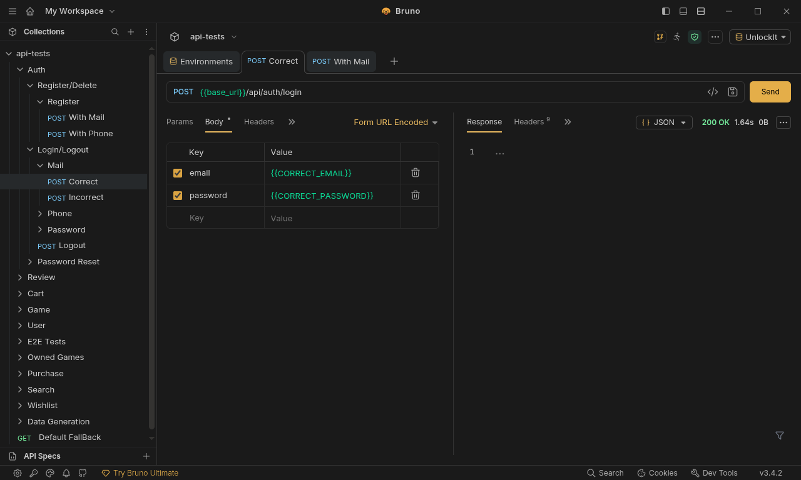
*Figure – Interface Bruno avec requête login exécuté .*

Ce fichier remplissait son rôle, mais il fallait l'écrire et le maintenir à part, sans lien avec la route elle-même.

</div>

<div class="after">
<h3>Après</h3>

Avec Swagger, la même déclaration sert à la fois de documentation et d'outil de vérification manuelle : il suffit d'ouvrir la page, de renseigner un identifiant, et de lire la réponse réelle.

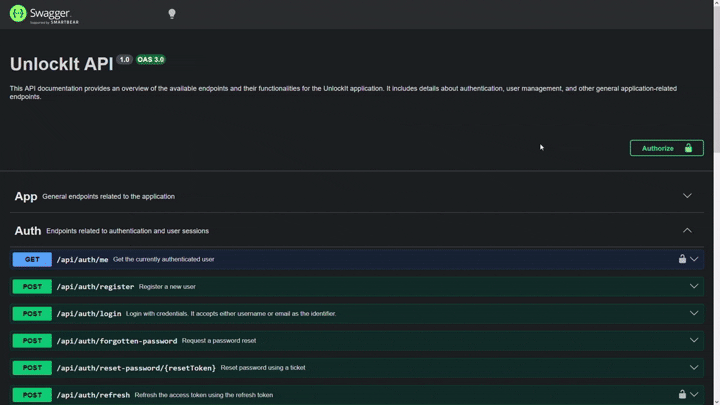

*Figure – Détail du endpoint généré par la déclaration ci-dessus avec exécution de la requête et résultat affiché directement dans l'interface.*

</div>


Cette bascule a une contrepartie que nous détaillons en <a href="#35-difficultés-rencontrées-et-solutions">3.5</a> : Swagger documente et permet de tester manuellement, mais il ne remplace pas une suite de tests automatisés.

## 3.5 Difficultés rencontrées et solutions

### 3.5.1 Tester sans suite automatisée : Swagger comme filet de sécurité

Contrairement au frontend, qui dispose d'une suite de tests automatisés avec Playwright (voir <a href="#25-tests-automatisés">2.5</a>), le backend n'en a pas eu : le temps disponible a été investi en priorité dans l'architecture elle-même. Cela ne supprime pas le besoin de vérifier qu'un comportement précis fonctionne, en particulier avec des valeurs limites ou inhabituelles (un prix négatif, un identifiant inexistant, un champ manquant).

C'est là que la documentation Swagger, déjà décrite en <a href="#342-la-documentation-swagger-comme-garde-fou">3.4.2</a>, a fini par jouer un second rôle, non prévu au départ : chaque route déjà documentée propose une interface où l'on peut directement saisir une valeur précise et observer la réponse réelle de l'API, sans écrire la moindre ligne de test. Ce n'est pas un remplacement satisfaisant à une suite automatisée, rien n'est rejoué automatiquement, rien n'empêche une régression silencieuse, mais cela a couvert l'essentiel de nos besoins de vérification ponctuelle pendant le développement.

### 3.5.2 Les nombres décimaux et les grands entiers sous TypeORM

Deux types posent un problème similaire avec PostgreSQL : les colonnes décimales et les grands entiers (bigint) sont tous deux renvoyés sous forme de texte par défaut, pour éviter une perte de précision silencieuse. Sans intervention, le champ <code class="c">price</code> d'un jeu serait par exemple reçu comme la chaîne <code class="c">"59.99"</code> plutôt que le nombre <code class="c">59.99</code>.

Pour les colonnes décimales, la solution est un transformer attaché à la colonne :

```ts
export class DecimalColumnTransformer {
  to(data: number): number {
    return data;
  }
  from(data: string): number {
    return parseFloat(data);
  }
}
```

Pour les identifiants en bigint, le même problème se règle au niveau du pilote, une seule fois pour toute l'application :

```ts
parseInt8: true,
```

Les deux solutions ne se ressemblent pas, mais répondent à la même cause : PostgreSQL et le pilote sous-jacent privilégient la sécurité (ne jamais perdre en précision) à la commodité, et c'est au développeur de redemander explicitement un nombre quand un nombre est réellement attendu.

### 3.5.3 Un système de seeding fait maison pour les données de test

TypeORM fournit des migrations pour versionner le schéma, mais ne propose aucun système de seeding : remplir la base avec des données réalistes reste entièrement à la charge du développeur. Or nous en avions besoin en permanence, pour développer dans des conditions proches du réel, et pour tester manuellement via Swagger (voir <a href="#351-tester-sans-suite-automatisée--swagger-comme-filet-de-sécurité">3.5.1</a>) avec des comptes et des jeux qui existent vraiment.

Toute factory repose sur un même contrat minimal :

```ts
export abstract class Factory<T> {
  abstract get entity(): EntityTarget<T>;
  abstract definition(): Partial<T> | Promise<Partial<T>>;

  /* Code */
}
```

Une factory n'a que deux choses à dire : à quelle entité elle correspond, et comment remplir une instance. Tout le reste (créer une instance, en créer plusieurs, les enregistrer, vérifier qu'une connexion à la base est bien disponible) est écrit une seule fois, dans la classe de base.

<details class="accordion">
<summary>Voir l'implémentation complète de Factory</summary>

```ts
export abstract class Factory<T> {
  async make(overrides = {}) {
    return { ...(await this.definition()), ...overrides };
  }

  async makeMany(count: number, overrides = {}) {
    return Promise.all(Array.from({ length: count }, () => this.make(overrides)));
  }

  async create(overrides = {}) {
    const [result] = await this.createMany(1, overrides);
    return result;
  }

  async createMany(count: number, overrides = {}) {
    this.assertDatasource();
    const items = this.datasource.manager.create(this.entity, await this.makeMany(count, overrides));
    return this.datasource.manager.save(this.entity, items);
  }

  protected assertDatasource() {
    /* vérifie que le datasource existe et est initialisé */
  }
}
```

</details>

Le cas le plus simple, <code class="c">UserFactory</code>, se limite à peu près à ce contrat :

```ts
export class UserFactory extends Factory<UserEntity> {
  get entity() {
    return UserEntity;
  }

  definition() {
    const randomStr = Math.random().toString(36).substring(2, 15);
    const password = `Test${randomStr}!Aa`; // voir ci-dessous

    return {
      username: this.fk.internet.username(),
      email: this.fk.internet.email(),
      password,
      phoneNumber: this.fk.datatype.boolean() ? this.fk.phone.number() : null,
      cart: {},
    };
  }
}
```

<code class="c">GameFactory</code> est nettement plus ambitieuse : plutôt que d'inventer des jeux au hasard, elle pioche parmi des fiches réelles, une par fichier JSON :

```ts
interface GameJson {
  name: string;
  type: string;
  tags: string[];
  developers: string[];
  publishers: string[];
  price: number;
  series: { name: string; slug: string } | null;
  /* ... */
}
```

Chacun des jeux fournis avec le projet est décrit par un fichier de ce type. La factory choisit un jeu pas encore présent en base, puis reconstruit le jeu complet à partir du JSON : étiquettes, développeurs, éditeurs, médias et série inclus. La difficulté n'est pas de créer un jeu, mais de ne pas dupliquer ce qu'il partage avec les autres : si soixante jeux ont l'étiquette « Action », elle ne doit exister qu'une seule fois en base.

<details class="accordion">
<summary>Voir l'implémentation (transaction et déduplication)</summary>

```ts
private async persist(game: GameEntity) {
  return this.datasource.transaction(async (manager) => {
    const savedTags = await Promise.all(
      game.tags.map((t) => this.upsertByName(manager, TagEntity, { name: t.name })),
    );
    /* même logique pour developers, publishers, series */

    const savedGame = await manager.save(GameEntity, game);
    await manager.createQueryBuilder().relation(GameEntity, 'tags').of(savedGame.id).add(savedTags.map((t) => t.id));
    /* même logique pour developers, publishers */

    return game;
  });
}

private async upsertByName(manager, target, values) {
  // INSERT ... ON CONFLICT DO NOTHING, puis recherche si rien n'a été inséré
}
```

</details>

<code class="c">StockFactory</code> est plus modeste : elle génère une clé de produit aléatoire et la rattache à un jeu existant, choisi au hasard si aucun n'est précisé. Le script <code class="c">seed.ts</code> orchestre les trois, et contient quelques détails révélateurs de son écriture rapide :

```ts
const FACTORIES: [name: string, factory: any][] = [
  ['users', UserFactory],
  ['games', GameFactory],
  ['stocks', StockFactory],
];
```

```ts
if (process.env.NODE_ENV === 'production') {
  console.error('ERROR: Database commands cannot be executed in a PRODUCTION environment!');
  process.exit(1);
}
```

Le second extrait n'est pas anecdotique : un script capable de remplir la base ne doit jamais pouvoir s'exécuter par erreur sur une base de production. Le script crée enfin systématiquement un compte fixe, avec des identifiants connus à l'avance et le rôle le plus permissif :

```ts
userFactory.create({
  username: 'TestUser',
  email: 'test@test.test',
  password: 'Test123&',
  employee: { role: EmployeeRole.OWNER },
});
```

C'est ce compte qui rend le filet de sécurité décrit en <a href="#351-tester-sans-suite-automatisée--swagger-comme-filet-de-sécurité">3.5.1</a> réellement pratique : tester une route réservée aux administrateurs depuis Swagger ne demande pas de fouiller des données aléatoires, l'identifiant et le mot de passe sont toujours les mêmes. En une seule commande, ce système installe une base entière (quelques utilisateurs, soixante-quatre jeux, dix mille clés de produit) directement utilisable, ce que TypeORM ne propose pas nativement.

...

# 5. Conclusion

## 5.1 Bilan

### 5.1.1 Frontend

La refonte du frontend a permis de transformer une base fonctionnelle mais hétérogène en une architecture cohérente et professionnelle. La réorganisation des composants (<a href="#21-refonte-de-larchitecture-react">2.1</a>) et la mise en place d’une véritable couche d’abstraction entre l’interface et le réseau (<a href="#24-nouvelle-couche-api-frontend">2.4</a>) ont clarifié les responsabilités de chaque partie du code. En parallèle, plusieurs chantiers jusque-là absents de la première version ont été menés à bien : le référencement naturel (<a href="#22-référencement-et-indexation">2.2</a>), l’optimisation des performances appuyée sur des outils de mesure (<a href="#23-optimisation-des-performances">2.3</a>), les tests automatisés avec Playwright (<a href="#25-tests-automatisés">2.5</a>) ainsi que l’optimisation du build (<a href="#26-build-et-compression">2.6</a>). Les quelques difficultés rencontrées en cours de route (<a href="#27-difficultés-rencontrées-et-solutions">2.7</a>), notamment liées à React Router, ont par ailleurs été identifiées et résolues sans compromettre la stabilité de l’application.

Cette refonte apporte plusieurs avantages concrets : un code plus maintenable et plus simple à faire évoluer, des performances mesurées et validées plutôt que supposées, une meilleure visibilité de l’application sur les moteurs de recherche, et une couverture de tests qui sécurise les évolutions futures. Plus largement, la démarche adoptée, mesurer avant d’optimiser, structurer avant d’ajouter des fonctionnalités, rapproche le projet des pratiques utilisées en environnement professionnel et constitue une base solide pour la suite.

### 5.2.2 Backend

...

### 5.2.3 Structure

...


## 5.2 Perspectives

### 5.2.1 Frozen1753

Avec le recul, je retiens surtout un changement de méthode plus qu’un changement de résultat. Le site de la SAÉ 3.01 ne me semblait pas spécialement lent, mais je jugeais ses performances "à l’oeil", sans jamais avoir réelement mesuré quoi que ce soit. Découvrir des outils comme **React Scan** ou le Profiler de **React Developer Tools** a changé ma manière d’aborder un ralentissement : au lieu de deviner quel composant pose problème, je sais désormais où regarder et comment vérifier mon intuition. Les chunks et le build du frontend n'avaient jamais été abordé auparavant car nous ne quittions jamais le mode dev dans les projets comme pour les cours.

Plusieurs chantiers commencés durant cette SAÉ mériteraient d’être poussés plus loin. Le sitemap reste aujourd’hui statique, faute de script de génération automatique à partir de la base de données (<a href="#22-référencement-et-indexation">2.2</a>) ; c’est un développement que j’aimerais intégrer si le projet venait à continuer au-delà du cadre académique. La couverture Playwright pourrait également s’étendre au-delà des premiers tests critiques faute de temps à cause de la refonte intégrale (<a href="#25-tests-automatisés">2.5</a>), et **React Doctor** (<a href="#23-optimisation-des-performances">2.3</a>), découvert trop tard pour être réellement exploité, est un outil que je compte essayer dès le prochain projet React.

J’aimerais aussi pousser davantage la partie algorithmique plutôt que du 100% développement web et expérimenter avec <a href="#236-pixijs">PixiJS</a> pour créer des moteurs, interfaces ou prototypes visuels, pour ne pas m'arrêter à un simple arrière‑plan.

Si je devais résumer mon ressenti en une phrase : le frontend d’UnlockIt est aujourd’hui une base sur laquelle j’ai envie de continuer à construire, plutôt qu’un prototype que je voudrais déjà réécrire. C’est, je pense, la meilleure preuve que cette refonte avait du sens.

### 5.2.2 ElPotato

...