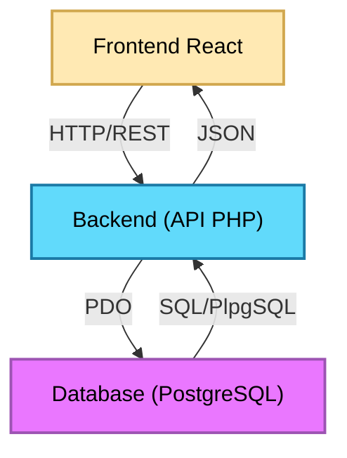
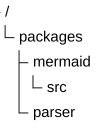
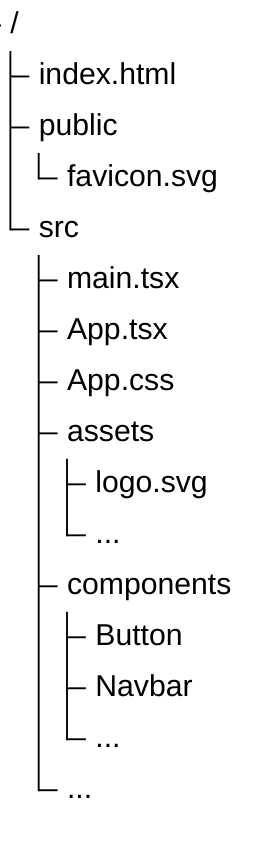
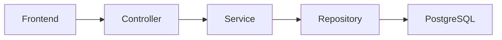

<link rel="stylesheet" href="./src/style.css">
<link rel="stylesheet" href="./src/hljs.css">

<script src="./src/mermaid.min.js"></script> + rm styles + pseudo ref name

<header class="sticky-header">
    <span class="header-title">Rapport SAÉ 4.01 - Qualité</span>
    
</header>

<div class="false-body">

<div class="cover-page">
    <h1>Rapport SAÉ 4.01 - Qualité</h1>
    <a href="https://github.com/ElPotatoCorp/UnlockIt" target="_blank">
        
    </a>
    <div class="cover-authors">
        <div class="info-line">Mars – Juin 2026</div>
        <div class="info-line authors">
            <a href="https://github.com/Frozen1753" target="_blank">Frozen1753</a>
            <span>&</span>
            <a href="https://github.com/ElPotatoCorp" target="_blank">ElPotato</a>
        </div>
        <div class="info-line">BUT Informatique</div>
</div>

</div>

<div class="page-break"></div>

# Sommaire

<div class="toc">

<ul>
    <li><a href="#1-introduction">1. Introduction</a></li>
    <li class="lvl2"><a href="#11-présentation-du-projet">1.1 Présentation du projet</a></li>
    <li class="lvl2"><a href="#12-objectifs-de-la-refonte">1.2 Objectifs de la refonte</a></li>
    <li><a href="#2-analyse-de-lancien-projet">2. Analyse de l'ancien projet</a></li>
    <li class="lvl2"><a href="#21-constats">2.1 Constats</a></li>
    <li class="lvl2"><a href="#22-avant--après-la-refonte">2.2 Avant / Après la refonte</a></li>
    <li><a href="#3-frontend">3. Frontend</a></li>
    <li class="lvl2"><a href="#31-refonte-de-larchitecture-react">3.1 Refonte de l'architecture React</a></li>
    <li class="lvl2"><a href="#32-référencement-et-indexation">3.2 Référencement et indexation</a></li>
    <li class="lvl2"><a href="#33-optimisation-des-performances">3.3 Optimisation des performances</a></li>
    <li class="lvl2"><a href="#34-refonte-graphique">3.4 Refonte graphique</a></li>
    <li class="lvl2"><a href="#35-pixijs">3.5 PixiJS</a></li>
    <li class="lvl2"><a href="#36-nouvelle-couche-api-frontend">3.6 Nouvelle couche API Frontend</a></li>
    <li class="lvl2"><a href="#37-tests-automatisés">3.7 Tests automatisés</a></li>
    <li class="lvl2"><a href="#38-difficultés-rencontrées-et-solutions">3.8 Difficultés rencontrées et solutions</a></li>
    <li><a href="#4-backend">4. Backend</a></li>
    <li class="lvl2"><a href="#41-migration-vers-nestjs">4.1 Migration vers NestJS</a></li>
    <li class="lvl2"><a href="#42-architecture-modulaire">4.2 Architecture modulaire</a></li>
    <li class="lvl2"><a href="#43-validation-et-sécurité">4.3 Validation et sécurité</a></li>
    <li class="lvl2"><a href="#44-maintenabilité">4.4 Maintenabilité</a></li>
    <li class="lvl2"><a href="#45-difficultés-rencontrées-et-solutions">4.5 Difficultés rencontrées et solutions</a></li>
    <li><a href="#5-conclusion">5. Conclusion</a></li>
    <li class="lvl2"><a href="#51-bilan">5.1 Bilan</a></li>
    <li class="lvl2"><a href="#52-perspectives">5.2 Perspectives</a></li>
</ul>

</div>

# 1. Introduction

## 1.1 Présentation du projet

UnlockIt est une plateforme web de distribution de jeux vidéo dématérialisés, s'inspirant des principales plateformes du marché telles que Steam, Instant Gaming ou Epic Games Store. Le projet a pour objectif de reproduire une partie de leurs fonctionnalités à travers une architecture full-stack moderne.

La première version du projet, durant la SAÉ 3.01, avait pour ambition de proposer une expérience complète autour de l'achat et de la gestion de jeux numériques. Les utilisateurs pouvaient consulter un catalogue de jeux, rechercher des produits, créer un compte, gérer leur panier d'achat, constituer une liste de souhaits et accéder à leur bibliothèque personnelle après l'achat.

L'objectif académique de cette première version était avant tout de nous confronter à la réalisation d'une application web de grande ampleur, nécessitant la conception d'un frontend moderne, d'une API backend ainsi que d'une base de données relationnelle relativement complexe. Ce projet nous a également permis d'expérimenter le travail en équipe, la gestion d'une architecture multi-couches et la mise en place de méthodologies de développement proches du monde professionnel.

<div class="card">


*Figure 1 – Capture de la page d'accueil de UnlockIt (SAÉ 3.01).*

</div>

D'un point de vue fonctionnel, UnlockIt (SAÉ 3.01) proposait déjà la majorité des fonctionnalités attendues pour une plateforme de distribution numérique :

* consultation du catalogue de jeux
* recherche et filtrage avancés
* authentification et gestion de compte
* système de panier et de wishlist
* historique d'achats
* récupération des clés d'activation
* système de commentaires et d'avis

Ces fonctionnalités ont permis de valider la faisabilité du projet et de produire une première version entièrement fonctionnelle.

<div class="card">


*Figure 2 – Exemple de la page détaillée d'un jeu sur UnlockIt (SAÉ 3.01).*

</div>

L'architecture technique de cette première version reposait sur une séparation classique entre trois couches :

* un frontend développé avec **React**, **TypeScript** et **Vite**
* un backend développé en **PHP** suivant une architecture inspirée du modèle MVC
* une base de données **PostgreSQL** exploitant de nombreuses fonctionnalités natives, notamment les fonctions stockées et les triggers.

<div class="card">

<div class="mermaid-center" style="text-align:center;">



</div>

*Figure 3 – Architecture simplifiée de UnlockIt (SAÉ 3.01).*

\* Si du code s'affiche à la place du schéma, rafraichissez la page.

</div>

Cette architecture nous a permis de développer rapidement un ensemble riche de fonctionnalités et de mieux appréhender les enjeux liés à la conception d’une application web complète. Toutefois, au fil de l’avancement du projet, plusieurs limites sont apparues. Le développement de nouvelles fonctionnalités devenait progressivement plus complexe, certains composants frontend mélangeaient logique métier et rendu visuel, et plusieurs parties du code manquaient d’homogénéité. L’absence d’outils d’analyse et de tests automatisés compliquait également la détection des régressions et l’optimisation des performances.

Bien que fonctionnelle et suffisamment robuste pour être présentée lors de la première soutenance, cette version s’apparentait davantage à un produit minimum viable (MVP) qu’à une base technique durable. Avec la montée en compétences de l’équipe, les parties les plus anciennes du code nous sont apparues comme insuffisamment structurées, parfois mal écrites, voire difficilement lisibles en comparaison des fonctionnalités plus récentes. Le projet tenait, mais ses fondations étaient fragiles. Pour envisager une évolution pérenne, une refonte devenait nécessaire.

Ces constats nous ont naturellement conduits à envisager une seconde itération du projet, non plus centrée sur l’ajout de fonctionnalités, mais sur une amélioration profonde de sa qualité technique et de son architecture.

## 1.2 Présentation des membres

<div class="card">

<a href="https://github.com/Frozen1753" target="_blank">
    <h3>Frozen1753</h3>
</a>

**Compétences techniques**

- **Développement & Programmation :** Java • C • C++ • C# • Bash • Python
- **Développement Web :** JavaScript • TypeScript • React • Vite • Playwright • PHP • NestJS • TypeORM
- **Design & Interfaces :**  XAML • HTML • CSS • Figma
- **Bases de données :**  SQL • PostgreSQL
- **Réseaux & Systèmes :** TCP/IP • Cisco Packet Tracer • Windows • Linux
- **Outils & Environnements :** Visual Studio • IntelliJ • Git • GitHub • PowerBI • PhpMyAdmin • MySQL • Workbench • Docker

**Formation**  
Étudiant en 2ᵉ année de BUT Informatique (formation initiale)

**Rôles dans le projet**  
Frontend • UX/UI Design • Design graphique • Optimisation • Testing

</div>

<div class="card">

<a href="https://github.com/ElPotatoCorp" target="_blank">
    <h3>ElPotato</h3>
</a>

**Compétences techniques**

- **Développement & Programmation :** Rust • C • C++ • C# • Bash • Python
- **Développement Web :** JavaScript • TypeScript • React • PHP • Swagger • Vite • NestJS • TypeORM
- **Design & Interfaces :** XAML • XML • HTML • CSS
- **Bases de données :** SQL • PostgreSQL
- **Réseaux & Systèmes :** TCP/IP • Cisco Packet Tracer • Windows • Linux
- **Outils & Environnements :** Visual Studio • IntelliJ • Git • GitHub • PowerBI • PhpMyAdmin • MySQL • Workbench • Docker

**Formation**  
Étudiant en 2ᵉ année de BUT Informatique (formation initiale)

**Rôles dans le projet**  
Backend • Base de données • Documentation • Optimisation • Scripts

</div>

## 1.3 Pourquoi une refonte complète ?

À l'issue de la SAÉ 3.01, nous disposions d'une application fonctionnelle répondant à la majorité des objectifs initiaux. Malgré ce résultat satisfaisant, nous avions pleinement conscience des limites de notre implémentation. Une grande partie de l'architecture avait été construite progressivement, au fur et à mesure de l'ajout de nouvelles fonctionnalités et de notre montée en compétences durant le projet.

Avec le recul, certaines décisions techniques prises au début du développement ne correspondaient plus à nos besoins actuels. Plusieurs composants étaient devenus trop volumineux, certaines responsabilités étaient mal réparties et une partie du code était devenue difficile à maintenir. Ajouter une nouvelle fonctionnalité nécessitait parfois de modifier plusieurs zones de l'application, augmentant le risque d'introduire des régressions.

De plus, la première version du projet avait été développée avec un objectif principalement fonctionnel : produire une application complète dans le temps imparti. Des aspects plus avancés tels que l'optimisation des performances, le référencement, les tests automatisés, l'analyse des rendus React ou encore la mise en place d'une architecture frontend et backend plus moderne avaient volontairement été laissés de côté.

La SAÉ 4.01 nous a offert l'opportunité de revenir sur ce projet avec un regard plus critique et davantage d'expérience. Plutôt que d'ajouter de nouvelles fonctionnalités sur des fondations que nous jugions désormais fragiles, nous avons fait le choix de repartir de zéro.

Cette décision peut sembler radicale, mais elle nous a permis de repenser entièrement l'application :

* en adoptant une architecture plus propre et plus maintenable
* en améliorant les performances globales du site
* en modernisant les outils utilisés
* en introduisant des pratiques de développement plus professionnelles
* en préparant le projet à de futures évolutions

L'objectif de cette seconde version n'était donc pas simplement de produire un « UnlockIt plus complet », mais de transformer un premier prototype fonctionnel en une base technique plus robuste, plus cohérente et davantage orientée vers la qualité logicielle.

<div class="card">


*Figure 4 – Passage d'un premier prototype fonctionnel à une refonte complète orientée qualité.*

</div>

Avant de présenter les changements apportés dans cette nouvelle version, il est nécessaire d'analyser plus en détail les principales limites de UnlockIt (SAÉ 3.01). Cette analyse permettra de comprendre les choix techniques effectués au cours de cette refonte et de justifier les différentes décisions présentées dans la suite de ce rapport.

# 2. Analyse de l'ancien projet

## 2.1 Constats

La première version du projet remplissait correctement son rôle fonctionnel. Néanmoins, son développement s'étant effectué de manière itérative, certaines décisions techniques prises en début de projet ne répondaient plus aux besoins apparus par la suite.

Les composants React contenaient parfois à la fois de la logique métier, des appels API et du rendu visuel. Cette situation compliquait la lecture du code et rendait les tests plus difficiles.

## 2.2 Avant / Après la refonte

<div class="before">

### Avant

<details class="accordion">
<summary>Voir plus d'informations</summary>

```tsx
const onSubmit = async (data: FormData) => {
    setErrorMessage(null);
    setStatus("idle");

    if (!isStrong) {
        setStatus("error");
        setErrorMessage("Le mot de passe ne respecte pas les critères de sécurité");
        return;
    }

    try {
        const payload: any = {
            username: data.username,
            password: data.password,
        };

        if (data.contactType === "email") {
            payload.email = data.email;
        } else {
            payload.phone_wzc = data.phone_wzc;
            payload.phone_number = data.phone_number;
        }

        const res = await fetch(`/api/auth/register`, {
            method: "POST",
            credentials: "include",
            headers: { "Content-Type": "application/json" },
            body: JSON.stringify(payload),
        });

        if (res.ok) {
            setStatus("success");
            reset();
            navigate('/');
            window.location.reload();
        } else if (res.status === 403) {
            throw new Error("Un utilisateur avec ces informations existe déjà");
        } else {
            throw new Error(payload.message || "Échec de l'inscription");
        }
    } catch (err: any) {
        setStatus("error");
        setErrorMessage(err.message || "Erreur d'inscription");
    }
};
```

L'architecture de la première version était principalement orientée vers la mise en place rapide des fonctionnalités.

</details>

</div>

<div class="after">

### Après

<details class="accordion">
<summary>Voir plus d'informations</summary>

```tsx
const onSubmit = async (data: FormData) => {
    try {
      await authRegister(data.username, data.email, data.password);

      navigate("/login");
    } catch (err: any) {
      setError("root", { message: err.message ?? "Erreur d'inscription." });
    }
};
```
```ts
import { api } from "../axios.instance";

export const authService = {
    {...}

    register: async (username: string, email: string, password: string) => {
        try {
            await api.post("/auth/register", { username, email, password });
        } catch (err: any) {
            const s = err.response?.status;

            if (s === 400) throw { message: "Données invalides." };
            if (s === 409) throw { message: "Email ou nom d'utilisateur déjà utilisé." };
            if (s === 429) throw { message: "Trop de tentatives. Réessayez plus tard." };
            throw { message: "Erreur serveur." };
        }
    }

    {...}
};
```

L'architecture actuelle privilégie la séparation des responsabilités, les performances et la maintenabilité.

</details>

</div>

# 3. Frontend

## 3.1 Refonte de l'architecture React

L'un des principaux objectifs de cette seconde version de UnlockIt a été de revoir entièrement l'architecture du frontend. La première version du projet avait été développée de manière progressive, au fur et à mesure de l'ajout de nouvelles fonctionnalités et de notre montée en compétences. Bien que fonctionnelle, cette approche avait progressivement conduit à une certaine dette technique.

Certains composants regroupaient simultanément l'affichage, la gestion de l'état, les appels API et une partie de la logique métier. Cette organisation rendait le code plus difficile à maintenir et augmentait le risque d'introduire des régressions lors de l'ajout de nouvelles fonctionnalités.

La refonte du frontend a donc été l'occasion de repartir sur des bases plus saines. L'application a été réorganisée autour d'une architecture plus modulaire, privilégiant une séparation claire des responsabilités entre les composants de présentation, les hooks métiers, les services d'accès aux données et les utilitaires partagés.



<div class="card">


*Figure X – Nouvelle organisation du frontend après la refonte.*

</div>

Cette nouvelle organisation permet aujourd'hui de faire évoluer le projet plus sereinement et facilite grandement l'intégration de nouvelles fonctionnalités.

---

## 3.2 Référencement et indexation

### 3.2.1 React Helmet

Lors du développement de la première version de UnlockIt, très peu d’attention avait été portée aux problématiques de référencement naturel. Comme dans la plupart des applications React, l’architecture reposait sur le principe d’une **Single Page Application (SPA)** : un unique fichier **`index.html`** sert de point d’entrée, puis React prend le relais pour générer et mettre à jour l’interface.

Le fonctionnement suit une chaîne simple :

- **index.html** — contient uniquement la structure minimale et un conteneur `<div id="root">`
- **main.tsx** — monte l’application React dans `#root`.
- **App.tsx** — constitue le composant racine et gère le routage.
- **Composants** — chaque page ou section du site est rendue dynamiquement à l’intérieur de `App`.

Dans ce modèle, changer de page ne provoque pas le chargement d'un nouveau document HTML. Seul le contenu affiché à l'écran est modifié par JavaScript, ce qui empêche naturellement chaque page de disposer de ses propres métadonnées.

<details class="accordion">
<summary>Exemple</summary>



```html
<!-- index.html -->
<!doctype html>
<html lang="en">
  <head>
    ...
  </head>
  <body>
    <div id="root"></div>
    <script type="module" src="/src/main.tsx"></script>
  </body>
</html>
```

```tsx
// main.tsx
createRoot(document.getElementById('root')!).render(
  <StrictMode>
    <App />
  </StrictMode>,
)
```

```tsx
// App.tsx
export default function App() {
  return (
      <BrowserRouter>
        <Routes>
          <Route element={<Layout />}>
            <Route index element={<Home />}/>
            <Route ... />
            <Route path="*" element={<NotFound />} />
          </Route>
        </Routes>
      </BrowserRouter>
  );
}
```

</details>

En nous intéressant davantage au fonctionnement des moteurs de recherche et aux recommandations fournies par Lighthouse, nous avons constaté que l'absence de métadonnées adaptées à chaque page pénalisait le référencement du site ainsi que le partage de son contenu sur les réseaux sociaux.

Pour répondre à cette problématique, nous avons intégré la bibliothèque **React Helmet Async**, qui permet de modifier dynamiquement le contenu de l'élément `<head>` en fonction de la page actuellement affichée.

Plutôt que de dupliquer les mêmes balises dans chaque composant, nous avons créé un composant réutilisable nommé `UnlockItHelmet`, appliquant le principe DRY (Don't Repeat Yourself).  Celui-ci centralise la gestion :

* du titre de la page ;
* de la description ;
* des balises `OpenGraph` ;
* des métadonnées Twitter ;
* de l'URL canonique ;
* des consignes d'indexation.

```tsx
<UnlockItHelmet
    title="Accueil"
    path="/"
/>
```

À partir de cette simple déclaration, le composant génère automatiquement l'ensemble des métadonnées nécessaires.

<details class="accordion">
<summary>Résultats</summary>

```html
<head>
    <...>
    <title>UnlockIt – Accueil</title>
    <meta name="description" content="UnlockIt : achetez vos jeux PC moins cher. Clés Steam, Origin et Uplay livrées instantanément au meilleur prix.">
    <meta name="robots" content="index, follow">
    <meta property="og:title" content="UnlockIt – Accueil">
    <meta ...>
    <meta name="twitter:card" content="summary_large_image">
    <meta ...>
    <link rel="canonical" href="https://unlock-it.com/">
    <...>
</head>
```

</details>

L'approche devient encore plus intéressante pour les pages dynamiques. Une recherche sur le terme `test` génère automatiquement un titre et une description adaptés au contenu affiché.

```tsx
<UnlockItHelmet
    title={`Recherche : ${term}`}
    description={`Résultats de recherche pour "${term}"`}
    path={`/search/${term}`}
/>
```

<details class="accordion">
<summary>Résultats</summary>

```html
<head>
    <...>
    <title>UnlockIt – Recherche : test</title>
    <meta name="description" content="Résultats de recherche pour &quot;test&quot; sur UnlockIt. Trouvez vos jeux PC au meilleur prix.">
    <meta name="robots" content="index, follow">
    <meta property="og:title" content="UnlockIt – Recherche : test">
    <meta ...>
    <meta name="twitter:card" content="summary_large_image">
    <meta ...>
    <link rel="canonical" href="https://unlock-it.com/search/test">
    <...>
</head>
```

</details>

Cette amélioration, relativement simple à mettre en œuvre, rapproche davantage UnlockIt du fonctionnement d'un véritable site de production. Elle améliore les scores de référencement fournis par Lighthouse, facilite l'indexation par les moteurs de recherche et permet également un meilleur rendu lors du partage des pages sur les réseaux sociaux.

Au-delà de l'aspect technique, cette démarche nous a permis de mieux comprendre le fonctionnement du web moderne et de découvrir des problématiques que nous n'avions encore jamais abordées dans le cadre des précédentes SAÉ.

---

### 3.2.2 Robots.txt

Lors des différents audits réalisés avec Lighthouse, nous avons découvert plusieurs recommandations liées au référencement naturel et à l'indexation du site. Parmi celles-ci figurait la présence d'un fichier <code class="c">robots.txt</code>, mécanisme que nous ne connaissions pas avant cette refonte.

En nous documentant davantage, notamment à l'aide de la documentation officielle et de l'intelligence artificielle, nous avons découvert qu'il s'agissait d'un fichier standard du Web permettant de communiquer certaines informations aux robots d'exploration des moteurs de recherche.

Encore une fois, même si UnlockIt reste un projet académique et n'a pas vocation à être réellement indexé (surtout avec le marché actuel et des géant comme Steam et Instant Gaming, on coulerait instantanément), nous avons souhaité reproduire le fonctionnement d'une application de production en mettant en place ce mécanisme.

Le fichier <code class="c">robots.txt</code> est placé dans le dossier <code class="c">public</code> afin d'être directement accessible à l'adresse :

<a>https://unlock-it.com/robots.txt</a>

Son contenu est volontairement simple :

```txt
User-agent: *
Allow: /

Sitemap: https://unlock-it.com/sitemap.xml
```

Ce fichier indique que l'ensemble du site peut être exploré par les robots d'indexation et leur fournit également l'emplacement du sitemap de l'application.

<details class="accordion">
<summary>Pourquoi le placer dans public ?</summary>

Le dossier <code class="c">public</code> de Vite contient les ressources statiques qui doivent être servies directement par le serveur sans être traitées par le bundler. Les fichiers <code class="c">robots.txt</code>, <code class="c">sitemap.xml</code> ou encore <code class="c">favicon.ico</code> sont donc naturellement placés dans ce répertoire afin d'être accessibles depuis la racine du site.

```
public/
├── favicon.ico
├── robots.txt
└── sitemap.xml
```

</details>

L'ajout de ce fichier participe à rendre le projet plus conforme aux standards actuels du Web et nous a permis de mieux comprendre le fonctionnement de l'exploration et de l'indexation des sites internet.

Le fichier robots.txt ne garantit pas qu'une page sera indexée ou non par un moteur de recherche. Il constitue uniquement une convention permettant de donner des indications aux robots d'exploration.

---

### 3.2.3 Sitemap XML

Si le fichier <code class="c">robots.txt</code> indique aux robots d'exploration où trouver certaines informations, le fichier <code class="c">sitemap.xml</code> leur fournit quant à lui la liste des pages disponibles sur le site ainsi que certaines informations complémentaires concernant leur importance et leur fréquence de mise à jour.

<details class="accordion">
<summary>Grosso modo</summary>

> <code class="c">robots.txt</code> dit aux robots « où regarder ».
>
> <code class="c">sitemap.xml</code> dit aux robots « quelles pages existent ».

</details>

Lors de nos recherches sur le référencement naturel et après plusieurs audits réalisés avec Lighthouse, nous avons découvert qu'il était courant pour les sites de production de mettre à disposition un sitemap afin de faciliter leur indexation.

Nous avons donc décidé d'ajouter un fichier <code class="c">sitemap.xml</code> à la racine du projet, également placé dans le dossier <code class="c">public</code> afin qu'il soit accessible à l'adresse :

<a>https://unlock-it.com/sitemap.xml</a>

Le sitemap contient les principales pages publiques du site, accompagnées de plusieurs informations :

* <code class="c">loc</code> : l'adresse de la page ;
* <code class="c">changefreq</code> : la fréquence estimée des modifications ;
* <code class="c">priority</code> : l'importance relative de la page au sein du site.

L'extrait suivant présente quelques entrées du fichier :

```xml
<url>
    <loc>https://unlock-it.com/login</loc>
    <changefreq>yearly</changefreq>
    <priority>0.1</priority>
</url>

<url>
    <loc>https://unlock-it.com/privacy</loc>
    <changefreq>yearly</changefreq>
    <priority>0.2</priority>
</url>
```

Même si UnlockIt comporte actuellement un nombre relativement limité de pages, la mise en place de ce mécanisme permet de reproduire le comportement d'un véritable site de production et de mieux comprendre la manière dont les moteurs de recherche découvrent et parcourent un site web.

Cette fonctionnalité constitue finalement un excellent exercice de compréhension des mécanismes d'indexation modernes et nous a permis de découvrir un aspect du développement web que nous n'avions encore jamais abordé au cours des précédentes SAÉ.

<div class="success">

Bien qu'un sitemap soit principalement utile pour les sites de grande taille, sa mise en place nous a permis d'adopter une démarche plus professionnelle et de nous rapprocher du fonctionnement réel d'une application web en production.

</div>

---

## 3.3 Optimisation des performances

L'amélioration des performances a constitué l'un des principaux axes de travail de cette nouvelle version. Contrairement à la première itération du projet, plusieurs outils de mesure et de profilage ont été utilisés afin d'identifier les points de ralentissement et de mesurer objectivement les gains obtenus.

<div class="card">


*Figure X – Exemple de rapport Lighthouse après optimisation.*

</div>

### 3.3.1 React Scan

L'introduction de React Scan a permis de visualiser en temps réel les composants effectuant des rendus inutiles.

Au fur et à mesure du développement, cet outil nous a permis de mieux comprendre le cycle de rendu de React et d'identifier plusieurs composants dont les performances pouvaient être améliorées.

Cette démarche a notamment conduit à simplifier certaines dépendances et à limiter plusieurs re-rendus superflus.

<div class="card">


*Figure X – Analyse des rendus avec React Scan.*

</div>

---

### 3.3.2 Lighthouse

Lighthouse a été utilisé tout au long du développement afin de mesurer plusieurs indicateurs :

* performances
* accessibilité
* référencement
* bonnes pratiques.

Ces mesures nous ont permis de valider objectivement l'impact de certaines optimisations et de guider les améliorations à apporter au site.

---

### 3.3.3 Firefox Profiler

En complément de Lighthouse, Firefox Profiler a été utilisé afin d'obtenir une vision plus détaillée du comportement de l'application.

L'outil permet notamment d'analyser :

* le temps passé dans certaines fonctions
* le coût des opérations JavaScript
* les phases de rendu
* certaines opérations particulièrement coûteuses.

Cette analyse a été particulièrement utile lors de l'optimisation de certaines animations et de l'arrière-plan du site.

---

### 3.3.4 Lazy Loading et Suspense

L'une des principales optimisations apportées concerne le chargement des pages.

Dans la première version du projet, une partie importante du code JavaScript était chargée dès l'ouverture du site. Cette approche augmentait inutilement la taille du bundle initial.

La seconde version utilise désormais `React.lazy` et `Suspense` afin de charger certaines pages uniquement lorsqu'elles sont réellement nécessaires.

Cette technique de découpage du code permet de :

* réduire le temps de chargement initial
* diminuer la quantité de JavaScript téléchargée
* améliorer les scores de performance
* offrir une expérience plus fluide à l'utilisateur.

<div class="card">


*Figure X – Illustration du chargement différé des pages.*

</div>

---

## 3.4 Refonte graphique

La refonte du frontend a également été l'occasion de revoir une partie de l'identité visuelle du projet.

Plusieurs éléments graphiques ont été redessinés et certaines ressources PNG ont été remplacées par des équivalents SVG. Cette démarche permet de réduire significativement le poids des ressources tout en améliorant leur qualité d'affichage sur les écrans haute définition.

Parallèlement, plusieurs composants ont été entièrement repensés afin d'offrir une interface plus cohérente et plus homogène.

<div class="card">


*Figure X – Comparaison entre certains composants avant et après la refonte.*

</div>

---

## 3.5 PixiJS

Le système d'arrière-plan du site a été entièrement réécrit à l'aide de PixiJS.

Cette bibliothèque permet de s'appuyer sur l'accélération matérielle du navigateur afin de produire des animations plus fluides et moins coûteuses en ressources.

L'utilisation de PixiJS a également été l'occasion d'expérimenter de nouvelles technologies et d'approfondir notre compréhension du rendu graphique dans un environnement web.

<div class="card">


*Figure X – Nouvel arrière-plan développé avec PixiJS.*

</div>

---

## 3.6 Nouvelle couche API Frontend

```mermaid
flowchart LR

    %% ========= Définition des styles =========
    classDef react fill:#61dafb,stroke:#1b7aa6,stroke-width:2px,color:#000;
    classDef hook fill:#b3e5ff,stroke:#4fa3d1,stroke-width:2px,color:#000;
    classDef service fill:#ffe9b3,stroke:#d1a84f,stroke-width:2px,color:#000;
    classDef backend fill:#ffb3b3,stroke:#d14f4f,stroke-width:2px,color:#000;
    classDef db fill:#c6ffb3,stroke:#4fd14f,stroke-width:2px,color:#000;
    classDef cache fill:#fff2b3,stroke:#d1c24f,stroke-width:2px,color:#000;
    classDef log fill:#d6b3ff,stroke:#7a4fd1,stroke-width:2px,color:#000;
    classDef external fill:#e0e0e0,stroke:#999,stroke-width:2px,color:#000;

    %% ========= Frontend =========
    subgraph FE[Frontend]
        A[Composant React]:::react
        B[Hook métier]:::hook
        C[Service API]:::service
    end

    %% ========= Backend =========
    subgraph BE[NestJS Backend]
        D[Controller]:::backend
        E[Service]:::backend
        F[Repository]:::backend
    end

    %% ========= Stockage =========
    G[(PostgreSQL)]:::db
    R[(Redis Cache)]:::cache

    %% ========= Logs =========
    L[Logger]:::log

    %% ========= Service externe =========
    X[Service Auth externe]:::external

    %% ========= Flux principal =========
    A e1@-->|Appel logique| B
    B e2@-->|Appel API| C
    C e3@-->|HTTP| D
    D e4@-->|Appel interne| E
    E e5@-->|Requête DB| F
    F e6@-->|SQL| G

    %% ========= Flux secondaires =========
    C e7@-->|Token| X
    E e8@-->|Cache| R
    E e9@-.->|Logs| L

    %% ========= Styles des courbes =========
    e1@{ curve: linear }
    e2@{ curve: linear }
    e3@{ curve: stepBefore }
    e4@{ curve: stepBefore }
    e5@{ curve: linear }
    e6@{ curve: linear }
    e7@{ curve: natural }
    e8@{ curve: stepAfter }
    e9@{ curve: natural }

    %% ========= Styles des liens =========
    linkStyle 0 stroke:#1b7aa6,stroke-width:2px
    linkStyle 1 stroke:#4fa3d1,stroke-width:2px
    linkStyle 2 stroke:#d1a84f,stroke-width:2px
    linkStyle 3 stroke:#d14f4f,stroke-width:2px
    linkStyle 4 stroke:#d14f4f,stroke-width:2px
    linkStyle 5 stroke:#4fd14f,stroke-width:2px
    linkStyle 6 stroke:#999,stroke-width:2px
    linkStyle 7 stroke:#d1c24f,stroke-width:2px
    linkStyle 8 stroke:#7a4fd1,stroke-width:2px,stroke-dasharray:4 4
```

L'un des changements les plus importants de cette refonte concerne la manière dont le frontend communique avec le backend.

Dans la première version, plusieurs composants réalisaient directement leurs appels réseau, mélangeant parfois logique métier, gestion des erreurs et rendu visuel.

La seconde version introduit une véritable couche d'abstraction composée :

* de hooks métiers
* de services d'accès aux données
* de modèles de données partagés.

Cette architecture permet d'obtenir un code plus lisible, plus facilement testable et beaucoup plus simple à maintenir.

Elle facilite également l'écriture de tests automatisés et réduit fortement le couplage entre l'interface utilisateur et l'API.

---

## 3.7 Tests automatisés

La première version du projet reposait principalement sur des tests manuels. Cette approche devenait rapidement chronophage à mesure que le nombre de fonctionnalités augmentait.

Afin de sécuriser davantage le développement, nous avons intégré Playwright et mis en place plusieurs scénarios automatisés couvrant les fonctionnalités essentielles du site.

Les tests permettent notamment de vérifier :

* l'authentification
* la navigation
* la gestion du panier
* la wishlist
* l'historique d'achats
* certains parcours utilisateurs critiques.

<div class="card">


*Figure X – Exemple d'exécution d'un scénario de tests automatisés.*

</div>

L'introduction de ces tests constitue un véritable gain de temps lors du développement et réduit considérablement le risque de réintroduire d'anciens bugs.

---

## 3.8 Difficultés rencontrées et solutions

La principale difficulté rencontrée durant cette refonte a été de déterminer jusqu'où pousser la reconstruction de l'application. Repartir de zéro impliquait de réimplémenter de nombreuses fonctionnalités déjà existantes, tout en cherchant à améliorer leur qualité.

L'introduction de nouveaux outils, l'optimisation des performances et la réorganisation complète de l'architecture ont également nécessité une importante phase d'apprentissage.

Malgré ces difficultés, cette refonte nous a permis d'acquérir une meilleure compréhension des bonnes pratiques de développement frontend et de construire une base technique beaucoup plus saine pour les futures évolutions de UnlockIt.


## 3.X Exemple mermaid

<details class="accordion">
<summary>Voir le schéma</summary>


\* Si seul le code du schéma s'affiche, rafraichissez la page pour voir le schéma. 

</details>

# 4. Backend

## 4.1 Migration vers NestJS

...

## 4.2 Architecture modulaire



## 4.3 Validation et sécurité

...

## 4.4 Maintenabilité

...

## 4.5 Difficultés rencontrées et solutions

...

# 5. Conclusion

## 5.1 Bilan

...

## 5.2 Perspectives

...