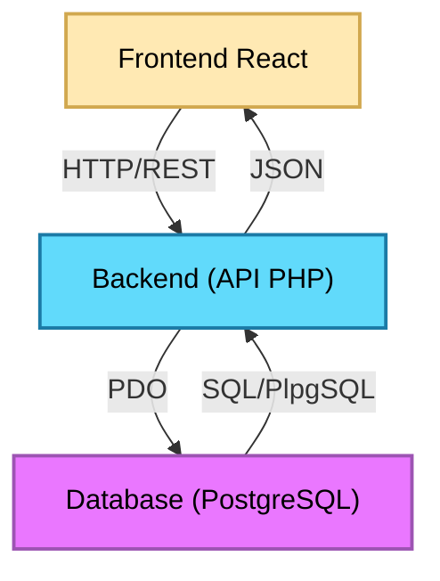
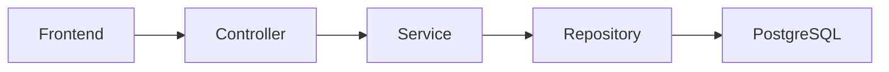

<link rel="stylesheet" href="./src/style.css">
<link rel="stylesheet" href="./src/hljs.css">

<script src="./src/mermaid.min.js"></script> + rm styles

<header class="sticky-header">
    <span class="header-title">Rapport SAÉ 4.01 - Qualité</span>
    
</header>

<div class="false-body">

<div class="cover-page">
    <h1>Rapport SAÉ 4.01 - Qualité</h1>
    <a href="https://github.com/ElPotatoCorp/UnlockIt" target="_blank">
        
    </a>
    <div class="cover-authors">
        <div class="info-line">Mars – Juin 2026</div>
        <div class="info-line authors">
            <a href="https://github.com/Frozen1753" target="_blank">Frozen1753</a>
            <span>&</span>
            <a href="https://github.com/ElPotatoCorp" target="_blank">ElPotato</a>
        </div>
        <div class="info-line">BUT Informatique</div>
</div>

</div>

<div class="page-break"></div>

# Sommaire

<div class="toc">

<ul>
    <li><a href="#1-introduction">1. Introduction</a></li>
    <li class="lvl2"><a href="#11-présentation-du-projet">1.1 Présentation du projet</a></li>
    <li class="lvl2"><a href="#12-objectifs-de-la-refonte">1.2 Objectifs de la refonte</a></li>
    <li><a href="#2-analyse-de-lancien-projet">2. Analyse de l'ancien projet</a></li>
    <li class="lvl2"><a href="#21-constats">2.1 Constats</a></li>
    <li class="lvl2"><a href="#22-avant--après-la-refonte">2.2 Avant / Après la refonte</a></li>
    <li><a href="#3-frontend">3. Frontend</a></li>
    <li class="lvl2"><a href="#31-refonte-de-larchitecture-react">3.1 Refonte de l'architecture React</a></li>
    <li class="lvl2"><a href="#32-référencement-et-indexation">3.2 Référencement et indexation</a></li>
    <li class="lvl2"><a href="#33-optimisation-des-performances">3.3 Optimisation des performances</a></li>
    <li class="lvl2"><a href="#34-refonte-graphique">3.4 Refonte graphique</a></li>
    <li class="lvl2"><a href="#35-pixijs">3.5 PixiJS</a></li>
    <li class="lvl2"><a href="#36-nouvelle-couche-api-frontend">3.6 Nouvelle couche API Frontend</a></li>
    <li class="lvl2"><a href="#37-tests-automatisés">3.7 Tests automatisés</a></li>
    <li class="lvl2"><a href="#38-difficultés-rencontrées-et-solutions">3.8 Difficultés rencontrées et solutions</a></li>
    <li><a href="#4-backend">4. Backend</a></li>
    <li class="lvl2"><a href="#41-migration-vers-nestjs">4.1 Migration vers NestJS</a></li>
    <li class="lvl2"><a href="#42-architecture-modulaire">4.2 Architecture modulaire</a></li>
    <li class="lvl2"><a href="#43-validation-et-sécurité">4.3 Validation et sécurité</a></li>
    <li class="lvl2"><a href="#44-maintenabilité">4.4 Maintenabilité</a></li>
    <li class="lvl2"><a href="#45-difficultés-rencontrées-et-solutions">4.5 Difficultés rencontrées et solutions</a></li>
    <li><a href="#5-conclusion">5. Conclusion</a></li>
    <li class="lvl2"><a href="#51-bilan">5.1 Bilan</a></li>
    <li class="lvl2"><a href="#52-perspectives">5.2 Perspectives</a></li>
</ul>

</div>

# 1. Introduction

## 1.1 Présentation du projet

UnlockIt est une plateforme web de distribution de jeux vidéo dématérialisés, s'inspirant des principales plateformes du marché telles que Steam, Instant Gaming ou Epic Games Store. Le projet a pour objectif de reproduire une partie de leurs fonctionnalités à travers une architecture full-stack moderne.

La première version du projet, durant la SAÉ 3.01, avait pour ambition de proposer une expérience complète autour de l'achat et de la gestion de jeux numériques. Les utilisateurs pouvaient consulter un catalogue de jeux, rechercher des produits, créer un compte, gérer leur panier d'achat, constituer une liste de souhaits et accéder à leur bibliothèque personnelle après l'achat.

L'objectif académique de cette première version était avant tout de nous confronter à la réalisation d'une application web de grande ampleur, nécessitant la conception d'un frontend moderne, d'une API backend ainsi que d'une base de données relationnelle relativement complexe. Ce projet nous a également permis d'expérimenter le travail en équipe, la gestion d'une architecture multi-couches et la mise en place de méthodologies de développement proches du monde professionnel.

<div class="card">


*Figure 1 – Capture de la page d'accueil de UnlockIt (SAÉ 3.01).*

</div>

D'un point de vue fonctionnel, UnlockIt (SAÉ 3.01) proposait déjà la majorité des fonctionnalités attendues pour une plateforme de distribution numérique :

* consultation du catalogue de jeux
* recherche et filtrage avancés
* authentification et gestion de compte
* système de panier et de wishlist
* historique d'achats
* récupération des clés d'activation
* système de commentaires et d'avis

Ces fonctionnalités ont permis de valider la faisabilité du projet et de produire une première version entièrement fonctionnelle.

<div class="card">


*Figure 2 – Exemple de la page détaillée d'un jeu sur UnlockIt (SAÉ 3.01).*

</div>

L'architecture technique de cette première version reposait sur une séparation classique entre trois couches :

* un frontend développé avec **React**, **TypeScript** et **Vite**
* un backend développé en **PHP** suivant une architecture inspirée du modèle MVC
* une base de données **PostgreSQL** exploitant de nombreuses fonctionnalités natives, notamment les fonctions stockées et les triggers.

<div class="card">

<div class="mermaid-center" style="text-align:center;">



</div>

*Figure 3 – Architecture simplifiée de UnlockIt (SAÉ 3.01).*

\* Si du code s'affiche à la place du schéma, rafraichissez la page.

</div>

Cette architecture nous a permis de développer rapidement un ensemble riche de fonctionnalités et de mieux appréhender les enjeux liés à la conception d’une application web complète. Toutefois, au fil de l’avancement du projet, plusieurs limites sont apparues. Le développement de nouvelles fonctionnalités devenait progressivement plus complexe, certains composants frontend mélangeaient logique métier et rendu visuel, et plusieurs parties du code manquaient d’homogénéité. L’absence d’outils d’analyse et de tests automatisés compliquait également la détection des régressions et l’optimisation des performances.

Bien que fonctionnelle et suffisamment robuste pour être présentée lors de la première soutenance, cette version s’apparentait davantage à un produit minimum viable (MVP) qu’à une base technique durable. Avec la montée en compétences de l’équipe, les parties les plus anciennes du code nous sont apparues comme insuffisamment structurées, parfois mal écrites, voire difficilement lisibles en comparaison des fonctionnalités plus récentes. Le projet tenait, mais ses fondations étaient fragiles. Pour envisager une évolution pérenne, une refonte devenait nécessaire.

Ces constats nous ont naturellement conduits à envisager une seconde itération du projet, non plus centrée sur l’ajout de fonctionnalités, mais sur une amélioration profonde de sa qualité technique et de son architecture.

## 1.2 Objectifs de la refonte

L'objectif de cette seconde itération n'était plus uniquement de développer de nouvelles fonctionnalités. Nous avons fait le choix d'entreprendre une **refonte complète** du projet en repartant de zéro afin de corriger les faiblesses identifiées lors du développement de la première version.

Cette nouvelle version, nommée **UnlockIt V2**, poursuit plusieurs objectifs :

* améliorer la qualité globale du code ;
* renforcer la maintenabilité de l'application ;
* améliorer les performances côté client ;
* faciliter les évolutions futures ;
* mettre en place de meilleures pratiques de développement ;
* introduire des outils de mesure, de tests et d'analyse ;
* moderniser l'architecture frontend et backend.

L'un des principaux axes de travail de cette refonte a été la volonté de construire une base technique plus propre et plus durable, capable de supporter de futures fonctionnalités sans nécessiter de nouvelles reconstructions majeures.

<div class="card">


*Figure 4 – Évolution globale du projet entre la première et la seconde version.*

</div>

Ainsi, UnlockIt V2 ne constitue pas simplement une nouvelle version du site, mais représente une véritable démarche d'amélioration continue visant à transformer un projet fonctionnel en une application plus professionnelle, plus performante et plus facilement maintenable.

# 2. Analyse de l'ancien projet

## 2.1 Constats

La première version du projet remplissait correctement son rôle fonctionnel. Néanmoins, son développement s'étant effectué de manière itérative, certaines décisions techniques prises en début de projet ne répondaient plus aux besoins apparus par la suite.

Les composants React contenaient parfois à la fois de la logique métier, des appels API et du rendu visuel. Cette situation compliquait la lecture du code et rendait les tests plus difficiles.

## 2.2 Avant / Après la refonte

<div class="before">

### Avant

<details class="accordion">
<summary>Voir plus d'informations</summary>

```tsx
const onSubmit = async (data: FormData) => {
    setErrorMessage(null);
    setStatus("idle");

    if (!isStrong) {
        setStatus("error");
        setErrorMessage("Le mot de passe ne respecte pas les critères de sécurité");
        return;
    }

    try {
        const payload: any = {
            username: data.username,
            password: data.password,
        };

        if (data.contactType === "email") {
            payload.email = data.email;
        } else {
            payload.phone_wzc = data.phone_wzc;
            payload.phone_number = data.phone_number;
        }

        const res = await fetch(`/api/auth/register`, {
            method: "POST",
            credentials: "include",
            headers: { "Content-Type": "application/json" },
            body: JSON.stringify(payload),
        });

        if (res.ok) {
            setStatus("success");
            reset();
            navigate('/');
            window.location.reload();
        } else if (res.status === 403) {
            throw new Error("Un utilisateur avec ces informations existe déjà");
        } else {
            throw new Error(payload.message || "Échec de l'inscription");
        }
    } catch (err: any) {
        setStatus("error");
        setErrorMessage(err.message || "Erreur d'inscription");
    }
};
```

L'architecture de la première version était principalement orientée vers la mise en place rapide des fonctionnalités.

</details>

</div>

<div class="after">

### Après

<details class="accordion">
<summary>Voir plus d'informations</summary>

```tsx
const onSubmit = async (data: FormData) => {
    try {
      await authRegister(data.username, data.email, data.password);

      navigate("/login");
    } catch (err: any) {
      setError("root", { message: err.message ?? "Erreur d'inscription." });
    }
};
```
```ts
import { api } from "../axios.instance";

export const authService = {
    {...}

    register: async (username: string, email: string, password: string) => {
        try {
            await api.post("/auth/register", { username, email, password });
        } catch (err: any) {
            const s = err.response?.status;

            if (s === 400) throw { message: "Données invalides." };
            if (s === 409) throw { message: "Email ou nom d'utilisateur déjà utilisé." };
            if (s === 429) throw { message: "Trop de tentatives. Réessayez plus tard." };
            throw { message: "Erreur serveur." };
        }
    }

    {...}
};
```

L'architecture actuelle privilégie la séparation des responsabilités, les performances et la maintenabilité.

</details>

</div>

# 3. Frontend

## 3.1 Refonte de l'architecture React

...

## 3.2 Référencement et indexation

### 3.2.1 React Helmet

Parmi les améliorations apportées, une attention particulière a été portée au référencement naturel. React Helmet a été utilisé afin de générer dynamiquement les balises meta de chaque page du site.

### 3.2.2 Robots.txt

Un fichier robots.txt a été ajouté afin de guider les robots d'indexation et d'améliorer la visibilité du projet.

### 3.2.3 Sitemap XML

La génération d'un sitemap.xml permet aux moteurs de recherche d'identifier rapidement les différentes pages disponibles.

## 3.3 Optimisation des performances

### 3.3.1 React Scan

React Scan a été utilisé afin d'identifier les composants effectuant des rendus inutiles.

### 3.3.2 Lighthouse

Lighthouse a permis de mesurer objectivement les performances, l'accessibilité et le référencement du site.

### 3.3.3 Firefox Profiler

Firefox Profiler a été utilisé pour analyser les temps d'exécution JavaScript et identifier les opérations coûteuses.

### 3.3.4 Lazy Loading et Suspense

L'utilisation de React.lazy et Suspense permet désormais de charger certaines pages uniquement lorsqu'elles sont nécessaires.

## 3.4 Refonte graphique

Une partie importante de la refonte a consisté à remplacer plusieurs ressources PNG par des équivalents SVG afin de réduire le poids des pages tout en améliorant la qualité visuelle.

## 3.5 PixiJS

Le système d'arrière-plan du site a été entièrement repensé grâce à PixiJS.

## 3.6 Nouvelle couche API Frontend

```mermaid
flowchart LR

    %% ========= Définition des styles =========
    classDef react fill:#61dafb,stroke:#1b7aa6,stroke-width:2px,color:#000;
    classDef hook fill:#b3e5ff,stroke:#4fa3d1,stroke-width:2px,color:#000;
    classDef service fill:#ffe9b3,stroke:#d1a84f,stroke-width:2px,color:#000;
    classDef backend fill:#ffb3b3,stroke:#d14f4f,stroke-width:2px,color:#000;
    classDef db fill:#c6ffb3,stroke:#4fd14f,stroke-width:2px,color:#000;
    classDef cache fill:#fff2b3,stroke:#d1c24f,stroke-width:2px,color:#000;
    classDef log fill:#d6b3ff,stroke:#7a4fd1,stroke-width:2px,color:#000;
    classDef external fill:#e0e0e0,stroke:#999,stroke-width:2px,color:#000;

    %% ========= Frontend =========
    subgraph FE[Frontend]
        A[Composant React]:::react
        B[Hook métier]:::hook
        C[Service API]:::service
    end

    %% ========= Backend =========
    subgraph BE[NestJS Backend]
        D[Controller]:::backend
        E[Service]:::backend
        F[Repository]:::backend
    end

    %% ========= Stockage =========
    G[(PostgreSQL)]:::db
    R[(Redis Cache)]:::cache

    %% ========= Logs =========
    L[Logger]:::log

    %% ========= Service externe =========
    X[Service Auth externe]:::external

    %% ========= Flux principal =========
    A e1@-->|Appel logique| B
    B e2@-->|Appel API| C
    C e3@-->|HTTP| D
    D e4@-->|Appel interne| E
    E e5@-->|Requête DB| F
    F e6@-->|SQL| G

    %% ========= Flux secondaires =========
    C e7@-->|Token| X
    E e8@-->|Cache| R
    E e9@-.->|Logs| L

    %% ========= Styles des courbes =========
    e1@{ curve: linear }
    e2@{ curve: linear }
    e3@{ curve: stepBefore }
    e4@{ curve: stepBefore }
    e5@{ curve: linear }
    e6@{ curve: linear }
    e7@{ curve: natural }
    e8@{ curve: stepAfter }
    e9@{ curve: natural }

    %% ========= Styles des liens =========
    linkStyle 0 stroke:#1b7aa6,stroke-width:2px
    linkStyle 1 stroke:#4fa3d1,stroke-width:2px
    linkStyle 2 stroke:#d1a84f,stroke-width:2px
    linkStyle 3 stroke:#d14f4f,stroke-width:2px
    linkStyle 4 stroke:#d14f4f,stroke-width:2px
    linkStyle 5 stroke:#4fd14f,stroke-width:2px
    linkStyle 6 stroke:#999,stroke-width:2px
    linkStyle 7 stroke:#d1c24f,stroke-width:2px
    linkStyle 8 stroke:#7a4fd1,stroke-width:2px,stroke-dasharray:4 4
```

<details class="accordion">
<summary>Voir le schéma</summary>


\* Si seul le code du schéma s'affiche, rafraichissez la page pour voir le schéma. 

</details>

Les composants ne réalisent désormais plus directement leurs appels réseau.

## 3.7 Tests automatisés

Playwright a été intégré afin de mettre en place des tests unitaires et des scénarios End-to-End couvrant les fonctionnalités essentielles.

## 3.8 Difficultés rencontrées et solutions

Détailler ici les problèmes rencontrés durant la refonte React.

# 4. Backend

## 4.1 Migration vers NestJS

...

## 4.2 Architecture modulaire



## 4.3 Validation et sécurité

...

## 4.4 Maintenabilité

...

## 4.5 Difficultés rencontrées et solutions

...

# 5. Conclusion

## 5.1 Bilan

...

## 5.2 Perspectives

...

---

# Table des matières détaillée

(reprise automatique de toutes les sections du rapport)

</div>