<link rel="stylesheet" href="./src/style.css">
<link rel="stylesheet" href="./src/hljs.css">

<script src="./src/mermaid.min.js"></script> + rm 2nd styles + pseudo ref name

<header class="sticky-header">
    <span class="header-title">Rapport SAÉ 4.01 - Qualité</span>
    
</header>

<div class="false-body">

<div class="cover-page">
    <h1>Rapport SAÉ 4.01 - Qualité</h1>
    <div>
        <a href="https://github.com/ElPotatoCorp/UnlockIt" target="_blank">
            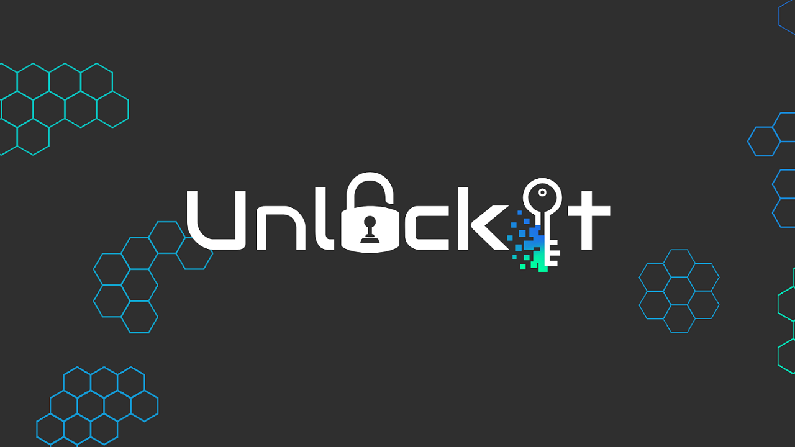
        </a>
    </div>
    <div class="cover-authors">
        <div class="info-line">Mars – Juin 2026</div>
        <div class="info-line authors">
            <a href="https://github.com/Frozen1753" target="_blank">Frozen1753</a>
            <span>&</span>
            <a href="https://github.com/ElPotatoCorp" target="_blank">ElPotato</a>
        </div>
        <div class="info-line">BUT Informatique</div>
</div>

</div>

<div class="page-break"></div>

# Sommaire

<div class="toc">

<ul>
    <li><a href="#1-introduction">1. Introduction</a></li>
    <li class="lvl2"><a href="#11-présentation-du-projet">1.1 Présentation du projet</a></li>
    <li class="lvl2"><a href="#12-présentation-des-membres">1.2 Présentation des membres</a></li>
    <li class="lvl2"><a href="#13-pourquoi-une-refonte-complète-">1.3 Pourquoi une refonte complète ?</a></li>
    <li class="lvl2"><a href="#14-avertissements-et-déclarations">1.4 Avertissements et déclarations</a></li>
    <li><a href="#2-frontend">2. Frontend</a></li>
    <li class="lvl2"><a href="#21-refonte-de-larchitecture-react">2.1 Refonte de l'architecture React</a></li>
    <li class="lvl2"><a href="#22-référencement-et-indexation">2.2 Référencement et indexation</a></li>
    <li class="lvl2"><a href="#23-optimisation-des-performances">2.3 Optimisation des performances</a></li>
    <li class="lvl2"><a href="#24-nouvelle-couche-api-frontend">2.4 Nouvelle couche API Frontend</a></li>
    <li class="lvl2"><a href="#25-tests-automatisés">2.5 Tests automatisés</a></li>
    <li class="lvl2"><a href="#26-build-et-compression">2.6 Build et compression</a></li>
    <li class="lvl2"><a href="#27-difficultés-rencontrées-et-solutions">2.7 Difficultés rencontrées et solutions</a></li>
    <li><a href="#3-backend">3. Backend</a></li>
    <li class="lvl2"><a href="#31-migration-vers-nestjs">3.1 Migration vers NestJS</a></li>
    <li class="lvl2"><a href="#32-architecture-modulaire">3.2 Architecture modulaire</a></li>
    <li class="lvl2"><a href="#33-validation-et-sécurité">3.3 Validation et sécurité</a></li>
    <li class="lvl2"><a href="#34-maintenabilité">3.4 Maintenabilité</a></li>
    <li class="lvl2"><a href="#35-difficultés-rencontrées-et-solutions">3.5 Difficultés rencontrées et solutions</a></li>
    <li><a href="#4-conclusion">4. Conclusion</a></li>
    <li class="lvl2"><a href="#41-bilan">4.1 Bilan</a></li>
    <li class="lvl2"><a href="#42-perspectives">4.2 Perspectives</a></li>
</ul>

</div>

# 1. Introduction

## 1.1 Présentation du projet

UnlockIt est une plateforme web de distribution de jeux vidéo dématérialisés, s'inspirant des principales plateformes du marché telles que Steam, Instant Gaming ou Epic Games Store. Le projet a pour objectif de reproduire une partie de leurs fonctionnalités à travers une architecture full-stack moderne.

La première version du projet, durant la SAÉ 3.01, avait pour ambition de proposer une expérience complète autour de l'achat et de la gestion de jeux numériques. Les utilisateurs pouvaient consulter un catalogue de jeux, rechercher des produits, créer un compte, gérer leur panier d'achat, constituer une liste de souhaits et accéder à leur bibliothèque personnelle après l'achat.

L'objectif académique de cette première version était avant tout de nous confronter à la réalisation d'une application web de grande ampleur, nécessitant la conception d'un frontend moderne, d'une API backend ainsi que d'une base de données relationnelle relativement complexe. Ce projet nous a également permis d'expérimenter le travail en équipe, la gestion d'une architecture multi-couches et la mise en place de méthodologies de développement proches du monde professionnel.

<div class="card">

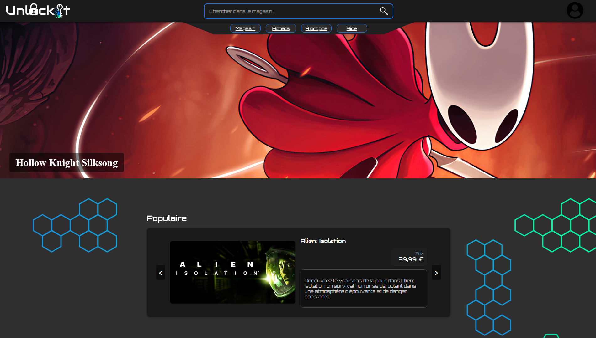

*Figure 1 – Capture de la page d'accueil de UnlockIt (SAÉ 3.01).*

</div>

D'un point de vue fonctionnel, UnlockIt (SAÉ 3.01) proposait déjà la majorité des fonctionnalités attendues pour une plateforme de distribution numérique :

* consultation du catalogue de jeux
* recherche et filtrage avancés
* authentification et gestion de compte
* système de panier et de wishlist
* historique d'achats
* récupération des clés d'activation
* système de commentaires et d'avis

Ces fonctionnalités ont permis de valider la faisabilité du projet et de produire une première version entièrement fonctionnelle.

<div class="card">

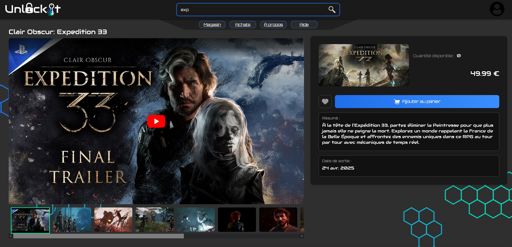

*Figure 2 – Exemple de la page détaillée d'un jeu sur UnlockIt (SAÉ 3.01).*

</div>

L'architecture technique de cette première version reposait sur une séparation classique entre trois couches :

* un frontend développé avec **React**, **TypeScript** et **Vite**
* un backend développé en **PHP** suivant une architecture inspirée du modèle MVC
* une base de données **PostgreSQL** exploitant de nombreuses fonctionnalités natives, notamment les fonctions stockées et les triggers.

<div class="card">

<div class="mermaid-center" style="text-align:center;">

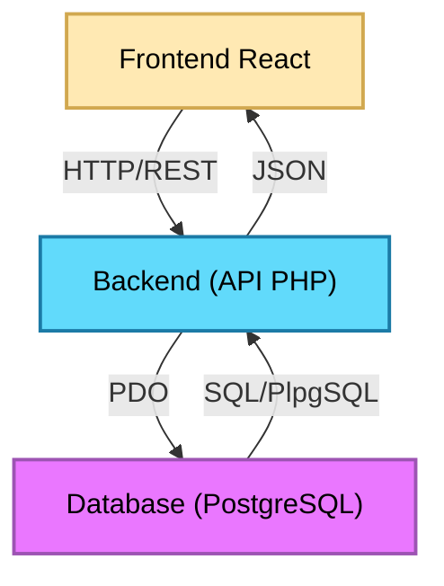

</div>

*Figure 3 – Architecture simplifiée de UnlockIt (SAÉ 3.01).*

\* Si du code s'affiche à la place du schéma, rafraichissez la page.

</div>

Cette architecture nous a permis de développer rapidement un ensemble riche de fonctionnalités et de mieux appréhender les enjeux liés à la conception d’une application web complète. Toutefois, au fil de l’avancement du projet, plusieurs limites sont apparues. Le développement de nouvelles fonctionnalités devenait progressivement plus complexe, certains composants frontend mélangeaient logique métier et rendu visuel, et plusieurs parties du code manquaient d’homogénéité. L’absence d’outils d’analyse et de tests automatisés compliquait également la détection des régressions et l’optimisation des performances.

Bien que fonctionnelle et suffisamment robuste pour être présentée lors de la première soutenance, cette version s’apparentait davantage à un produit minimum viable (MVP) qu’à une base technique durable. Avec la montée en compétences de l’équipe, les parties les plus anciennes du code nous sont apparues comme insuffisamment structurées, parfois mal écrites, voire difficilement lisibles en comparaison des fonctionnalités plus récentes. Le projet tenait, mais ses fondations étaient fragiles. Pour envisager une évolution pérenne, une refonte devenait nécessaire.

Ces constats nous ont naturellement conduits à envisager une seconde itération du projet, non plus centrée sur l’ajout de fonctionnalités, mais sur une amélioration profonde de sa qualité technique et de son architecture.

## 1.2 Présentation des membres

### 1.2.1 Organisation

Notre équipe était composée de deux membres, chacun avec un domaine principal : le frontend pour l’un, le backend pour l’autre. Malgré cette répartition naturelle, notre manière de travailler n’a jamais été cloisonnée. Nous échangions en permanence sur nos avancées, nos idées, nos essais et nos ajustements, et chaque décision importante était discutée ensemble, même lorsqu’elle concernait un domaine attribué à l’autre. Cette communication continue nous a permis de conserver une vision commune du projet et d’assurer une cohérence globale entre toutes ses couches, du design de l’interface jusqu’à la structure de la base de données.

Pour organiser notre travail, nous nous appuyions sur trois outils complémentaires : Git pour le versionnement, Trello pour le suivi des tâches et Discord pour la communication quotidienne. Notre workflow Git était volontairement simple : nous ne travaillions pas avec des branches séparées, car nos fichiers ne se chevauchaient pas et les types étaient centralisés dans un module partagé compilé automatiquement. Cette approche, combinée à une communication fluide, nous a permis d’éviter les conflits et de maintenir un rythme de développement efficace. Nous nous synchronisions régulièrement sur l’avancement des fonctionnalités, en nous attendant mutuellement lorsque l’un avait besoin d’un ajustement côté front ou d’une nouvelle route côté back.

Lors des périodes de télétravail, nous travaillions dans le même salon vocal Discord, ce qui recréait une véritable proximité malgré la distance. Nous développions en direct, partagions nos écrans lorsque nécessaire et prenions même nos pauses ensemble. Cette dynamique a rendu le travail plus agréable et a renforcé notre coordination. Elle a également permis de résoudre rapidement les problèmes, d’ajuster les fonctionnalités au fur et à mesure et de maintenir une cohésion forte tout au long du projet.

### 1.2.2 Les membres

<div class="card">

<a href="https://github.com/Frozen1753" target="_blank">
    <h3>Frozen1753</h3>
</a>

**Compétences techniques**

- **Développement & Programmation :** Java • C • C++ • C# • Bash • Python
- **Développement Web :** JavaScript • TypeScript • React • Vite • Playwright • PHP • NestJS • TypeORM
- **Design & Interfaces :**  XAML • HTML • CSS • Figma
- **Bases de données :**  SQL • PostgreSQL
- **Réseaux & Systèmes :** TCP/IP • Cisco Packet Tracer • Windows • Linux
- **Outils & Environnements :** Visual Studio • IntelliJ • Git • GitHub • PowerBI • PhpMyAdmin • MySQL • Workbench • Docker

**Formation**  
Étudiant en 2ᵉ année de BUT Informatique (formation initiale)

**Rôles dans le projet**  
Frontend • UX/UI Design • Design graphique • Optimisation • Testing

</div>

<div class="card">

<a href="https://github.com/ElPotatoCorp" target="_blank">
    <h3>ElPotato</h3>
</a>

**Compétences techniques**

- **Développement & Programmation :** Rust • C • C++ • C# • Bash • Python
- **Développement Web :** JavaScript • TypeScript • React • PHP • Swagger • Vite • NestJS • TypeORM
- **Design & Interfaces :** XAML • XML • HTML • CSS
- **Bases de données :** SQL • PostgreSQL
- **Réseaux & Systèmes :** TCP/IP • Cisco Packet Tracer • Windows • Linux
- **Outils & Environnements :** Visual Studio • IntelliJ • Git • GitHub • PowerBI • PhpMyAdmin • MySQL • Workbench • Docker

**Formation**  
Étudiant en 2ᵉ année de BUT Informatique (formation initiale)

**Rôles dans le projet**  
Backend • Base de données • Documentation • Optimisation • Scripts

</div>

## 1.3 Pourquoi une refonte complète ?

À l'issue de la SAÉ 3.01, nous disposions d'une application fonctionnelle répondant à la majorité des objectifs initiaux. Malgré ce résultat satisfaisant, nous avions pleinement conscience des limites de notre implémentation. Une grande partie de l'architecture avait été construite progressivement, au fur et à mesure de l'ajout de nouvelles fonctionnalités et de notre montée en compétences durant le projet.

Avec le recul, certaines décisions techniques prises au début du développement ne correspondaient plus à nos besoins actuels. Plusieurs composants étaient devenus trop volumineux, certaines responsabilités étaient mal réparties et une partie du code était devenue difficile à maintenir. Ajouter une nouvelle fonctionnalité nécessitait parfois de modifier plusieurs zones de l'application, augmentant le risque d'introduire des régressions.

De plus, la première version du projet avait été développée avec un objectif principalement fonctionnel : produire une application complète dans le temps imparti. Des aspects plus avancés tels que l'optimisation des performances, le référencement, les tests automatisés, l'analyse des rendus React ou encore la mise en place d'une architecture frontend et backend plus moderne avaient volontairement été laissés de côté.

La SAÉ 4.01 nous a offert l'opportunité de revenir sur ce projet avec un regard plus critique et davantage d'expérience. Plutôt que d'ajouter de nouvelles fonctionnalités sur des fondations que nous jugions désormais fragiles, nous avons fait le choix de repartir de zéro.

Cette décision peut sembler radicale, mais elle nous a permis de repenser entièrement l'application :

* en adoptant une architecture plus propre et plus maintenable
* en améliorant les performances globales du site
* en modernisant les outils utilisés
* en introduisant des pratiques de développement plus professionnelles
* en préparant le projet à de futures évolutions

L'objectif de cette seconde version n'était donc pas simplement de produire un « UnlockIt plus complet », mais de transformer un premier prototype fonctionnel en une base technique plus robuste, plus cohérente et davantage orientée vers la qualité logicielle.

## 1.4 Avertissements et déclarations

### **1.4.1 Utilisation de l’intelligence artificielle**

L’intelligence artificielle n’a été utilisée dans ce projet qu’à des fins ponctuelles et strictement encadrées. Elle a servi principalement à automatiser certaines tâches répétitives, à reformuler ou clarifier certains passages, et surtout à répondre à des questions techniques précises lorsque cela permettait d’éviter de longues recherches documentaires. Les sollicitations de l’IA portaient essentiellement sur des interrogations ciblées du type : « Existe‑t‑il une manière plus propre de faire X en Y ? » ou « Comment aborder tel problème sans passer par telle solution ? ». Dès lors qu’une réponse pouvait être trouvée rapidement dans la documentation officielle, nous privilégions systématiquement cette voie plutôt que l’IA.

Toutes les suggestions générées ont été systématiquement vérifiées, corrigées ou réécrites par les membres de l’équipe, et aucune partie du code métier, des algorithmes ou des décisions techniques n’a été produite automatiquement sans supervision humaine. Toute erreur restante sera donc authentiquement humaine, probablement due à notre maladresse ou à notre incompétence personnelle.

### **1.4.2 Images, médias et éléments graphiques**

L’ensemble des éléments visuels présents dans le projet : images, icônes, illustrations, SVG, animations ou compositions graphiques; a été soit réalisé manuellement, soit récupéré depuis des plateformes proposant des licences autorisant explicitement leur utilisation. Aucun média n’a été intégré sans vérification préalable de ses droits d’usage. Les ressources graphiques externes ont été sélectionnées avec soin afin de respecter les contraintes légales et d’assurer une cohérence esthétique avec l’identité visuelle du projet.

### **1.4.3 Ressources externes et données utilisées**

Toutes les données exploitées dans l’application proviennent de sources publiques ou ouvertes. Les informations relatives aux jeux vidéo, par exemple, ont été récupérées via l’API officielle de Steam, qui met ces données à disposition de manière publique. Elles ont ensuite été retraitées, filtrées et enrichies pour améliorer leur qualité et leur pertinence, ce qui explique leur quantité réduite par rapport à la version précédente du projet. De la même manière, les bibliothèques logicielles utilisées dans le code sont exclusivement des solutions publiques, open‑source ou librement accessibles, sélectionnées pour leur fiabilité et leur compatibilité avec les besoins du projet.

# 2. Frontend

## 2.1 Refonte de l'architecture React

### 2.1.1 Le problème

L’un des objectifs majeurs de cette seconde version d’UnlockIt a été d’améliorer et de clarifier l’architecture du frontend. La première version reposait déjà sur une base solide : une structure modulaire, organisée autour de composants réutilisables, de pages fonctionnelles et de dossiers bien séparés. Cette organisation était tout à fait exploitable et scalable, mais elle montrait ses limites à mesure que le projet grandissait.

Le principal défi ne venait donc pas d’un manque de modularité, mais plutôt de la **classification des composants et des fichiers**. Il devenait parfois difficile de déterminer où placer un nouvel élément :  
- un composant était‑il propre au projet ou suffisamment générique pour être réutilisable ailleurs ?  
- un hook relevait‑il de la logique métier, d’un helper ou d’un validateur ?  
- où ranger les refactors liés à l’API sans mélanger logique et présentation ?  
- comment éviter que certains dossiers deviennent des “fourre‑tout” au fil du temps ?  

Ces zones grises entraînaient des hésitations, des réorganisations ponctuelles et une perte de cohérence dans la structure globale.

La refonte n’a donc pas consisté à repartir de zéro, mais à rendre l’architecture plus explicite, plus cohérente et plus prévisible. Plusieurs dossiers ont été introduits ou repensés pour clarifier les responsabilités et éviter les ambiguïtés :

- <code class="c">layout/</code> regroupe désormais tous les composants qui encadrent ou se superposent aux pages (header, footer, background, panneau de debug, etc.). Le layout est ensuite appliqué globalement dans <code class="c">App.tsx</code>, ce qui simplifie la structure des pages.  
- <code class="c">common/</code> accueille les composants génériques et réutilisables indépendamment du projet : systèmes de skeleton, modals, alertes, providers, etc. Ce sont des briques transversales que l’on pourrait réutiliser dans d’autres applications.  
- <code class="c">api/</code> centralise toute la logique liée aux appels API : hooks dédiés, services, stores Zustand, types, mocks, et l’instance Axios. Les composants n’ont plus aucune logique API : ils se contentent d’appeler un hook métier.  
- <code class="c">utils/</code> regroupe tous les refactors logiques qui ne relèvent pas de l’API : formatteurs, validateurs, helpers, hooks transversaux, stores globaux (langue, thème, etc.).  
- <code class="c">public/media/</code> remplace l’ancien dossier <code class="c">images/</code>, qui servait parfois de fourre‑tout. Les médias sont désormais classés par type (images, vidéos, icônes, etc.), ce qui améliore la lisibilité et la maintenance.

L’objectif global était de **lever les ambiguïtés**, d’améliorer la lisibilité et de rendre l’architecture plus intuitive pour toute l’équipe. Cette nouvelle organisation facilite aujourd’hui l’intégration de nouvelles fonctionnalités, limite les risques de confusion et renforce la cohérence du projet sur le long terme.

### 2.1.2 Nouvelle architecture 

<div class="before">

<h3>Avant</h3>

<details class="accordion">
<summary>Voir plus d'informations</summary>

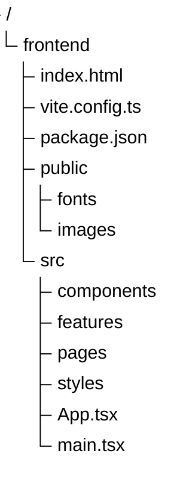

Les composants pouvaient ressembler à ceci :

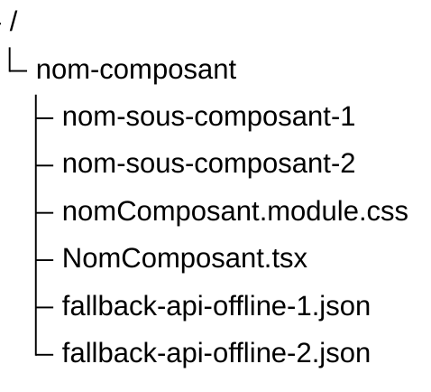


</details>

</div>

<div class="after">

<h3>Après</h3>

<details class="accordion">
<summary>Voir plus d'informations</summary>


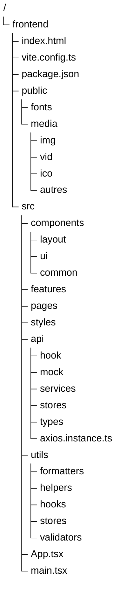

La structure d'un composant n'a pas réellement changé, sauf que cette fois ci, il n'y a pas de fallback locaux car tout marche bien :

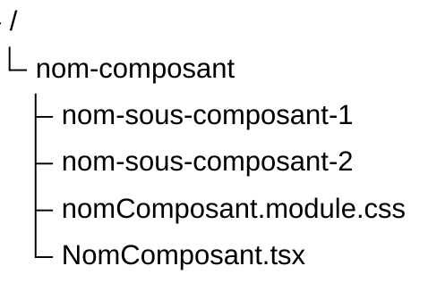

</details>

</div>

## 2.2 Référencement et indexation

### 2.2.1 React Helmet

Lors du développement de la première version de UnlockIt, très peu d’attention avait été portée aux problématiques de référencement naturel. Comme dans la plupart des applications React, l’architecture reposait sur le principe d’une **Single Page Application (SPA)** : un unique fichier <code class="c">index.html</code> sert de point d’entrée, puis React prend le relais pour générer et mettre à jour l’interface.

Le fonctionnement suit une chaîne simple :

- **index.html :** contient uniquement la structure minimale et un conteneur <code class="c">\<div id="root"\></code>.
- **main.tsx :** monte l’application React dans <code class="c">#root</code>.
- **App.tsx :** constitue le composant racine et gère le routage.
- **Composants :** chaque page ou section du site est rendue dynamiquement à l’intérieur de <code class="c">App</code>.

Dans ce modèle, changer de page ne provoque pas le chargement d'un nouveau document HTML. Seul le contenu affiché à l'écran est modifié par JavaScript, ce qui empêche naturellement chaque page de disposer de ses propres métadonnées.

<details class="accordion">
<summary>Exemple de SPA React</summary>

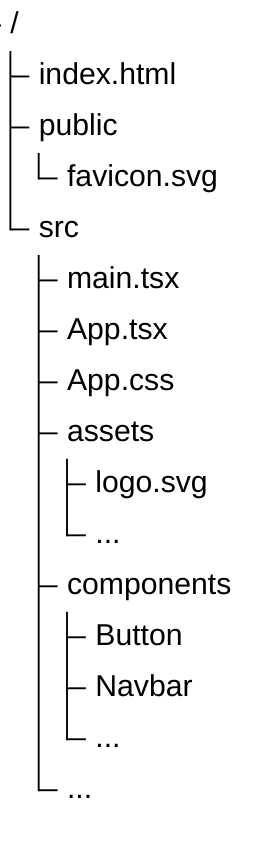

```html
<!-- index.html -->
<!doctype html>
<html lang="en">
  <head>
    ...
  </head>
  <body>
    <div id="root"></div>
    <script type="module" src="/src/main.tsx"></script>
  </body>
</html>
```

```tsx
// main.tsx
createRoot(document.getElementById('root')!).render(
  <StrictMode>
    <App />
  </StrictMode>,
)
```

```tsx
// App.tsx
export default function App() {
  return (
      <BrowserRouter>
        <Routes>
          <Route element={<Layout />}>
            <Route index element={<Home />}/>
            <Route ... />
            <Route path="*" element={<NotFound />} />
          </Route>
        </Routes>
      </BrowserRouter>
  );
}
```

</details>

En nous intéressant davantage au fonctionnement des moteurs de recherche et aux recommandations fournies par Lighthouse, nous avons constaté que l'absence de métadonnées adaptées à chaque page pénalisait le référencement du site ainsi que le partage de son contenu sur les réseaux sociaux.

Pour répondre à cette problématique, nous avons intégré la bibliothèque **React Helmet Async**, qui permet de modifier dynamiquement le contenu de l'élément <code class="c">\<head\></code> en fonction de la page actuellement affichée.

Plutôt que de dupliquer les mêmes balises dans chaque composant, nous avons créé un composant réutilisable nommé <code class="c">UnlockItHelmet</code>, appliquant le principe DRY (Don't Repeat Yourself).  Celui-ci centralise la gestion :

* du titre de la page ;
* de la description ;
* des balises <code class="c">OpenGraph</code> ;
* des métadonnées Twitter ;
* de l'URL canonique ;
* des consignes d'indexation.

```tsx
<UnlockItHelmet
    title="Accueil"
    path="/"
/>
```

À partir de cette simple déclaration, le composant génère automatiquement l'ensemble des métadonnées nécessaires.

<details class="accordion">
<summary>Résultats</summary>

```html
<head>
    <...>
    <title>UnlockIt – Accueil</title>
    <meta name="description" content="UnlockIt : achetez vos jeux PC moins cher. Clés Steam, Origin et Uplay livrées instantanément au meilleur prix.">
    <meta name="robots" content="index, follow">
    <meta property="og:title" content="UnlockIt – Accueil">
    <meta ...>
    <meta name="twitter:card" content="summary_large_image">
    <meta ...>
    <link rel="canonical" href="https://unlock-it.com/">
    <...>
</head>
```

</details>

L'approche devient encore plus intéressante pour les pages dynamiques. Une recherche sur le terme <code class="c">test</code> génère automatiquement un titre et une description adaptés au contenu affiché.

```tsx
<UnlockItHelmet
    title={`Recherche : ${term}`}
    description={`Résultats de recherche pour "${term}"`}
    path={`/search/${term}`}
/>
```

<details class="accordion">
<summary>Résultats</summary>

```html
<head>
    <...>
    <title>UnlockIt – Recherche : test</title>
    <meta name="description" content="Résultats de recherche pour &quot;test&quot; sur UnlockIt. Trouvez vos jeux PC au meilleur prix.">
    <meta name="robots" content="index, follow">
    <meta property="og:title" content="UnlockIt – Recherche : test">
    <meta ...>
    <meta name="twitter:card" content="summary_large_image">
    <meta ...>
    <link rel="canonical" href="https://unlock-it.com/search/test">
    <...>
</head>
```

</details>

Cette amélioration, relativement simple à mettre en œuvre, rapproche davantage UnlockIt du fonctionnement d'un véritable site de production. Elle améliore les scores de référencement fournis par Lighthouse, facilite l'indexation par les moteurs de recherche et permet également un meilleur rendu lors du partage des pages sur les réseaux sociaux.

Au-delà de l'aspect technique, cette démarche nous a permis de mieux comprendre le fonctionnement du web moderne et de découvrir des problématiques que nous n'avions encore jamais abordées dans le cadre des précédentes SAÉ.

---

### 2.2.2 Robots.txt

Lors des différents audits réalisés avec Lighthouse, nous avons découvert plusieurs recommandations liées au référencement naturel et à l'indexation du site. Parmi celles-ci figurait la présence d'un fichier <code class="c">robots.txt</code>, mécanisme que nous ne connaissions pas avant cette refonte.

En nous documentant davantage, notamment à l'aide de la documentation officielle et de l'intelligence artificielle, nous avons découvert qu'il s'agissait d'un fichier standard du Web permettant de communiquer certaines informations aux robots d'exploration des moteurs de recherche.

Encore une fois, même si UnlockIt reste un projet académique et n’a pas vocation à être réellement indexé (surtout avec le marché actuel et des géants comme Steam ou Instant Gaming… on ne ferait pas long feu), nous avons tout de même souhaité reproduire le fonctionnement d’une application de production en mettant en place ce fichier.

Le fichier <code class="c">robots.txt</code> est placé dans le dossier <code class="c">public</code> afin d'être directement accessible à l'adresse :

<a>https://unlock-it.com/robots.txt</a>

Son contenu a été enrichi afin de refléter les bonnes pratiques d’un site e‑commerce moderne :

```txt
User-agent: *
Allow: /

Disallow: /settings
Disallow: /login
Disallow: /register
Disallow: /purchases
Disallow: /purchases/
Disallow: /purchases/*
Disallow: /wishlist

Sitemap: https://unlock-it.com/sitemap.xml
```

Ce fichier indique que l'ensemble du site peut être exploré, à l’exception des pages sensibles.
Nous avons choisi de bloquer explicitement :

* <code class="c">/login</code>, <code class="c">/register</code> et <code class="c">/settings</code> : pages strictement personnelles, sans intérêt SEO.
* <code class="c">/wishlist</code> : page liée au compte utilisateur, non destinée à être publique.
* <code class="c">/purchases</code> et <code class="c">/purchases/:id</code> : pages critiques contenant l’historique d’achat et les clés de jeux.

Même si ces pages sont protégées côté serveur, les exposer aux robots pourrait révéler des identifiants sensibles ou provoquer une indexation accidentelle, ce qui serait contraire aux bonnes pratiques de sécurité et de confidentialité.

Ainsi, le fichier robots.txt contribue à protéger les zones privées du site tout en guidant correctement les moteurs de recherche vers les pages réellement destinées à être explorées.

<details class="accordion">
<summary>Pourquoi le placer dans public ?</summary>

Le dossier <code class="c">public</code> de Vite contient les ressources statiques qui doivent être servies directement par le serveur sans être traitées par le bundler. Les fichiers <code class="c">robots.txt</code>, <code class="c">sitemap.xml</code> ou encore <code class="c">favicon.ico</code> sont donc naturellement placés dans ce répertoire afin d'être accessibles depuis la racine du site.

```
public/
├── favicon.ico
├── robots.txt
└── sitemap.xml
```

</details>

L'ajout de ce fichier participe à rendre le projet plus conforme aux standards actuels du Web et nous a permis de mieux comprendre le fonctionnement de l'exploration et de l'indexation des sites internet.

Le fichier <code class="c">robots.txt</code> ne garantit pas qu'une page sera indexée ou non par un moteur de recherche. Il constitue uniquement une convention permettant de donner des indications aux robots d'exploration.

---

### 2.2.3 Sitemap XML

Si le fichier <code class="c">robots.txt</code> indique aux robots d'exploration où trouver certaines informations, le fichier <code class="c">sitemap.xml</code> leur fournit quant à lui la liste des pages disponibles sur le site ainsi que certaines informations complémentaires concernant leur importance et leur fréquence de mise à jour.

<details class="accordion">
<summary>Grosso modo</summary>

> <code class="c">robots.txt</code> dit aux robots "où regarder".
>
> <code class="c">sitemap.xml</code> dit aux robots "quelles pages existent".

</details>

Lors de nos recherches sur le référencement naturel et après plusieurs audits réalisés avec Lighthouse, nous avons découvert qu'il était courant pour les sites de production de mettre à disposition un sitemap afin de faciliter leur indexation.

Nous avons donc décidé d'ajouter un fichier <code class="c">sitemap.xml</code> à la racine du projet, également placé dans le dossier <code class="c">public</code> afin qu'il soit accessible à l'adresse :

<a>https://unlock-it.com/sitemap.xml</a>

Le sitemap contient les principales pages publiques du site, accompagnées de plusieurs informations :

* <code class="c">loc</code> : l'adresse de la page ;
* <code class="c">changefreq</code> : la fréquence estimée des modifications ;
* <code class="c">priority</code> : l'importance relative de la page au sein du site.

L'extrait suivant présente quelques entrées du fichier :

```xml
<?xml version="1.0" encoding="UTF-8"?>
<urlset xmlns="http://www.sitemaps.org/schemas/sitemap/0.9">

  <url>
    <loc>https://unlock-it.com/</loc>
    <changefreq>weekly</changefreq>
    <priority>0.9</priority>
  </url>

  <url>
    <loc>https://unlock-it.com/search</loc>
    <changefreq>weekly</changefreq>
    <priority>0.5</priority>
  </url>

  ...

  <url>
    <loc>https://unlock-it.com/privacy</loc>
    <changefreq>yearly</changefreq>
    <priority>0.2</priority>
  </url>

  <url>
    <loc>https://unlock-it.com/login</loc>
    <changefreq>yearly</changefreq>
    <priority>0.1</priority>
  </url>

  ...

</urlset>
```

Concernant les pages dynamiques, même si UnlockIt (SAÉ 4.01) ne comporte actuellement qu’une soixantaine de jeux issus de l’API Steam, l’application a été pensée pour évoluer. Dans un contexte réel, un site de vente de licences pourrait facilement proposer **plusieurs milliers de jeux**, chacun accessible via une URL de type : <code class="c">/games/:slug</code>

Dans ce cas, il serait évidemment **impossible et totalement irréaliste** de maintenir manuellement une entrée dans le sitemap pour chaque jeu.  
C’est d’ailleurs pour cette raison que les sites e‑commerce professionnels (Steam, Instant Gaming, Eneba, Amazon…) génèrent leurs sitemaps automatiquement, à l’aide d’un script.

Un tel script peut être exécuté :

* à partir de la base de données (pour lister tous les jeux disponibles)
* à chaque déploiement
* ou encore une fois par jour, afin de refléter les ajouts ou suppressions de produits

Cette approche garantit que le sitemap reste toujours à jour, sans intervention manuelle, même lorsque le catalogue atteint plusieurs milliers d’entrées.  
Le sitemap actuel d’UnlockIt ne contient donc que les pages statiques et publiques, mais sa structure a été pensée pour être compatible avec une génération dynamique future, comme cela se ferait dans un environnement de production.

Cette réflexion autour du sitemap nous a permis de mieux comprendre les mécanismes d’indexation modernes et de découvrir un aspect du développement web que nous n’avions encore jamais abordé au cours des précédentes SAÉ.  
Au‑delà de son utilité immédiate, cette fonctionnalité a constitué un excellent exercice pour adopter une démarche plus professionnelle et se rapprocher du fonctionnement réel d’une application web en production.

## 2.3 Optimisation des performances

L’optimisation des performances a constitué l’un des principaux axes de travail de cette nouvelle version de l’application. Lors du développement de la SAÉ 3.01, notre démarche reposait essentiellement sur une évaluation subjective : tant que l’interface semblait fluide et réactive, nous considérions que les performances étaient satisfaisantes. Avec davantage d’expérience, nous avons compris que cette approche était insuffisante. Une application peut en effet paraître rapide tout en exécutant des traitements inutiles, en chargeant des ressources superflues ou en déclenchant des rendus React non nécessaires.

Afin d’adopter une démarche plus rigoureuse et professionnelle, nous avons choisi de mesurer avant d’optimiser. Nous avons ainsi intégré plusieurs outils de profilage, d’audit et d’analyse permettant d’identifier objectivement les points de ralentissement, de comprendre leur origine et de valider l’impact réel des optimisations apportées. Cette approche nous a également permis de mieux appréhender le fonctionnement interne de React, du moteur JavaScript et du navigateur, révélant des problématiques que l’on ne perçoit pas sans instrumentation adaptée.

Les outils utilisés couvrent différents aspects de la performance : certains se concentrent sur le rendu React, d’autres analysent le comportement global du navigateur, tandis que des outils comme Lighthouse évaluent la qualité générale de l’application (accessibilité, bonnes pratiques, poids des ressources, etc.). Les sections suivantes détaillent ces outils et expliquent comment ils nous ont guidés dans l’amélioration de l’application.

---

### 2.3.1 React Scan

L’outil principal utilisé durant cette phase a été **React Scan**, un utilitaire léger permettant de visualiser en temps réel les composants qui se réaffichent. Son activation est extrêmement simple : une seule ligne ajoutée dans le <code class="c">\<head\></code> du fichier <code class="c">index.html</code> suffit pour le rendre opérationnel.

```html
<script
  crossorigin="anonymous"
  src="//unpkg.com/react-scan/dist/auto.global.js">
</script>
```

React Scan met en évidence les composants qui se réaffichent, la fréquence de leurs re-rendus ainsi que les zones de l’interface les plus coûteuses. À chaque rendu, l’outil dessine une boîte autour du composant concerné, ce qui permet d’observer immédiatement si un comportement est normal ou excessif. Lors de l’ouverture d’un menu, par exemple, seuls le bouton déclencheur et le menu devraient être redessinés ; un re-rendu du header entier indiquerait au contraire une propagation indésirable des mises à jour.

<div class="card">

#### Exemple de diagnostic avec React Scan.

Lors d’un premier clic, le menu apparaît et seuls les éléments directement concernés sont redessinés. Un second clic ferme le menu, ce qui provoque son re-rendu et la disparition de son contenu. Cette visualisation simple permet de distinguer très rapidement un rendu localisé d’un rendu trop large.

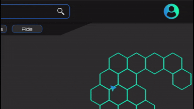

L’outil propose également un panneau d’analyse affichant l’historique des re-rendus, leur durée et les FPS en temps réel. Cette vue est particulièrement utile pour repérer les composants les plus coûteux ou identifier des pics de latence. Un re-rendu complet de la page, par exemple, ferait chuter les FPS de manière notable.


<details class="accordion">
<summary>Voir plus d'informations</summary>

PS 1 : Dans cet exemple, les FPS sont limités à environ 40 en raison du mode développement et des programmes en arrière-plan (base de données, Docker, enregistrement vidéo, etc.). En production, la page atteint généralement autour de 100 FPS, sauf sur des machines peu performantes.

PS 2 : Le premier événement affiché à 7 FPS correspond simplement au démarrage de l’application et de React Scan. Les rendus se font généralement dans l’ordre de la dizaine de millisecondes.

</details>

</div>

Ces analyses nous ont encouragés à adopter de meilleurs réflexes lors de la conception de nouveaux composants, notamment en limitant les dépendances inutiles et en structurant plus clairement les responsabilités de chaque élément.  

Découper les grands composants joue également un rôle essentiel. Une page représentée par un seul composant implique que la moindre modification locale, par exemple l’apparition conditionnelle d’un simple <code class="c">\<div\></code> déclenchera le re‑rendu de l’ensemble. Fragmenter un composant lorsqu’il devient trop volumineux ou contient trop de logique améliore à la fois la lisibilité et les performances. Heureusement, cette habitude avait déjà été adoptée dans l’ancien projet. D’autres découpes ont été réalisées, mais en quantité limitée.

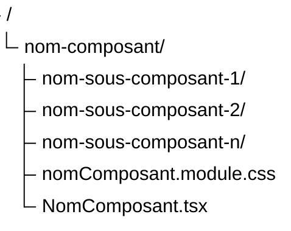

Au-delà des gains de performance, React Scan nous a surtout permis de **visualiser concrètement** ce qui se passe dans React : comprendre pourquoi certains composants se réaffichent, comment les changements d’état se propagent et quels éléments sont réellement coûteux.

---

### 2.3.2 React Developer Tools

En complément de **React Scan**, nous avons utilisé **React Developer Tools**, une extension officielle disponible sur les navigateurs Chromium et Firefox. Cet outil constitue une référence pour analyser le comportement interne d’une application React, car il permet d’inspecter précisément la structure des composants, leurs états et leurs contextes.

Contrairement à React Scan, qui met l’accent sur la visualisation immédiate des re‑rendus, React Developer Tools offre une analyse plus détaillée et plus technique. Il permet d’examiner l’arbre complet des composants, d’observer leurs props et états en temps réel, et d’inspecter les contextes utilisés dans l’application. Ces fonctionnalités nous ont permis de confirmer l’origine de certains re‑rendus et de valider l’efficacité des optimisations appliquées, comme l’utilisation de **React.memo** ou la stabilisation de certaines props.

<div class="card">

Analyse de l'arbre des composants avec React Developer Tools.  

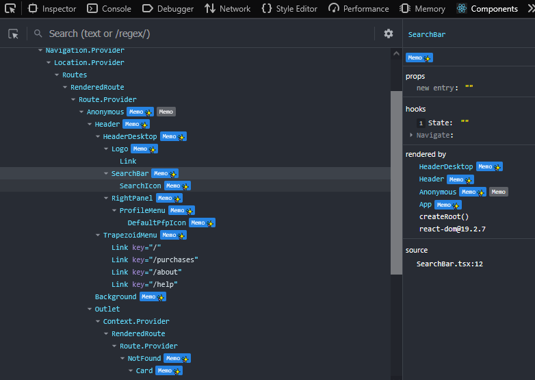

L’onglet **Components** a un interface qui reprend les principes de l’inspecteur d’éléments classique : sélection d’éléments, navigation dans l’arbre, recherche, et affichage des propriétés spécifiques à React. On peut notamment identifier les composants mémorisés via *Memo*, les contextes consommés ou encore les hooks utilisés.

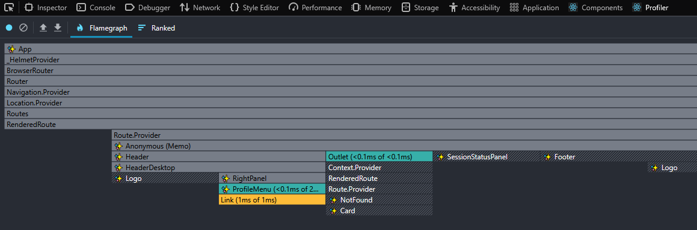

Le **Profiler** complète parfaitement React Scan. Il permet d’identifier quel composant a déclenché un rendu, à quel moment, en combien de temps, et de visualiser la chronologie des rendus ainsi que les relations entre composants. Cette vue temporelle est particulièrement utile pour repérer les goulots d’étranglement.

</div>

React Developer Tools s’est révélé utilie tout au long du développement. Même si nous n’avons jamais rencontré de problèmes de performance majeurs ou de composants réellement trop lourds, la possibilité d’inspecter rapidement la hiérarchie, les contextes consommés ou la raison d’un re‑rendu offrait une grande tranquillité d’esprit. Dès qu’un comportement semblait inhabituel, React Developer Tools permettait de vérifier en quelques secondes si tout fonctionnait comme prévu. Couplé à React Scan, qui met en évidence les re‑rendus en temps réel, l’outil offrait une vision complète : d’un côté l’observation instantanée du rendu, de l’autre une analyse détaillée des causes et du coût associé.

### 2.3.3 Lighthouse

Lighthouse a été utilisé tout au long du développement pour mesurer plusieurs indicateurs essentiels à la qualité globale de l’application : performances, accessibilité, référencement et bonnes pratiques. Contrairement aux outils centrés sur React, Lighthouse évalue l’application dans son ensemble : structure HTML, chargement initial, gestion des ressources, interactions, et conformité aux standards du web.  
Ces audits nous ont permis de valider objectivement l’impact de nos optimisations et d’orienter les améliorations à apporter.

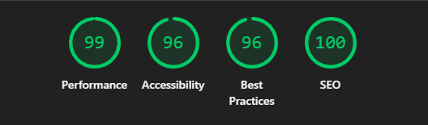

Les scores Lighthouse peuvent varier légèrement selon la page analysée ou les conditions d’exécution, en particulier pour la partie Performance. En build, les résultats restent toutefois très stables et dépassent généralement 95, ce qui confirme la bonne optimisation globale de l’application.

<details class="accordion">
<summary>Les 4 notations</summary>

Lighthouse évalue l’application selon quatre axes principaux :

**Performance**  
Analyse la rapidité de chargement et la fluidité générale.  
Exemples de critères :  
- temps d’affichage du premier contenu (FCP) ;  
- temps d’affichage du contenu principal (LCP) ;  
- délai avant interactivité (TTI) ;  
- poids des ressources et efficacité du cache.

**Accessibilité**  
Vérifie la conformité aux bonnes pratiques d’accessibilité.  
Exemples :  
- contraste des couleurs ;  
- présence de labels sur les champs de formulaire ;  
- structure correcte des titres ;  
- attributs alt sur les images.

**Best Practices**  
Évalue la sécurité et la qualité technique du site.  
Exemples :  
- utilisation de HTTPS ;  
- absence d’erreurs JavaScript ;  
- images correctement dimensionnées ;  
- absence d’API obsolètes.

**SEO**  
Mesure la capacité du site à être correctement référencé.  
Exemples :  
- présence de balises meta essentielles ;  
- structure HTML sémantique ;  
- liens accessibles et valides.

</details>

<div class="card">

Lighthouse met en évidence encore aujourd'hui des points d’améliorations, même si les scores sont excellents. Certains avertissements ne peuvent tout simplement pas être corrigés, notamment ceux provenant de scripts tiers. L’outil doit donc être vu comme un guide, non comme une vérité absolue. Sa documentation, en revanche, s’est révélée extrêmement utile : elle fournit des explications claires et concrètes sur les bonnes pratiques du web, bien plus accessibles que la plupart des ressources généralistes.

- Concernant l’accessibilité, Lighthouse a notamment signalé un contraste comme insuffisant : les quatres liens du footer, de couleur bleu foncé et vert néon au survol. Sans l'animation et un écran sombre il est vrai que la visibilité pour être complexifié sur fond noir. Nous avons décidé de ne pas le corriger, car il s'agissait de liens pour des pages peu importantes pour conserver l'identité graphique et l'harmonie des couleurs, gardant également la seule faute de l'audit sur le point de l'accessiblité.


- Pour les performances, l’outil a relevé que les polices locales prenaient du temps a charger en raison de leur taille (0.4s pour 2 fois 40ko). Nous avons choisi de conserver ces polices d'ecritures car nous ne voulons pas dépendre d'un site externe pour assurer le bon fonctionnement de notre texte.

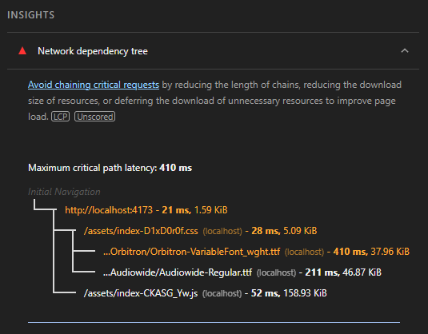

- Du côté des bonnes pratiques, certains avertissements provenaient de scripts externes, notamment ceux de l’API YouTube utilisée pour les trailers. Ces logs ne peuvent pas être supprimés puisqu’ils proviennent de services tiers.

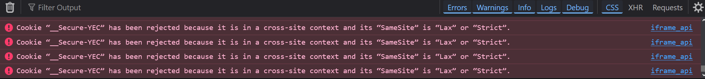

- Enfin, le SEO a un score parfait. 🎉🎉🎉 (allez voir la partie <a href="#22-référencement-et-indexation">2.2 Référencement et indexation</a>)

</div>

Lighthouse s’est donc révélé être un outil précieux pour valider nos choix techniques et garantir une qualité globale élevée. Là où **React Developer Tools** et **React Scan** se concentrent sur le comportement interne de React, Lighthouse adopte une perspective plus large, centrée sur l’expérience utilisateur, la robustesse du site et sa conformité aux standards du web.

---

### 2.3.4 Firefox Profiler

En complément des outils orientés React, nous avons utilisé **Firefox Profiler** afin d’obtenir une vision plus large du comportement global de l’application. Contrairement à React Developer Tools, qui se concentre sur l’arbre des composants et leurs re‑rendus, Firefox Profiler analyse l’activité complète du navigateur : exécution JavaScript, calcul des styles, opérations de rendu, gestion des événements et utilisation des ressources matérielles.

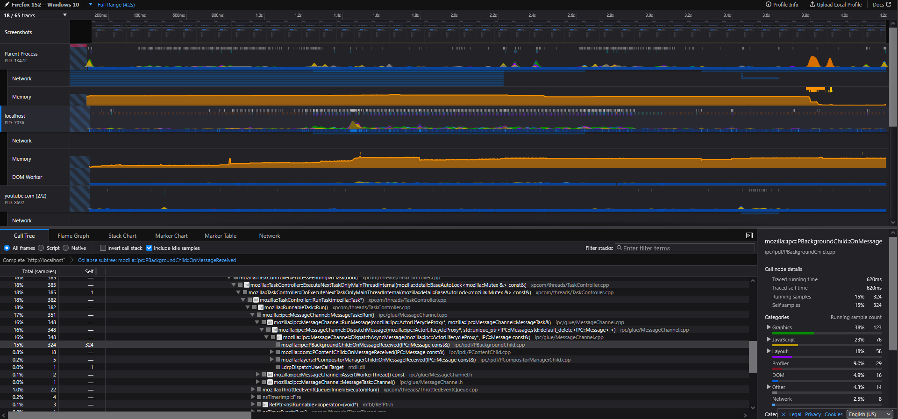

Dans notre cas, l’outil n’a pas servi à résoudre des problèmes de performance critiques (nous n’en avons jamais réellement rencontrés), mais plutôt comme un gestionnaire de tâches avancé, capable d’expliquer pourquoi le navigateur utilise le CPU ou le GPU. Là où le gestionnaire de tâches classique affiche uniquement un pourcentage global, Firefox Profiler permet de comprendre ce qui se cache derrière ce chiffre.

Lorsque nous avons développé la première version du background animé, un comportement nous avait particulièrement inquiétés. En faisant simplement défiler la page, le gestionnaire de tâches affichait parfois 90 % d’utilisation GPU, ce qui donnait l’impression que l’animation risquait de surcharger les machines des utilisateurs. Pensant qu’il s’agissait d’un problème sérieux, nous avions même imposé un rafraîchissement extrêmement bas (4 FPS) pour éviter de consommer "ne serait‑ce qu’1 %" de GPU selon l’outil système.

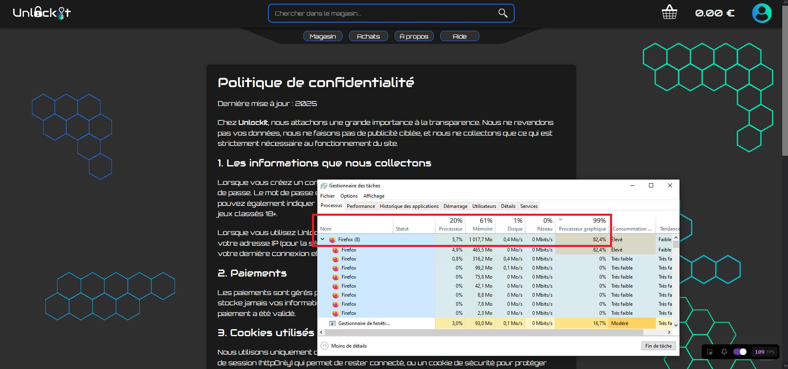

Firefox Profiler a finalement montré que cette interprétation était trompeuse :  
le GPU était bien sollicité, mais **à une fréquence extrêmement basse**, ce qui signifie que la charge réelle était minime. En d’autres termes, l’animation n’était pas dangereuse pour les cartes graphiques, et aurait pu fonctionner à un framerate plus élevé sans poser de problème.  
Cette analyse a été particulièrement utile lors de la refonte du background avec **PixiJS** (voir <a href="#236-pixijs">2.3.6 PixiJS</a>), où nous avons pu vérifier que les optimisations graphiques appliquées n’entraînaient aucune surcharge matérielle.

<details class="accordion">
<summary>GPU élevé ≠ danger</summary>

**Grosso modo :**

Le gestionnaire de tâches affiche un **pourcentage d’utilisation**, mais pas l’**intensité réelle** du travail effectué. Un GPU peut très bien indiquer **80 % d’utilisation**, tout en tournant à une **fréquence extrêmement basse** (par exemple 200 MHz au lieu de 1800 MHz).  
Autrement dit, il "travaille", mais très lentement, sans effort.  
Une analogie simple serait une voiture roulant à "80 % de sa vitesse"... mais en première, moteur à peine allumé.

**Cas concret :**
 
| Situation     | Fréquence GPU | Utilisation | Charge réelle |
| ------------- | ------------- | ----------- | ------------- |
| Jeu vidéo     | 1800 MHz      | 80 %        | Très élevée   |
| Animation web | 200 MHz       | 80 %        | Très faible   |

Dans notre cas, Firefox Profiler a montré que le navigateur utilisait le GPU à **faible fréquence**, ce qui signifie que l’animation était **peu coûteuse**, même si le gestionnaire de tâches affichait un pourcentage élevé.  
On peut d’ailleurs observer le même phénomène sur d’autres sites utilisant un <code class="c">\<canvas\></code> ou des animations WebGL : le GPU peut afficher 70–90 % d’utilisation, mais l’ordinateur reste parfaitement silencieux et froid, loin de la charge réelle d’un logiciel de montage vidéo, d’un jeu 3D ou d’une simulation lourde.

</details>

Au‑delà de ce cas précis, nous n’avons pas eu besoin d’utiliser Firefox Profiler de manière plus poussée : les outils comme React Developer Tools et React Scan étaient largement suffisants pour le reste du projet.
Cependant, comprendre comment un navigateur répartit réellement le travail (exécution JavaScript, calcul des styles, layout, paint, etc.) reste extrêmement utile. Dans des situations plus complexes, ou lorsqu’un comportement semble inhabituel, nous savons désormais où regarder et comment interpréter les données pour éviter de fausses alertes.

---

### 2.3.5 Lazy Loading et Suspense

L'une des optimisations les plus importantes apportées à cette nouvelle version concerne la stratégie de chargement des pages. Dans la première version du projet, l'ensemble des routes principales était importé directement au démarrage de l'application. Même lorsqu'un utilisateur ne visitait qu'une petite partie du site, il téléchargeait malgré tout une quantité importante de JavaScript.

Cette approche reste acceptable pour de petites applications, mais devient rapidement problématique lorsque le nombre de pages augmente. Le navigateur doit télécharger, analyser et exécuter davantage de code avant de pouvoir afficher l'interface.

Pour résoudre ce problème, nous avons mis en place une stratégie de **code splitting** basée sur **React.lazy** et **Suspense**.

```tsx
const ProductPage = lazy(() => import("./pages/ProductPage"));

<Suspense fallback={<Loader />}>
    <ProductPage />
</Suspense>
```

Avec cette approche, le code d'une page n'est téléchargé qu'au moment où l'utilisateur en a réellement besoin. Chaque route importante devient ainsi un bundle indépendant pouvant être chargé dynamiquement.

Cette optimisation apporte plusieurs avantages :

- réduction significative de la taille du bundle initial ;
- diminution du temps de téléchargement lors du premier chargement ;
- réduction du temps d'analyse et d'exécution JavaScript ;
- amélioration des métriques Lighthouse ;
- meilleure expérience utilisateur sur les connexions lentes.

Le composant **Suspense** joue ici un rôle essentiel. Lorsqu'une ressource n'est pas encore disponible, React affiche temporairement un composant de remplacement (*fallback*), généralement un loader ou un skeleton. L'utilisateur obtient ainsi un retour visuel immédiat plutôt qu'un écran vide.

Cette technique s'est révélée particulièrement efficace pour les pages rarement consultées, comme certaines pages de paramètres ou de gestion du compte. Leur code n'est chargé que lorsqu'il devient réellement nécessaire, ce qui contribue à maintenir une interface réactive même lorsque l'application continue de s'enrichir.

---

### 2.3.6 PixiJS

L'arrière-plan animé constitue l'un des éléments visuels les plus complexes de la nouvelle version d'UnlockIt. Les premiers prototypes reposaient principalement sur des animations CSS et sur la manipulation d'éléments HTML classiques. Bien que fonctionnelle, cette approche devenait coûteuse dès lors que le nombre d'éléments affichés augmentait.

Afin d'obtenir de meilleures performances, nous avons choisi d'utiliser **PixiJS**, une bibliothèque de rendu 2D s'appuyant directement sur **WebGL** lorsque celui-ci est disponible.

L'intérêt principal de PixiJS réside dans sa capacité à exploiter l'accélération matérielle du navigateur. Une partie importante du travail est alors déléguée au processeur graphique (GPU), ce qui réduit la charge du processeur principal et améliore la fluidité des animations.

L'intégration de PixiJS nous a permis :

- d'afficher un grand nombre d'éléments animés simultanément ;
- d'obtenir un framerate plus stable ;
- de réduire les calculs effectués dans le DOM ;
- de limiter les opérations de repaint et de reflow ;
- de conserver une bonne fluidité sur des machines moins puissantes.

Cette réécriture a également constitué une opportunité d'explorer des concepts plus avancés liés au rendu graphique temps réel : gestion d'une scène, sprites, textures, boucle de rendu et accélération GPU. Même si UnlockIt reste une application web classique, cette expérimentation nous a permis d'acquérir une meilleure compréhension des technologies graphiques modernes utilisées dans de nombreux sites interactifs et jeux web.

---

### 2.3.7 SVGR

Au cours du projet, nous avons progressivement remplacé plusieurs ressources graphiques PNG par des fichiers SVG. Ces derniers présentent de nombreux avantages : taille réduite, qualité parfaite quelle que soit la résolution de l'écran et possibilité de modifier dynamiquement certains attributs via CSS ou JavaScript.

Afin d'intégrer ces fichiers plus efficacement dans React, nous avons utilisé **SVGR**. Cet outil transforme automatiquement un fichier SVG en composant React.

Au lieu d'utiliser :

```tsx

```

nous pouvons directement écrire :

```tsx
import CartIcon from "./cart.svg";

<CartIcon />
```

Cette approche apporte plusieurs bénéfices :

- suppression d'une requête réseau supplémentaire dans certains cas ;
- intégration naturelle dans l'arbre React ;
- personnalisation facilitée via les props ;
- modification dynamique des couleurs et dimensions ;
- meilleure maintenabilité des ressources graphiques.

SVGR s'est révélé particulièrement utile pour les icônes utilisées dans les boutons, menus et éléments de navigation. Ces ressources sont désormais manipulées comme de véritables composants React, ce qui simplifie leur réutilisation et leur personnalisation.

Même si l'impact sur les performances reste plus modeste que celui du lazy loading ou de la minification, cette optimisation participe à la réduction du poids global de l'application et améliore la cohérence de l'architecture frontend.

---

### 2.3.8 React Doctor

J'ai conscience que déjà beaucoup d'outils ont été utilisé pour la qualité et que j'ai peut etre abusé, mais l'utilisation de React Doctor aurait pu être réellement interessant si j'avais plus de temps et que d'autre projet ne nécéssitaient pas mon attention.

Nous avons également étudié l’utilisation de React Doctor, un outil relativement récent conçu pour analyser automatiquement une application React et détecter des problèmes de performance difficiles à repérer manuellement. Contrairement à des outils plus visuels comme React Scan, React Doctor adopte une approche plus analytique : il inspecte le comportement interne de l’application, examine les cycles de rendu et signale les composants susceptibles de poser problème.

Même si nous ne l’avons pas intégré directement au projet, son fonctionnement et ses capacités méritent d’être présentés, car il s’agit d’un outil prometteur qui pourrait devenir un standard dans les prochaines années.

React Doctor est capable d’identifier plusieurs types de problèmes, notamment les re-rendus inutiles, les dépendances incorrectes dans les hooks, ou encore les composants dont le coût de rendu est anormalement élevé. L’outil analyse également la stabilité des props et des références, ce qui permet de repérer des erreurs de conception difficiles à détecter autrement. Par exemple, il peut signaler un useEffect déclenché trop souvent à cause d’une dépendance instable, ou un composant qui se réaffiche alors que ses props n’ont pas changé.

<div class="card">

Figure X – Exemple d’analyse automatisée proposée par React Doctor.  
(placeholder capture d’écran)

</div>

Nous avons découvert React Doctor relativement tard dans le développement, à un moment où la majorité des optimisations principales étaient déjà en place. Par manque de temps, nous n’avons pas pu l’explorer en profondeur ni l’intégrer dans notre workflow. De plus, l’outil étant encore jeune, certaines fonctionnalités manquent de stabilité et peuvent produire des faux positifs. Cela rend son utilisation délicate dans un contexte de production ou dans un projet où les délais sont serrés.

Malgré cela, cette phase de veille technologique s’est révélée utile. Elle nous a permis d’identifier des outils émergents et de mieux comprendre les tendances actuelles autour de l’écosystème React. React Doctor pourrait être envisagé dans de futurs projets, notamment pour automatiser une partie du diagnostic de performance et pour compléter des outils plus établis comme React Developer Tools ou React Scan.

---

## 2.4 Nouvelle couche API Frontend

L’un des changements les plus importants de cette refonte concerne la manière dont le frontend communique avec le backend.  
Dans la première version, plusieurs composants réalisaient directement leurs appels réseau, mélangeant logique métier, gestion des erreurs et rendu visuel. Cette approche fonctionnait pour un prototype, mais elle devenait difficile à maintenir à mesure que l’application grandissait.

La seconde version introduit une véritable couche d’abstraction, structurée autour de trois éléments complémentaires :

- **hooks métiers**  
- **services d’accès aux données**  
- **stores centralisés**  

Cette architecture permet d’obtenir un code plus lisible, plus facilement testable et beaucoup plus simple à maintenir. Elle facilite également l’écriture de tests automatisés et réduit fortement le couplage entre l’interface utilisateur et l’API.

L’objectif est clair : chaque couche doit avoir une responsabilité unique.  
Les composants ne s’occupent plus de la logique réseau ; les services ne gèrent plus l’état global ; les hooks orchestrent les appels et exposent une API claire aux composants.  
Cette séparation des responsabilités améliore la qualité du code et s’inscrit dans la démarche générale du projet : structurer, isoler, optimiser.

### Architecture de la nouvelle couche API

La nouvelle organisation repose sur trois dossiers principaux :

```
src/api/
├── hooks/
├── services/
└── stores/
```

Chaque fonctionnalité (authentification, produits, panier, etc.) possède son propre trio *hook / service / store*, ce qui permet une structure modulaire et évolutive.

### Exemple : la gestion de l’authentification

L’authentification illustre parfaitement cette architecture.  
Elle repose sur :

- un **store Zustand** pour conserver la session et l’état de connexion ;
- un **service** chargé de communiquer avec l’API ;
- un **hook métier** qui orchestre les appels et expose une API simple aux composants.

### Le hook métier : `useAuth`

Le hook regroupe toute la logique métier liée à l’authentification : connexion, inscription, rafraîchissement de session, déconnexion, etc.  
Il s’appuie sur le store et sur le service, mais les composants n’ont pas besoin de connaître ces détails.

```ts
export function useAuth() {
  const { session, isLogged, setSession, clearSession } = useAuthStore();

  const login = async (identifier: string, password: string) => {
    await authService.login(identifier, password);
    await fetchSession();
  };

  const register = async (username: string, email: string, password: string) => {
    await authService.register(username, email, password);
  };

  const fetchSession = async () => {
    try {
      const data = await authService.fetchSession();
      setSession(data);
    } catch {
      try {
        await authService.refresh();
        const data = await authService.fetchSession();
        setSession(data);
      } catch {
        clearSession();
      }
    }
  };

  const logout = async () => {
    await authService.logout();
    clearSession();
  };

  return {
    session,
    isLogged,
    login,
    register,
    logout,
    fetchSession,
  };
}
```

Ce hook permet aux composants d’utiliser l’authentification via une API claire et stable, sans jamais manipuler directement Axios ou les stores.

### Le service : `authService`

Le service encapsule tous les appels HTTP.  
Il gère également les erreurs, ce qui permet d’uniformiser les messages renvoyés au frontend.

```ts
export const authService = {
    login: async (identifier: string, password: string) => {
        try {
            await api.post("/auth/login", { identifier, password });
        } catch (err: any) {
            const s = err.response?.status;

            if (s === 401) throw { message: "Identifiants invalides." };
            if (s === 429) throw { message: "Trop de tentatives. Réessayez plus tard." };
            throw { message: "Erreur serveur." };
        }
    },

    register: async (username: string, email: string, password: string) => {
        try {
            await api.post("/auth/register", { username, email, password });
        } catch (err: any) {
            const s = err.response?.status;

            if (s === 400) throw { message: "Données invalides." };
            if (s === 409) throw { message: "Email ou nom d'utilisateur déjà utilisé." };
            if (s === 429) throw { message: "Trop de tentatives. Réessayez plus tard." };
            throw { message: "Erreur serveur." };
        }
    },

    fetchSession: async () => {
        try {
            const res = await api.get("/auth/me");
            return res.data;
        } catch (err: any) {
            const s = err.response?.status;

            if (s === 401) throw { message: "Non authentifié." };
            throw { message: "Erreur serveur." };
        }
    },

    refresh: async () => {
        try {
            await api.post("/auth/refresh");
        } catch (err: any) {
            const s = err.response?.status;

            if (s === 401) throw { message: "Session expirée." };
            throw { message: "Erreur serveur." };
        }
    },

    logout: async () => {
        try {
            await api.post("/auth/logout");
        } catch {
            throw { message: "Erreur serveur." };
        }
    },
};
```

### Le store Zustand : `useAuthStore`

Le store conserve l’état global lié à l’authentification.  
Il est minimaliste, ce qui facilite sa compréhension et son utilisation.

```ts
export const useAuthStore = create<AuthState>((set) => ({
  session: null,
  isLogged: false,

  setSession: (session) => set({ session, isLogged: true }),

  clearSession: () => set({ session: null, isLogged: false }),
}));
```

### Avant / Après la refonte

La différence entre l’ancienne architecture et la nouvelle est particulièrement visible dans la gestion de l’inscription.

<div class="before">

### Avant

*(Appels réseau dans les composants, gestion d’erreurs dispersée, logique métier mélangée au rendu.)*

</div>

<div class="after">

### Après

*(Un simple appel à un hook métier, le reste est géré par la couche API.)*

</div>

Cette évolution améliore la lisibilité, la maintenabilité et la testabilité du code.  
Elle permet également d’intégrer plus facilement des outils comme **Playwright** pour tester les parcours utilisateurs.

</details>

<details class="accordion">
<summary>Voir le schéma</summary>

```mermaid
flowchart LR

    %% ========= Définition des styles =========
    classDef react fill:#61dafb,stroke:#1b7aa6,stroke-width:2px,color:#000;
    classDef hook fill:#b3e5ff,stroke:#4fa3d1,stroke-width:2px,color:#000;
    classDef service fill:#ffe9b3,stroke:#d1a84f,stroke-width:2px,color:#000;
    classDef backend fill:#ffb3b3,stroke:#d14f4f,stroke-width:2px,color:#000;
    classDef db fill:#c6ffb3,stroke:#4fd14f,stroke-width:2px,color:#000;
    classDef cache fill:#fff2b3,stroke:#d1c24f,stroke-width:2px,color:#000;
    classDef log fill:#d6b3ff,stroke:#7a4fd1,stroke-width:2px,color:#000;
    classDef external fill:#e0e0e0,stroke:#999,stroke-width:2px,color:#000;

    %% ========= Frontend =========
    subgraph FE[Frontend]
        A[Composant React]:::react
        B[Hook métier]:::hook
        C[Service API]:::service
    end

    %% ========= Backend =========
    subgraph BE[NestJS Backend]
        D[Controller]:::backend
        E[Service]:::backend
        F[Repository]:::backend
    end

    %% ========= Stockage =========
    G[(PostgreSQL)]:::db
    R[(Redis Cache)]:::cache

    %% ========= Logs =========
    L[Logger]:::log

    %% ========= Service externe =========
    X[Service Auth externe]:::external

    %% ========= Flux principal =========
    A e1@-->|Appel logique| B
    B e2@-->|Appel API| C
    C e3@-->|HTTP| D
    D e4@-->|Appel interne| E
    E e5@-->|Requête DB| F
    F e6@-->|SQL| G

    %% ========= Flux secondaires =========
    C e7@-->|Token| X
    E e8@-->|Cache| R
    E e9@-.->|Logs| L

    %% ========= Styles des courbes =========
    e1@{ curve: linear }
    e2@{ curve: linear }
    e3@{ curve: stepBefore }
    e4@{ curve: stepBefore }
    e5@{ curve: linear }
    e6@{ curve: linear }
    e7@{ curve: natural }
    e8@{ curve: stepAfter }
    e9@{ curve: natural }

    %% ========= Styles des liens =========
    linkStyle 0 stroke:#1b7aa6,stroke-width:2px
    linkStyle 1 stroke:#4fa3d1,stroke-width:2px
    linkStyle 2 stroke:#d1a84f,stroke-width:2px
    linkStyle 3 stroke:#d14f4f,stroke-width:2px
    linkStyle 4 stroke:#d14f4f,stroke-width:2px
    linkStyle 5 stroke:#4fd14f,stroke-width:2px
    linkStyle 6 stroke:#999,stroke-width:2px
    linkStyle 7 stroke:#d1c24f,stroke-width:2px
    linkStyle 8 stroke:#7a4fd1,stroke-width:2px,stroke-dasharray:4 4
```
\* Si seul le code du schéma s'affiche, rafraichissez la page pour voir le schéma. 

</details>

---

## 2.5 Tests automatisés

La première version du projet reposait principalement sur des tests manuels. Cette approche devenait rapidement chronophage à mesure que le nombre de fonctionnalités augmentait, et surtout difficile à maintenir : chaque nouvelle fonctionnalité nécessitait de repasser manuellement sur plusieurs parcours utilisateurs pour s’assurer qu’aucun comportement n’avait été cassé.
Afin de sécuriser davantage le développement et d’améliorer la qualité globale du projet, nous avons intégré Playwright, un outil moderne de tests end‑to‑end.

L’objectif était de couvrir les fonctionnalités essentielles du site et de garantir que les parcours critiques restent fonctionnels au fil des mises à jour. Les tests automatisés permettent notamment de vérifier l’authentification, la navigation, la gestion du panier, la wishlist, l’historique d’achats, ainsi que plusieurs scénarios utilisateurs sensibles.
Cette démarche s’inscrit dans la logique générale du projet : analyser les problèmes, comprendre leur origine, et mettre en place des solutions robustes, comme nous l’avons fait pour les performances, la structure des composants ou l’utilisation d’outils tels que React Developer Tools.

<div class="card">

[Il semble que le résultat n’était pas sûr à afficher. Changeons un peu et essayons autre chose !]

Figure X – Exemple d'exécution d'un scénario de tests automatisés.

</div>

L’introduction de Playwright a représenté un véritable gain de temps. Une fois les scénarios écrits, ils peuvent être exécutés en quelques secondes, ce qui réduit considérablement le risque de réintroduire d’anciens bugs. Les tests servent également de documentation vivante : ils décrivent précisément ce que l’application est censée faire, et permettent de détecter immédiatement toute régression.

Dans le dossier frontend/, un répertoire test/ regroupe l’ensemble des scénarios, organisés par thématique (auth/, nav/, etc.). Cette structure permet de maintenir facilement les tests et de les étendre au fur et à mesure du développement.

Voici par exemple le test complet du logout, couvrant plusieurs cas de figure (desktop, mobile, et déconnexion depuis différentes pages). Ce test illustre bien la manière dont Playwright permet de simuler des interactions réelles : navigation, clics, ouverture de menus, vérification d’URL, etc.

```tsx
TODO : exemple de ~~t~~
```

---

## 2.6 Build et compression

L’optimisation du build de production ne se limite pas à la minification du JavaScript.  
Dans ce projet, plusieurs techniques complémentaires ont été mises en œuvre afin de réduire la taille des fichiers, améliorer le temps de chargement et optimiser le comportement du navigateur lors de l’exécution.

Ces optimisations reposent sur quatre axes principaux :

- **minification du code** (Terser)  
- **compression avancée** (Gzip + Brotli)  
- **découpage manuel des bundles** (*manual chunks*)  
- **analyse et visualisation du graphe de dépendances** (Visualizer)

### 2.6.1 Terser

La minification consiste à transformer le code JavaScript lisible par les développeurs en une version plus compacte, tout en conservant un comportement identique.

Grâce à **Terser**, plusieurs transformations sont appliquées automatiquement :

- suppression des commentaires  
- suppression des espaces et indentations  
- raccourcissement des identifiants  
- simplification d’expressions  
- élimination du *dead code*  
- suppression des `console.log` et `debugger`

Exemple :

```ts
function calculateTotal(price, quantity) {
    return price * quantity;
}
```

devient :

```js
function calculateTotal(t,n){return t*n}
```

Cette réduction, appliquée à l’ensemble du code, permet de diminuer significativement la taille des bundles.

<div class="before">

### Avant

```
TODO
```

</div>

<div class="after">

### Après

```
TODO
```

</div>

---

### 2.6.2 Compression des assets : Gzip + Brotli

En complément de la minification, les fichiers générés sont compressés via deux algorithmes :

- **Gzip**, largement supporté par tous les navigateurs  
- **Brotli**, plus récent et offrant un taux de compression supérieur  

Grâce au plugin `vite-plugin-compression`, chaque fichier `.js`, `.css` et `.html` est produit en deux versions :

- `*.gz` (Gzip)  
- `*.br` (Brotli)

Les serveurs modernes choisissent automatiquement la version la plus efficace selon le navigateur du client.

Cette étape permet de réduire la taille transférée de **30 à 70 % supplémentaires**, notamment sur les gros bundles comme React ou PixiJS.

```
UnlockIt/apps/frontend/assets/Cookies-DR5NdOr3.js.br          brotliCompress: 1.01kb
UnlockIt/apps/frontend/assets/Background-CukwmJR_.js.br       brotliCompress: 2.65kb
UnlockIt/apps/frontend/assets/Home-CU98n8zi.css.br            brotliCompress: 0.45kb
UnlockIt/apps/frontend/assets/Login-Dcmp3sRo.js.br            brotliCompress: 1.00kb
UnlockIt/apps/frontend/assets/helmet-JdfEq1Ls.js.br           brotliCompress: 4.92kb
UnlockIt/apps/frontend/assets/index-CXPQlizz.css.br           brotliCompress: 3.73kb
UnlockIt/apps/frontend/assets/Privacy-YAYa-R_m.js.br          brotliCompress: 1.81kb
UnlockIt/apps/frontend/assets/Home-BMpoE3-N.js.br             brotliCompress: 1.52kb
UnlockIt/apps/frontend/assets/Legal-BpHE1FI5.js.br            brotliCompress: 1.13kb
UnlockIt/apps/frontend/assets/index-CFUwInI2.js.br            brotliCompress: 9.33kb
UnlockIt/apps/frontend/assets/Search-By_-Ccw_.css.br          brotliCompress: 0.84kb
UnlockIt/apps/frontend/assets/Register-B7OLBotr.css.br        brotliCompress: 0.46kb
UnlockIt/apps/frontend/assets/Refunds-BnK6OvgC.js.br          brotliCompress: 1.09kb
UnlockIt/apps/frontend/assets/Register-DKQIHVl9.js.br         brotliCompress: 1.30kb
UnlockIt/apps/frontend/assets/router-Dja-W-oD.js.br           brotliCompress: 6.63kb
UnlockIt/apps/frontend/assets/UnlockItHelmet-BGK7a8f6.js.br   brotliCompress: 0.82kb
UnlockIt/apps/frontend/assets/Search-Cx-u2G8I.js.br           brotliCompress: 2.71kb
UnlockIt/apps/frontend/assets/vendor-QzHy5b41.js.br           brotliCompress: 9.22kb
UnlockIt/apps/frontend/assets/ui-B8J3Plgw.css.br              brotliCompress: 1.27kb
UnlockIt/apps/frontend/index.html.br                          brotliCompress: 1.06kb
UnlockIt/apps/frontend/assets/api-eJIyGYhM.js.br              brotliCompress: 19.08kb
UnlockIt/apps/frontend/assets/ui-BGNp2rZQ.js.br               brotliCompress: 9.70kb
UnlockIt/apps/frontend/assets/react-CaPFs6it.js.br            brotliCompress: 47.88kb
UnlockIt/apps/frontend/assets/pixi-D5OU-vt1.js.br             brotliCompress: 105.18kb
```

---

### 2.6.3 Découpage manuel des bundles

Afin d’améliorer le caching et d’éviter qu’un changement mineur invalide tout le bundle, un découpage manuel a été mis en place.

Ce découpage sépare explicitement les dépendances majeures :

- **react** : React, ReactDOM, Scheduler  
- **router** : React Router  
- **helmet** : React Helmet Async  
- **vendor** : Zustand, use-debounce, react-fast-compare, shallowEqual, react-hook-form  
- **ui** : composants UI internes  
- **api** : couche API interne  
- **pixi** : moteur PixiJS  
- **index** : code applicatif principal

Ce découpage permet :

- un meilleur caching (React ne change presque jamais)  
- un chargement plus rapide des pages  
- une meilleure parallélisation des téléchargements  
- une réduction du bundle principal

<div class="before">

### Avant

```
TODO
```

</div>

<div class="after">

### Après

```
TODO
```

</div>

---

### 2.6.4 Visualisation du graphe de dépendances

Pour analyser la structure finale du build, le plugin **rollup-plugin-visualizer** a été intégré.

Il génère un fichier `stats.html` permettant :

- d’identifier les dépendances les plus lourdes  
- de visualiser les relations entre modules  
- de vérifier que les `manualChunks` fonctionnent correctement  
- d’optimiser le découpage si nécessaire

Cet outil a notamment permis de confirmer que :

- React, Router, Pixi et l’API sont bien isolés  
- les composants UI sont regroupés dans un chunk dédié  
- aucune dépendance lourde ne se retrouve dans le bundle principal

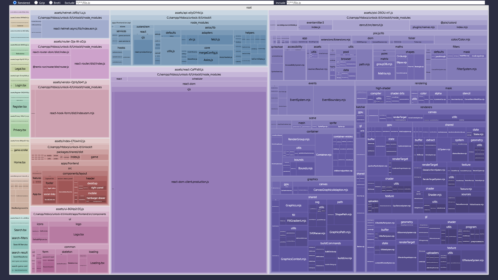

---

## 2.7 Difficultés rencontrées et solutions

### 2.7.1 Difficultés

L’un des problèmes les plus marquants rencontrés au cours du développement concerne l’utilisation de Suspense avec React Router. Ce point est particulièrement intéressant car il illustre parfaitement la démarche adoptée tout au long du projet : identifier un comportement inattendu, formuler des hypothèses, investiguer méthodiquement, puis mettre en place une solution pragmatique. C’est exactement ce que nous avons appliqué dans toutes les sections précédentes, qu’il s’agisse de performances, de structure des composants ou d’outils de diagnostic.

### 2.7.2 : React Router

L’utilisation de React Scan nous a permis d’identifier plusieurs comportements inattendus, notamment liés à **React Router**. Nous avons constaté que certains composants se réaffichaient lors de simples navigations, même lorsque leur contenu ne dépendait pas de l’URL. Les composants contenant des éléments <code class="c">\<Link\></code> étaient par exemple redessinés à cause de la mise à jour du contexte interne de React Router. De même, certains layouts ou composants structurels (comme le header ou le footer) étaient recalculés inutilement à chaque changement de route, alors qu’ils ne dépendaient d’aucune donnée dynamique.

Pour corriger ces comportements, nous avons introduit l’utilisation de **React.memo()**, notamment pour stabiliser les composants structurels tels que le header, le footer ou encore le layout global.

```tsx
export const Layout = memo(() => {
  return (
    <div>
      <Header />

      <main>
        <Background />
        <Outlet />
      </main>

      <Footer />
    </div>
  );
});
```

#### Avant / Après la refonte

<div class="before">

#### Avant

<details class="accordion">
<summary>Voir plus d'informations</summary>

```
TODO
```

</details>

</div>

<div class="after">

#### Après

<details class="accordion">
<summary>Voir plus d'informations</summary>

```
TODO
```

</details>

</div>

### 2.7.3 Difficulté n°2 : Suspence

Dans notre cas, nous avions mis en place un composant de chargement personnalisé destiné à s’afficher lors du chargement des pages rendues via lazy(). En théorie, l’utilisation combinée de lazy() et de Suspense devait permettre d’afficher ce loader dès que React chargeait dynamiquement une page. Pourtant, malgré une implémentation correcte, le loader ne s’affichait jamais.

Après plusieurs heures d’investigation, nous avons d’abord suspecté une mauvaise utilisation de Suspense, ou un problème dans la structure de nos routes. Nous avons testé différentes configurations, déplacé le composant de fallback, isolé les routes, et même simplifié la structure pour éliminer les causes possibles. Rien n’y faisait.

C’est en approfondissant nos recherches que nous sommes tombés sur une discussion GitHub liée à React Router v7, indiquant que cette version introduisait un comportement empêchant Suspense de fonctionner correctement dans certains cas. Plusieurs développeurs rencontraient exactement le même problème, et un contributeur avait même mis en ligne deux projets de démonstration permettant de comparer le comportement entre la version 6 et la version 7 :

- Version 6 : <a href="https://react-router-v7-issue-v6.netlify.app/">https://react-router-v7-issue-v6.netlify.app/</a>
- Version 7 : <a href="https://react-router-v7-issue-v7.netlify.app/">https://react-router-v7-issue-v7.netlify.app/</a>

La comparaison entre les deux projets est sans ambiguïté : le loader fonctionne parfaitement en version 6, mais ne s’affiche plus en version 7. Ce comportement est reconnu comme un problème dans React Router, et plusieurs issues sont encore ouvertes à ce sujet.

Ce constat confirmait que notre implémentation était correcte et que le problème ne venait pas de notre code, mais bien d’un changement interne dans React Router.

La solution la plus raisonnable, compte tenu des délais du projet, a donc été de downgrader React Router vers la version 6, ce qui a immédiatement rétabli le fonctionnement attendu de Suspense. Ce choix implique de conserver une version légèrement moins récente, mais cela n’a pas d’impact majeur sur la stabilité de l’application. La seule conséquence est un avertissement lié au fait que la version 7 corrige certaines vulnérabilités mineures, mais aucune n’est critique dans notre contexte.

# 3. Backend

## 3.1 Migration vers NestJS

...

## 3.2 Architecture modulaire

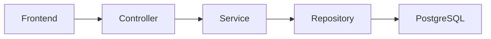

## 3.3 Validation et sécurité

...

## 3.4 Maintenabilité

...

## 3.5 Difficultés rencontrées et solutions

...

# 5. Conclusion

## 5.1 Bilan

...

## 5.2 Perspectives

...