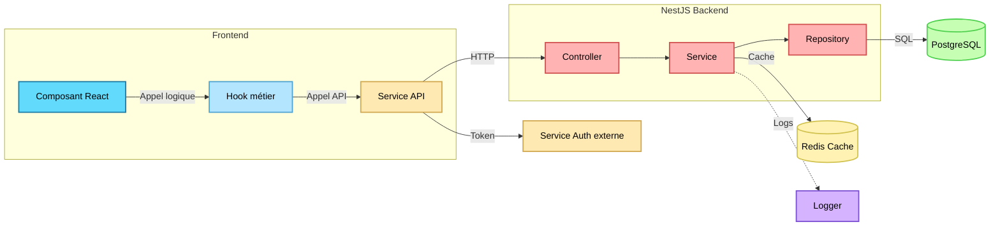
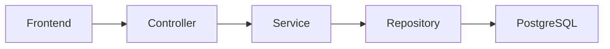

<link rel="stylesheet" href="style.css">
<link rel="stylesheet" href="hljs.css">

<header class="sticky-header">
    <span class="header-title">Rapport Qualité et Refonte Architecturale</span>
    
</header>

<div class="false-body">

<div class="cover-page">
    <h1>Rapport Qualité et Refonte Architecturale</h1>
    <a href="https://github.com/ElPotatoCorp/UnlockIt" target="_blank">
        
    </a>
    <div class="cover-authors">
        <div class="info-line">Mars – Juin 2026</div>
        <div class="info-line authors">
            <a href="https://github.com/Frozen1753" target="_blank">Frozen1753</a>
            <span>&</span>
            <a href="https://github.com/ElPotatoCorp" target="_blank">ElPotato</a>
        </div>
        <div class="info-line">BUT Informatique</div>
</div>

</div>

<div class="page-break"></div>

# Sommaire

<div class="toc">

<ul>
    <li><a href="#1-introduction">1. Introduction</a></li>
    <li class="lvl2"><a href="#11-présentation-du-projet">1.1 Présentation du projet</a></li>
    <li class="lvl2"><a href="#12-objectifs-de-la-refonte">1.2 Objectifs de la refonte</a></li>
    <li><a href="#2-analyse-de-lancien-projet">2. Analyse de l'ancien projet</a></li>
    <li class="lvl2"><a href="#21-constats">2.1 Constats</a></li>
    <li class="lvl2"><a href="#22-avant--après-la-refonte">2.2 Avant / Après la refonte</a></li>
    <li><a href="#3-frontend">3. Frontend</a></li>
    <li class="lvl2"><a href="#31-refonte-de-larchitecture-react">3.1 Refonte de l'architecture React</a></li>
    <li class="lvl2"><a href="#32-référencement-et-indexation">3.2 Référencement et indexation</a></li>
    <li class="lvl2"><a href="#33-optimisation-des-performances">3.3 Optimisation des performances</a></li>
    <li class="lvl2"><a href="#34-refonte-graphique">3.4 Refonte graphique</a></li>
    <li class="lvl2"><a href="#35-pixijs">3.5 PixiJS</a></li>
    <li class="lvl2"><a href="#36-nouvelle-couche-api-frontend">3.6 Nouvelle couche API Frontend</a></li>
    <li class="lvl2"><a href="#37-tests-automatisés">3.7 Tests automatisés</a></li>
    <li class="lvl2"><a href="#38-difficultés-rencontrées-et-solutions">3.8 Difficultés rencontrées et solutions</a></li>
    <li><a href="#4-backend">4. Backend</a></li>
    <li class="lvl2"><a href="#41-migration-vers-nestjs">4.1 Migration vers NestJS</a></li>
    <li class="lvl2"><a href="#42-architecture-modulaire">4.2 Architecture modulaire</a></li>
    <li class="lvl2"><a href="#43-validation-et-sécurité">4.3 Validation et sécurité</a></li>
    <li class="lvl2"><a href="#44-maintenabilité">4.4 Maintenabilité</a></li>
    <li class="lvl2"><a href="#45-difficultés-rencontrées-et-solutions">4.5 Difficultés rencontrées et solutions</a></li>
    <li><a href="#5-conclusion">5. Conclusion</a></li>
    <li class="lvl2"><a href="#51-bilan">5.1 Bilan</a></li>
    <li class="lvl2"><a href="#52-perspectives">5.2 Perspectives</a></li>
</ul>

</div>

# 1. Introduction

## 1.1 Présentation du projet

UnlockIt est une plateforme de distribution de jeux vidéo dématérialisés inspirée des principaux acteurs du marché. Le projet permet la consultation d'un catalogue, la gestion d'une bibliothèque personnelle, l'ajout de jeux dans une liste de souhaits ainsi que l'achat de clés numériques.

La première version du projet avait permis de valider les fonctionnalités essentielles attendues. Cependant, au fil du développement, plusieurs limites techniques sont apparues et ont rendu l'évolution du projet plus difficile.

## 1.2 Objectifs de la refonte

L'objectif de cette seconde itération n'était plus uniquement d'ajouter des fonctionnalités mais de reconstruire le projet sur des bases plus saines.

Cette refonte avait pour objectif principal d'améliorer la qualité globale du logiciel, la maintenabilité du code, les performances de l'application et la capacité du projet à évoluer dans le temps.

# 2. Analyse de l'ancien projet

## 2.1 Constats

La première version du projet remplissait correctement son rôle fonctionnel. Néanmoins, son développement s'étant effectué de manière itérative, certaines décisions techniques prises en début de projet ne répondaient plus aux besoins apparus par la suite.

Les composants React contenaient parfois à la fois de la logique métier, des appels API et du rendu visuel. Cette situation compliquait la lecture du code et rendait les tests plus difficiles.

## 2.2 Avant / Après la refonte

<div class="before">

### Avant

<details class="accordion">
<summary>Voir plus d'informations</summary>

```tsx
const onSubmit = async (data: FormData) => {
    setErrorMessage(null);
    setStatus("idle");

    if (!isStrong) {
        setStatus("error");
        setErrorMessage("Le mot de passe ne respecte pas les critères de sécurité");
        return;
    }

    try {
        const payload: any = {
            username: data.username,
            password: data.password,
        };

        if (data.contactType === "email") {
            payload.email = data.email;
        } else {
            payload.phone_wzc = data.phone_wzc;
            payload.phone_number = data.phone_number;
        }

        const res = await fetch(`/api/auth/register`, {
            method: "POST",
            credentials: "include",
            headers: { "Content-Type": "application/json" },
            body: JSON.stringify(payload),
        });

        if (res.ok) {
            setStatus("success");
            reset();
            navigate('/');
            window.location.reload();
        } else if (res.status === 403) {
            throw new Error("Un utilisateur avec ces informations existe déjà");
        } else {
            throw new Error(payload.message || "Échec de l'inscription");
        }
    } catch (err: any) {
        setStatus("error");
        setErrorMessage(err.message || "Erreur d'inscription");
    }
};
```

L'architecture de la première version était principalement orientée vers la mise en place rapide des fonctionnalités.

</details>

</div>

<div class="after">

### Après

<details class="accordion">
<summary>Voir plus d'informations</summary>

```tsx
const onSubmit = async (data: FormData) => {
    try {
      await authRegister(data.username, data.email, data.password);

      navigate("/login");
    } catch (err: any) {
      setError("root", { message: err.message ?? "Erreur d'inscription." });
    }
};
```
```ts
import { api } from "../axios.instance";

export const authService = {
    {...}

    register: async (username: string, email: string, password: string) => {
        try {
            await api.post("/auth/register", { username, email, password });
        } catch (err: any) {
            const s = err.response?.status;

            if (s === 400) throw { message: "Données invalides." };
            if (s === 409) throw { message: "Email ou nom d'utilisateur déjà utilisé." };
            if (s === 429) throw { message: "Trop de tentatives. Réessayez plus tard." };
            throw { message: "Erreur serveur." };
        }
    }

    {...}
};
```

L'architecture actuelle privilégie la séparation des responsabilités, les performances et la maintenabilité.

</details>

</div>

# 3. Frontend

## 3.1 Refonte de l'architecture React

...

## 3.2 Référencement et indexation

### 3.2.1 React Helmet

Parmi les améliorations apportées, une attention particulière a été portée au référencement naturel. React Helmet a été utilisé afin de générer dynamiquement les balises meta de chaque page du site.

### 3.2.2 Robots.txt

Un fichier robots.txt a été ajouté afin de guider les robots d'indexation et d'améliorer la visibilité du projet.

### 3.2.3 Sitemap XML

La génération d'un sitemap.xml permet aux moteurs de recherche d'identifier rapidement les différentes pages disponibles.

## 3.3 Optimisation des performances

### 3.3.1 React Scan

React Scan a été utilisé afin d'identifier les composants effectuant des rendus inutiles.

### 3.3.2 Lighthouse

Lighthouse a permis de mesurer objectivement les performances, l'accessibilité et le référencement du site.

### 3.3.3 Firefox Profiler

Firefox Profiler a été utilisé pour analyser les temps d'exécution JavaScript et identifier les opérations coûteuses.

### 3.3.4 Lazy Loading et Suspense

L'utilisation de React.lazy et Suspense permet désormais de charger certaines pages uniquement lorsqu'elles sont nécessaires.

## 3.4 Refonte graphique

Une partie importante de la refonte a consisté à remplacer plusieurs ressources PNG par des équivalents SVG afin de réduire le poids des pages tout en améliorant la qualité visuelle.

## 3.5 PixiJS

Le système d'arrière-plan du site a été entièrement repensé grâce à PixiJS.

## 3.6 Nouvelle couche API Frontend



Les composants ne réalisent désormais plus directement leurs appels réseau.

## 3.7 Tests automatisés

Playwright a été intégré afin de mettre en place des tests unitaires et des scénarios End-to-End couvrant les fonctionnalités essentielles.

## 3.8 Difficultés rencontrées et solutions

Détailler ici les problèmes rencontrés durant la refonte React.

# 4. Backend

## 4.1 Migration vers NestJS

...

## 4.2 Architecture modulaire



## 4.3 Validation et sécurité

...

## 4.4 Maintenabilité

...

## 4.5 Difficultés rencontrées et solutions

...

# 5. Conclusion

## 5.1 Bilan

...

## 5.2 Perspectives

...

---

# Table des matières détaillée

(reprise automatique de toutes les sections du rapport)

</div>